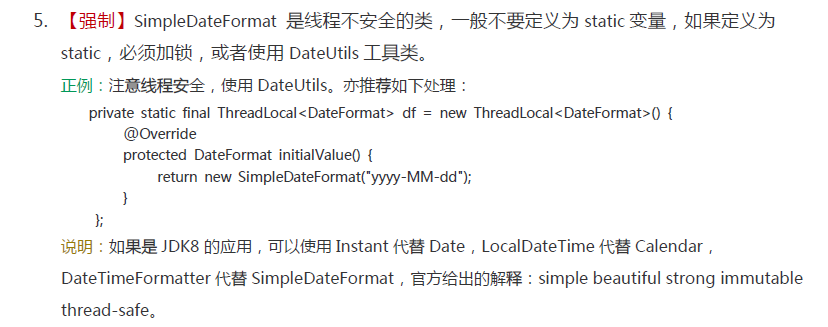

## Tips

### length()、length 和 size()

- **length()** 方法是针对字符串来说的，要求一个字符串的长度就要用到它的length()方法；
- **length 属性**是针对 Java 中的数组来说的，要求数组的长度可以用其 length 属性；
- **size()** 方法是针对泛型集合说的，如果想看这个泛型有多少个元素, 就调用此方法来查看。

### classpath

CLASSPATH 变量指明JAVA运行环境JRE搜索 .class 文件的路径。

1. 不采取任何方式，那么 ClassPath 的默认配值为 ‘.’，即类路径为当前目录及其子目录。

2. 使用环境变量 `CLASSPATH` 设置，设置后会覆盖默认配置。

3. 使用命令行参数 `-classpath` 或 `-cp` 设置，设置后会覆盖环境变量配置和默认配置。

   每个路径之间使用英文分号 ‘;’ 进行分隔（linux环境下则使用英文冒号 ‘:’ 分隔）。

4. 如果运行含有 `manifest` 文件的可执行 jar 包，那么 `manifest` 文件设置的类路径会覆盖前三种配置。

   使用空格分隔各个路径。当类路径过多而需要换行时，从第二行开始，必须以两个空格开头。

> 通配符只匹配目录下的`.jar`和`.JAR`文件，除此之外，既不匹配`.class`文件也不匹配子目录。
>
> 在`main`方法运行之前，通配符会自动展开为具体的路径，展开路径的顺序因平台不同而不同，甚至同一机器不同时刻不同。
>
> 通配符只适用配置的第二和第三种方式，第四种方式`manifest`文件不能使用通配符。

### default关键字

`default`的用法：

- 在`switch`语句的时候使用`default`

- 在定义接口的时候使用`default`来修饰具体的方法

  JDK1.8中为了加强接口的能力，使得接口可以存在具体的方法，前提是方法需要被default或static关键字所修饰。

  > default关键字是一个实实在在存在的关键字，是需要显式声明的，不要和有加任何访问修饰符的默认访问修饰符相混淆。

### 初始化块与构造函数

初始化块：

```java
static{ ...}
```

- 静态初始化块是类相关的，系统将在类初始化阶段执行静态初始化块，而不是在创建对象时执行。

- 静态初始化块不能对实例属性进行初始化处理，通常用于对类属性进行初始化处理。

区别：

- 当创建一个对象时，系统先为该对象的所有实例属性分配内存（前提是该类已经被加载过了），接着程序开始对这些实例属性执行初始化，其初始化顺序是：先执行初始化块或声明属性时指定的初始值，再执行构造器里指定的初始值;

- 初始化块是固定执行的代码，不能接受任何参数。通常把多个构造器中无须接受参数的相同代码提取到初始化块中定义，这样能更好地提高初始化块的复用，提高整个应用的可维护性。

### “假覆盖”行为

子类与父类的同名同参数静态方法和private方法，编译能通过，但这种行为并不是覆盖。

> 子类的方法与可见的父类同名同参数的方法必须保持static的一致，即都有或都没有，否则编译不通过。

**private**方法对于派生类来说根本不存在（不可见），只是名称一样的两个毫不相干的两个方法，只在各自的类里可见。

**static**成员不依赖对象而存在。静态方法的调用根本不取决于对象的实际类型，而只是声明的类型。

> 方法间没有多态就不能称作覆盖

#### null+""

`null+""` 返回字符串类型的 "null"。

> `null + null` 编译错误，二元运算符 '+' 的操作数类型错误

### JDK JRE JVM

- **JDK（Java Development Kit）**

  JDK是Java开发工具包，是Sun Microsystems针对Java开发员的产品。

  JDK中包含JRE，在JDK的安装目录下有一个名为jre的目录，里面有两个文件夹bin和lib，在这里可以认为bin里的就是jvm，lib中则是jvm工作所需要的类库，而jvm和 lib和起来就称为jre。

  JDK是整个JAVA的核心，包括了Java运行环境JRE（Java Runtime Envirnment）、一堆Java工具（javac/java/jdb等）和Java基础的类库（即Java API 包括rt.jar）。

- **Java Runtime Environment（JRE）**

  运行基于Java语言编写的程序所不可缺少的运行环境。也是通过它，Java的开发者才得以将自己开发的程序发布到用户手中，让用户使用。

  JRE中包含了Java virtual machine（JVM），runtime class libraries和Java application launcher，这些是运行Java程序的必要组件。

  JRE是Java运行环境，并不是一个开发环境，所以没有包含任何开发工具（如编译器和调试器），只是针对于使用Java程序的用户。

- **JVM（java virtual machine）**

  java虚拟机，它是整个java实现跨平台的最核心的部分，所有的java程序会首先被编译为.class的类文件，这种类文件可以在虚拟机上执行。

  也就是说class并不直接与机器的操作系统相对应，而是经过虚拟机间接与操作系统交互，由虚拟机将程序解释给本地系统执行。

  只有JVM还不能成class的执行，因为在解释class的时候JVM需要调用解释所需要的类库lib，而jre包含lib类库。

  JVM屏蔽了与具体操作系统平台相关的信息，使得Java程序只需生成在Java虚拟机上运行的目标代码（字节码），就可以在多种平台上不加修改地运行。

### jar包

jar文件实际上是class文件的zip压缩存档。

基本jar包：

- rt.jar：Java基础类库，也就是Java doc里面看到的所有的类的class文件。
- tools.jar：系统用来编译一个类的时候用到的，即执行javac的时候用到。
- dt.jar：关于运行环境的类库，主要是swing包。

#### META-INF

为了提供存档的便签信息，jar文件中有一个特定的目录来存放标签信息：META-INF目录。

META-INF目录下的 manifest.mf 文件包含了jar文件的内容描述，在应用程序运行时向JVM提供应用程序的信息。

使用jar命令默认会产生META-INF目录和manifest.mf文件。

##### manifest.mf

manifest 文件中的每一行都是 `key:value`属性键值对，每行最多72个字符，如果需要增加，可以在下一行续行，续行以空格开头。

基本属性：

Manifest-Version：生成的manifest.mf文件的版本

Built-By：文件的创建用户命名，在IDEA的配置文件中可以设置

Created-By：文件的生成者，一般由jar命令行工具生成，这里显示的时idea

Bulid-Jdk：所使用的JDK环境

除了上面的四个之外，还有很多其他属性，常用如下：

Signature-Vresion：定义jar文件的签名版本

Class-Path：内部的类搜索路径，提供给应用程序或者类装载器

Main-Class：定义jar文件的入口类，该类必须可执行！一旦定义了该属性就可以使用 `java -jar xxx.jar` 来运行该jar文件

#### 打jar包方式

##### idea

1. File -> Project Structure -> Artifacts -> + -> jar -> from modules with dependencies
2. 选择要打包的**模块**和运行的**主类**
3. 选择依赖 jars 包的存放。
   1. 如选择 "copy to the output directory and link via manifest"，继续选择 META-INF/MANIFEST.MF。
   2. 可选将依赖 jar 包放入 lib 文件夹中，然后修改模块 jar 包的 Class Path 以链接依赖的 jar 包。
4. Build -> Build Artifacts -> Rebuild，即可在设置的输出目录中生成 jar 包。

##### maven

使用 maven 的 package/install 也可将模块及其依赖打成jar包（在target目录生成/部署到本地 maven 仓库）。

```xml
<!-- pom.xml -->  
<packaging>jar</packaging>
```

想要maven打的springboot项目jar包能够运行，还需在pom.xml中的`project`标签内增加插件。

```xml
	<build>
        <plugins>
            <plugin>
                <groupId>org.springframework.boot</groupId>
                <artifactId>spring-boot-maven-plugin</artifactId>
                <configuration>
                    <fork>true</fork>
                </configuration>
            </plugin>
        </plugins>
    </build>
```

#### jar & war

[jar包和war包的介绍和区别](https://www.jianshu.com/p/3b5c45e8e5bd)

springboot打的jar包自带tomcat容器，适用于单个项目。

但是如果要把多个项目部署到一个tomcat容器上，就需要打成war包。多个war包部署到同一个tomcat容器上，节省资源。

### 异常时的返回值

`finally`块中的语句无论是否发生异常都会执行。其执行顺序同普通块，按在方法中的顺序从前往后执行。

不同异常处理情况：

- （捕获异常）跳过`try`块中剩下语句，进入`catch`块，然后执行`finally`块。

  如果`catch`中没有`return`会继续执行`finally`块后的语句直到返回值，否则不执行。

  `finally`中有`return`语句时`finally`块后不能有语句（编译错误，无法访问的语句）。

- （抛出异常）跳过剩下的语句，只执行`finally`块的语句。

  如果`finally`块有`return`语句，异常不会继续往上抛出（即使在`catch`中捕获后又抛出）。

> `throw` 和 `return` 语句后不能直接跟着的语句（编译错误，无法访问的语句）

关于`catch`和`finally`块里的`return`：

- `finally`里的`return`会覆盖`catch`的返回值。
- `catch`里返回的变量即使在`finally`内修改了，其返回值不变。

java中两种退出方法的方式，

1. 遇到一个返回的指令（`return`语句）；

2. 遇到一个异常，并且没有搜索到异常处理器，不会给调用返回任何值。

建议：在`catch`中返回异常时的返回值，在方法最后返回正常的返回值，`finally`块中只是执行最后的清理工作。

> Reports return statements inside of finally blocks. While occasionally intended, such return statements may mask exceptions thrown, and tremendously complicate debugging. 

### 字符串日期互转

#### 字符串 -> 日期

- `Timestamp.valueOf(String time)`

  返回`Timestamp`类。

  必须是`yyyy-[m]m-[d]d hh:mm:ss[.fffffffff]`格式，否则报错。

#### SimpleDateFormat

[深入理解Java：SimpleDateFormat安全的时间格式化](https://www.cnblogs.com/peida/archive/2013/05/31/3070790.html)



#### DateTimeFormatter

```java
	private static final DateTimeFormatter formatter = DateTimeFormatter.ofPattern("yyyy-MM-dd HH:mm:ss");
    
    public static String formatDate(LocalDateTime date){
        return formatter.format(date);
    }
    
    public static LocalDateTime parse(String strDate){
        return LocalDateTime.parse(strDate, formatter);
    }
```

#### 外部库

##### org.apache.commons.lang3

```java
 		String target = "";
        String[] srcPattern = new String[]{"yyyyMMdd HH:mm:ss"};
        String dstPattern = "yyyy-MM-dd HH:mm:ss";
        try {
            // 字符串 -> 时间
            Date date = DateUtils.parseDate(dateStr, srcPattern);
            // 时间 -> 字符串
            target = DateFormatUtils.format(date, dstPattern);
        } catch (ParseException e) {
            log.error("时间格式转换错误！字符串参数为：{}", dateStr);
            e.printStackTrace();
        }
```

注意处理异常，而不是忽视异常。

> 持续更新

### 特殊注释

`//TODO: 说明`：
说明在标识处有功能代码待编写，待实现的功能在说明中会简略说明。

`//FIXME: 说明`：
说明标识处代码需要修正，甚至代码是错误的，不能工作，需要修复，如何修正会在说明中简略说明。

`//XXX: 说明`：
说明标识处代码虽然实现了功能，但是实现的方法有待商榷，希望将来能改进，要改进的地方会在说明中简略说明。

### @Override

`@Override`注解只保留在源代码中，用于编译器验证`@Override`下的方法是否是父类或接口中所有的，如果没有则报错。

> 重写方法没加上`@Override`，编译器不会报错。

### isAssignableFrom() & instanceof

`isAssignableFrom()`方法与`instanceof`关键字的区别：

- isAssignableFrom()方法是从类继承的角度去判断，instanceof关键字是从实例继承的角度去判断。

- isAssignableFrom()方法是判断是否为某个类的父类，instanceof关键字是判断是否某个类的子类。

使用：

```java
父类.class.isAssignableFrom(子类.class)
子类实例 instanceof 父类类型
```

### 中文字符判断

- 正则表达式

  ```java
  public static boolean isContainChinese(String str) {
      Pattern p = Pattern.compile("[\u4e00-\u9fa5]");
      Matcher m = p.matcher(str);
      if (m.find()) {
          return true;
      }
      return false;
  }
  ```

  只能检测出中文汉字（中文汉字的编码范围：[\u4e00-\u9fa5]），不能检测中文标点。

- `Character`类

  [Java 中文字符判断 中文标点符号判断](https://www.cnblogs.com/zztt/p/3427452.html)

#### Character

`Character` 类中有3个静态内部类：

- `Character.Subset ` 该类的实例表示Unicode字符集的特定子集。
- `Character.UnicodeBlock` 代表一片连续的Unicode号码段
- `Character.UnicodeScript` 一个字符或者其他书写符号的集合

UnicodeBlock 与 UnicodeScript 关系：

UnicodeScript 是从语言书写规则层次对Unicode字符的分类，这是用使用角度划分，而UnicodeBlock是从硬的编码角度划分。

- UnicodeBlock是简单的数值范围 (其中可能有些Block中会有一些尚未分配字符的“空号”)。

- 在一个UnicodeScript中的字符可能分散在多个UnicodeBlock中；

- 一个UnicodeBlock中的字符可能会被划进多个UnicodeScript中。

### java命令

[java命令详解](https://blog.csdn.net/Trival_dreamy/article/details/86740281)

### 环境变量 & 系统属性

- `System.getenv()`：获取的是操作系统的变量如，path，java_home等，在系统环境变量里面进行配置；

- `System.getProperties()`：获取的是JAVA虚拟机的运行时系统属性，是java虚拟机自己的，通过-Dxxxx参数进行指定；如java.runtime.name，sun.boot.library.path等；

[Java中System.getProperties()和System.getenv()的区别](https://www.dazhuanlan.com/2019/12/09/5dedf7478f261/)

### 深拷贝 & 浅拷贝


= 运算符 

引用

:: 操作符 

方法变量 Function

close()

序列化

https://blog.csdn.net/qq_40670946/article/details/88106817

https://blog.csdn.net/yuyulover/article/details/4427527#commentBox

happens-before

jconsole


编码

https://www.ibm.com/developerworks/cn/java/j-lo-chinesecoding/#ibm-pcon


加载jar


异常规范

早抛出,晚捕获


## 代码常见缺陷

### 变量声明

#### 全局静态变量

解决：

1. 声明为全局静态常量，避免意料之外的修改
2. 声明为私有静态变量
3. 声明为实例变量

#### 未使用变量

### 空指针

函数参数空判断，防止NPE。

### equals

npe

不同类型返回