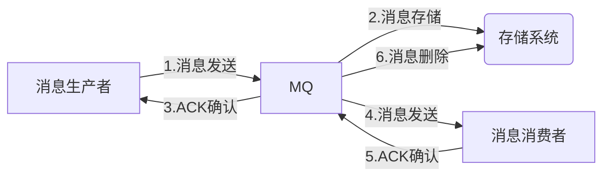
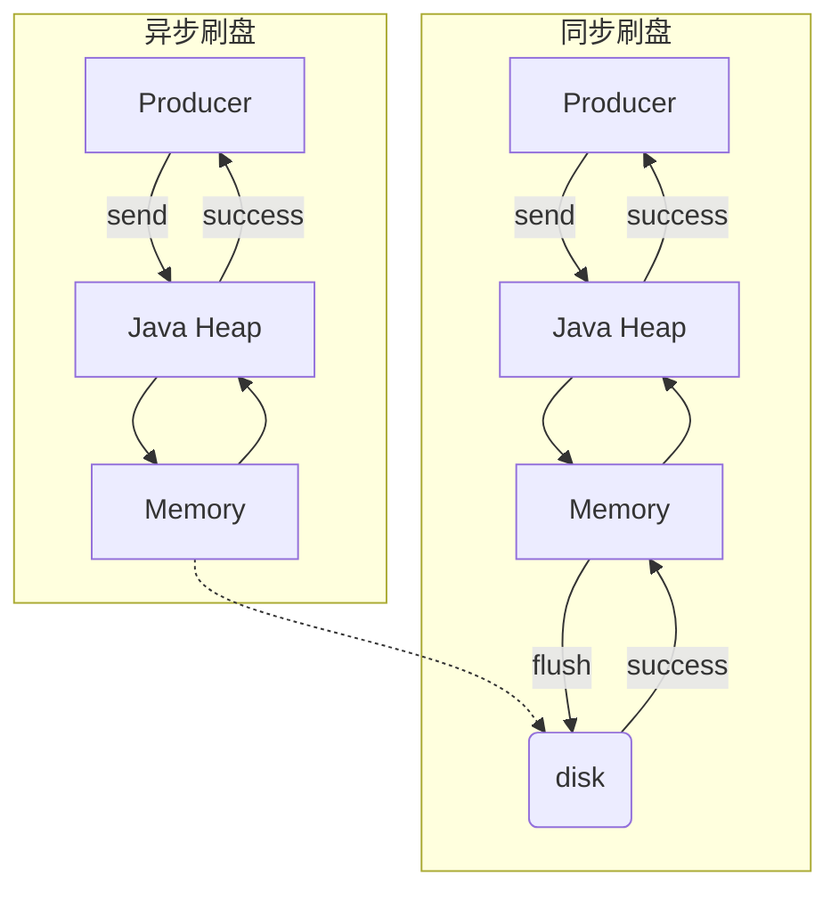
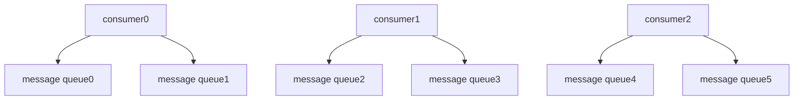

# RocketMQ

## 基本概念

[十分钟入门RocketMQ|阿里中间件团队博客](http://jm.taobao.org/2017/01/12/rocketmq-quick-start-in-10-minutes/)

[RocketMQ-架构](https://www.cnblogs.com/qdhxhz/p/11094624.html)

[DOCS](https://github.com/apache/rocketmq/tree/master/docs/cn)

[BEST PRACTICE](http://rocketmq.apache.org/docs/core-concept/)

## 部署

### 单机部署

#### 启动

**从源码编译**

```shell
cd rocketmq-all-4.6.1/
mvn -Prelease-all -DskipTests clean install -U
cd distribution/target/apache-rocketmq
```

**启动NameServer**

```shell
nohup sh bin/mqnamesrv &
```

**启动Broker**

```shell
nohup sh bin/mqbroker -n localhost:9876 &
```

**查看启动日志**

```shell
tail -f ~/logs/rocketmqlogs/namesrv.log
tail -f ~/logs/rocketmqlogs/broker.log 
```

##### Windows

1. 配置环境变量，增加bin路径至Path（可选）

2. CMD 运行`mqnamesrv` 启动 NameServer

3. CMD 运行`mqbroker -n 127.0.0.1::9876` 启动 broker

   或者使用 `set NAMESRV_ADDR=127.0.0.1:9876` 设置环境变量。

##### Question

**VM内存不足**

```
Error occurred during initialization of VM
Could not reserve enough space for object heap
```

解决方法：

修改`bin/runserver`将Xms、Xmx、Xmn配置改小，如：

```sh
set "JAVA_OPT=%JAVA_OPT% -server -Xms256m -Xmx256m -Xmn128m -XX:MetaspaceSize=128m -XX:MaxMetaspaceSize=320m"
```

`mqbroker`同理，修改`bin/runbrocker`。

**mqbroker 无反应**

`c:/User/用户名/store`目录下所有文件全部删除，再启动，成功。

#### 测试

##### 发送消息

```shell
# 1.设置环境变量
export NAMESRV_ADDR=localhost:9876
# 2.使用安装包的Demo发送消息
sh bin/tools.sh org.apache.rocketmq.example.quickstart.Producer
```

##### 接受信息

```shell
# 1.设置环境变量
export NAMESRV_ADDR=localhost:9876
# 2.接收消息
sh bin/tools.sh org.apache.rocketmq.example.quickstart.Consumer
```

#### 关闭

```shell
# 1.关闭NameServer
sh bin/mqshutdown namesrv
# 2.关闭Broker
sh bin/mqshutdown broker
```

#### 配置

```shell
cp ./conf/broker.conf ./conf/broker1.properties
nohup bin/mqbroker -c ./conf/broker1.properties -n localhost:9876 
```

配置参数：

[rocketmq配置](https://www.jianshu.com/p/12194f8738d7)

> Windows环境的目录配置使用形如`d:/Soft/WorkDep/rocketmq-all-4.7.0-bin-release/store`的格式。

##### Q&A

[解决rocketmq发送消息报错： service not available now, maybe disk full, CL: 0.87 CQ: 0.87 INDEX: 0.87, maybe your broker machine memory too small](https://www.cnblogs.com/shenrong/p/12670555.html)

### 集群部署

#### 集群特点


##### Name Server

Name Server是一个几乎无状态节点，可集群部署，节点之间无任何信息同步。

##### Broker

Broker部署相对复杂，Broker分为Master与Slave，一个Master可以对应多个Slave，但是一个Slave只能对应一个Master，Master与Slave的对应关系通过指定相同的Broker Name，不同的Broker Id来定义，BrokerId为0表示Master，非0表示Slave。Master也可以部署多个。

每个Broker与Name Server集群中的所有节点建立长连接，定时(每隔30s)注册Topic信息到所有Name Server。Name Server定时(每隔10s)扫描所有存活broker的连接，如果Name Server超过2分钟没有收到心跳，则Name Server断开与Broker的连接。

##### Producer

Producer与Name Server集群中的其中一个节点(随机选择)建立长连接，定期从Name Server取Topic路由信息，并向提供Topic服务的Master建立长连接，且定时向Master发送心跳。Producer完全无状态，可集群部署。

Producer每隔30s（由ClientConfig的pollNameServerInterval）从Name server获取所有topic队列的最新情况，这意味着如果Broker不可用，Producer最多30s能够感知，在此期间内发往Broker的所有消息都会失败。

Producer每隔30s（由ClientConfig中heartbeatBrokerInterval决定）向所有关联的broker发送心跳，Broker每隔10s中扫描所有存活的连接，如果Broker在2分钟内没有收到心跳数据，则关闭与Producer的连接。

##### Consumer

Consumer与Name Server集群中的其中一个节点(随机选择)建立长连接，定期从Name Server取Topic路由信息，并向提供Topic服务的Master、Slave建立长连接，且定时向Master、Slave发送心跳。Consumer既可以从Master订阅消息，也可以从Slave订阅消息，订阅规则由Broker配置决定。

Consumer每隔30s从Name server获取topic的最新队列情况，这意味着Broker不可用时，Consumer最多最需要30s才能感知。

Consumer每隔30s（由ClientConfig中heartbeatBrokerInterval决定）向所有关联的broker发送心跳，Broker每隔10s扫描所有存活的连接，若某个连接2分钟内没有发送心跳数据，则关闭连接；并向该Consumer Group的所有Consumer发出通知，Group内的Consumer重新分配队列，然后继续消费。

当Consumer得到master宕机通知后，转向slave消费，slave不能保证master的消息100%都同步过来了，因此会有少量的消息丢失。但是一旦master恢复，未同步过去的消息会被最终消费掉。

#### 集群模式

##### 单Master模式

这种方式风险较大，一旦Broker重启或者宕机时，会导致整个服务不可用。不建议线上环境使用,可以用于本地测试。

##### 多Master模式

一个集群无Slave，全是Master，例如2个Master或者3个Master，这种模式的优缺点如下：

- 优点：配置简单，单个Master宕机或重启维护对应用无影响，在磁盘配置为RAID10时，即使机器宕机不可恢复情况下，由于RAID10磁盘非常可靠，消息也不会丢（异步刷盘丢失少量消息，同步刷盘一条不丢），性能最高；
- 缺点：单台机器宕机期间，这台机器上未被消费的消息在机器恢复之前不可订阅，消息实时性会受到影响。

##### 多Master多Slave模式（异步）

每个Master配置一个Slave，有多对Master-Slave，HA采用异步复制方式，主备有短暂消息延迟（毫秒级），这种模式的优缺点如下：

- 优点：即使磁盘损坏，消息丢失的非常少，且消息实时性不会受影响，同时Master宕机后，消费者仍然可以从Slave消费，而且此过程对应用透明，不需要人工干预，性能同多Master模式几乎一样；
- 缺点：Master宕机，磁盘损坏情况下会丢失少量消息。

##### 多Master多Slave模式（同步）

每个Master配置一个Slave，有多对Master-Slave，HA采用同步双写方式，即只有主备都写成功，才向应用返回成功，这种模式的优缺点如下：

- 优点：数据与服务都无单点故障，Master宕机情况下，消息无延迟，服务可用性与数据可用性都非常高；
- 缺点：性能比异步复制模式略低（大约低10%左右），发送单个消息的RT会略高，且目前版本在主节点宕机后，备机不能自动切换为主机。

### Console

[rocketmq-console](https://github.com/apache/rocketmq-externals/tree/master/rocketmq-console)

```cmd
java -jar rocketmq-console-ng-1.0.0.jar --server.port=12581 --rocketmq.config.namesrvAddr=10.89.0.64:9876;10.89.0.65:9876
```

> Q: `nested exception is java.lang.NoClassDefFoundError: javax/xml/bind/ValidationException`
>
> AXB API是java EE 的API，因此在java SE 9.0 中不再包含这个 Jar 包。
> java 9 中引入了模块的概念，默认情况下，Java SE中将不再包含java EE 的Jar包。
> 而在 java 6/7/8 时关于这个API 都是捆绑在一起的。
>
> 增加一下依赖即可：
>
> ```xml
> <dependency>
>      <groupId>javax.xml.bind</groupId>
>      <artifactId>jaxb-api</artifactId>
>      <version>2.3.0</version>
>  </dependency>
>  <dependency>
>      <groupId>com.sun.xml.bind</groupId>
>      <artifactId>jaxb-impl</artifactId>
>      <version>2.3.0</version>
>  </dependency>
>  <dependency>
>      <groupId>com.sun.xml.bind</groupId>
>      <artifactId>jaxb-core</artifactId>
>      <version>2.3.0</version>
>  </dependency>
>  <dependency>
>      <groupId>javax.activation</groupId>
>      <artifactId>activation</artifactId>
>      <version>1.1.1</version>
>  </dependency>
> ```

## 使用

### 生产消费

#### 依赖

```pom
		<dependency>
            <groupId>org.apache.rocketmq</groupId>
            <artifactId>rocketmq-client</artifactId>
            <version>4.6.1</version>
        </dependency>
```

#### 发送消息

基本步骤：

1. 创建消息生产者`producer`，并指定生产者组名

   ```java
   DefaultMQProducer producer = new DefaultMQProducer("my-producer-group");
   ```

2. 指定Nameserver地址，集群环境多个Nameserver用`;`分割

   ```java
   producer.setNamesrvAddr("127.0.0.1:9876");
   ```

3. 启动`producer`

   ```java
    producer.start();
   ```

4. 创建消息对象，指定主题Topic、Tag和消息体

   ```java
   Message message = new Message("MyQuickStartTopic","tagA",("Hello World!").getBytes(RemotingHelper.DEFAULT_CHARSET));
   ```

5. 发送消息（三种模式：Sync、Async、Oneway）

   ```java
   producer.send(message);
   ```

6. 关闭生产者`producer`（根据自己需求确定是否需要关闭）

   ```java
   producer.shutdown();
   ```

> `tags`从命名来看像是一个复数，但发送消息时，目的地只能指定一个topic下的一个`tag`，不能指定多个。

##### 同步消息

这种可靠性同步地发送方式使用的比较广泛，比如：重要的消息通知，短信通知。

```java
// 调用发送结果之后会等待发送结果sendResult
SendResult sendResult = producer.send(msg);
```

##### 异步消息

异步消息通常用在对响应时间敏感的业务场景，即发送端不能容忍长时间地等待Broker的响应。

```java
// SendCallback接收异步返回结果的回调
producer.send(msg, new SendCallback() {
    @Override
    public void onSuccess(SendResult sendResult) {
        System.out.printf("%-10d OK %s %n", index,
                          sendResult.getMsgId());
    }
    @Override
    public void onException(Throwable e) {
        System.out.printf("%-10d Exception %s %n", index, e);
        e.printStackTrace();
    }
});
```

##### 单向发送消息

这种方式主要用在不特别关心发送结果的场景，例如日志发送。

```java
// 发送单向消息，没有任何返回结果
producer.sendOneway(msg);
```

**发送消息完整示例**

```java
public class MyProducer {
	public static void main(String[] args) throws Exception {
    	// 实例化消息生产者Producer
        DefaultMQProducer producer = new DefaultMQProducer("my-producer-group");
    	// 设置NameServer的地址
    	producer.setNamesrvAddr("localhost:9876");
    	// 启动Producer实例
        producer.start();
    	for (int i = 0; i < 100; i++) {
    	    // 创建消息，并指定Topic，Tag和消息体
    	    Message msg = new Message("TopicTest" /* Topic */,
        	"TagA" /* Tag */,
        	("Hello RocketMQ " + i).getBytes(RemotingHelper.DEFAULT_CHARSET) /* Message body */
        	);
        	// 发送消息到一个Broker
            SendResult sendResult = producer.send(msg);
            // 通过sendResult返回消息是否成功送达
            System.out.printf("%s%n", sendResult);
    	}
    	// 如果不再发送消息，关闭Producer实例。
    	producer.shutdown();
    }
}
```

#### 消费消息

基本步骤：

1. 创建消费者`consumer`，指定消费者所在组组名

   ```java
   DefaultMQPushConsumer consumer = new DefaultMQPushConsumer("my-consumer-group");
   ```

2. 指定Nameserver地址，集群环境多个Nameserver用`;`分割

   ```java
   producer.setNamesrvAddr("127.0.0.1:9876");
   ```

3. 订阅主题Topic和Tag

   ```java
   consumer.subscribe("MyQuickStartTopic", "*");
   ```

4. 设置回调函数，处理消息

   ```java
   consumer.registerMessageListener(new MessageListenerConcurrently() {
       @Override
       public ConsumeConcurrentlyStatus consumeMessage(List<MessageExt> list, ConsumeConcurrentlyContext consumeConcurrentlyContext) {
   });
   ```

5. 启动消费者`consumer`

   ```java
   consumer.start();
   ```

注意，启动的时候需要`consumer`先启动，因为它需要在生产者之前先订阅，否则将会收不到生产在`consumer`生产的消息，造成消息丢失。

消息消费返回重试后，将在`%RETRY%(consumer-group-name)`重试队列中进行重试。

##### ConsumeFromWhere

新创建的消费者ID在哪里开始消费消息？

1. 如果主题在三天内发送了一条消息，那么使用者开始使用服务器中保存的第一条消息中的消息。
2. 如果主题三天前发送了一条消息，则使用者开始使用服务器中最新消息中的消息，换句话说，从消息队列的尾部开始。
3. 如果重新启动了此类使用者，则它将开始使用最后一个使用者所在位置的消息。

通过设置`consumerFromWhere`可指示`consumer`第一次启动时从何处开始消费。默认为`CONSUME_FROM_LAST_OFFSET`。

```java
consumer.setConsumeFromWhere(ConsumeFromWhere.CONSUME_FROM_LAST_OFFSET);
```

```java
public enum ConsumeFromWhere {
    /**
     * 一个新的订阅组第一次启动从队列的最后位置开始消费<br>
     * 后续再启动接着上次消费的进度开始消费
     */
    CONSUME_FROM_LAST_OFFSET,
    /**
     * 一个新的订阅组第一次启动从队列的最前位置开始消费<br>
     * 后续再启动接着上次消费的进度开始消费
     */
    CONSUME_FROM_FIRST_OFFSET,
    /**
     * 一个新的订阅组第一次启动从指定时间点开始消费<br>
     * 后续再启动接着上次消费的进度开始消费<br>
     * 时间点设置参见DefaultMQPushConsumer.consumeTimestamp参数
     */
    CONSUME_FROM_TIMESTAMP,
}
```

这个参数只对一个新的consumeGroup第一次启动时有效。1
就是说，如果是一个consumerGroup重启，他只会从自己上次消费到的offset，继续消费。

而判断是不是一个新的ConsumerGroup是在broker端判断。消费到哪个offset最先是存在Consumer本地的，定时和broker同步自己的消费offset。broker在判断是不是一个新的consumergroup，就是查broker端有没有这个consumergroup的offset记录。

另外，对于一个新的queue，这个参数也是没用的，都是从0开始消费。

订阅组不存在情况下，如果这个队列的消息最小Offset是0，则表示这个Topic上线时间不长，服务器堆积的数据也不多，那么这个订阅组就从0开始消费。尤其对于Topic队列数动态扩容时，必须要从0开始消费。

##### 订阅组

每个消费者属于一个订阅组（消费组），一个订阅组可以有多个消费组。

> 同一JVM中使用相同的Producer / Consumer组启动Producer / Consumer的多个实例可能会抛出异常。

rocketMQ的订阅关系，是根据 group 来管理的。同组的每个消费者在向 broker 注册订阅信息的时候会相互覆盖掉对方的订阅信息，可能导致获取不到消息。

因此，同一个消费组应该拥有完全一样的订阅关系（Topic + Tag）。

同一订阅组的消费者消费消息有两种模式：

- `MessageModel.CLUSTERING`
- `MessageModel.BROADCASTING`

对于不同订阅组来说，消息是广播的。消息会发送到所有订阅了该消息的订阅组。

##### 负载均衡模式

消费者采用负载均衡方式（集群方式）消费消息，同一订阅组的多个消费者共同消费队列消息，每个消费者处理的不同消息。默认为集群模式。

在高并发下，依旧可能出现不同消费者消费统一个消息的情况。

```java
consumer.setMessageModel(MessageModel.CLUSTERING);
```

##### 广播模式

消费者采用广播的方式消费消息，同一订阅组的每个消费者都会消费所有消息。

```java
consumer.setMessageModel(MessageModel.BROADCASTING);
```

**消费消息完整示例**

```java
public class MyConsumer {
    public static void main(String[] args) throws MQClientException {
        DefaultMQPushConsumer consumer = new DefaultMQPushConsumer("my-consumer-group");
        //设置 NamesrvAddr
        consumer.setNamesrvAddr("127.0.0.1:9876");
        //设置订阅主题，第二个参数为过滤tabs的条件，可以写为tabA|tabB过滤Tab,*表示接受所有
        consumer.subscribe("MyQuickStartTopic", "*");
        //注册消息监听
        consumer.registerMessageListener(new MessageListenerConcurrently() {
            @Override
            public ConsumeConcurrentlyStatus consumeMessage(List<MessageExt> list, ConsumeConcurrentlyContext consumeConcurrentlyContext) {
                try {
                    MessageExt messageExt = list.get(0);
                    String topic = messageExt.getTopic();
                    String message = new String(messageExt.getBody(),"UTF-8");
                    int queueId = messageExt.getQueueId();
                    System.out.println("收到来自topic:" + topic + ", queueId:" + queueId + "的消息：" + message);

                } catch (Exception e) {
                    //失败，请求稍后重发
                    return ConsumeConcurrentlyStatus.RECONSUME_LATER;
                }
                //成功
                return ConsumeConcurrentlyStatus.CONSUME_SUCCESS;
            }
        });
        consumer.start();
    }
}
```

### 顺序消息

消息有序指的是可以按照消息的发送顺序来消费(FIFO)。RocketMQ可以严格的保证消息有序，可以分为分区有序或者全局有序。

在默认的情况下消息发送会采取Round Robin轮询方式把消息发送到不同的queue(分区队列)；而消费消息的时候从多个queue上拉取消息，这种情况发送和消费是不能保证顺序。

但是如果控制发送的顺序消息只依次发送到同一个queue中，消费的时候只从这个queue上依次拉取，则就保证了顺序。

当发送和消费参与的queue只有一个，则是**全局有序**；如果多个queue参与，则为**分区有序**，即相对每个queue，消息都是有序的。

#### 发送

发送顺序消息应保证：

- 消息不能异步发送，同步发送的时候才能保证broker收到是有序的；
- 每次发送选择的是同一个MessageQueue。

`MessageQueueSelector`可以让用户自己决定消息发送到哪一个队列。

使用带有`MessageQueueSelector`参数的`send`方法即可实现将消息发送到指定队列。

```java
public interface MessageQueueSelector {
    MessageQueue select(List<MessageQueue> var1, Message var2, Object var3);
}
```

`select`方法：

- `List<MessageQueue> var1`，消息队列列表，从中选择一个队列发送当前消息。
- `Message var2`，发送的消息。
- `Object var3`，对应`send`方法的`Object var`参数。

发送示例：

```java
String[] tags = new String[]{"TagA", "TagC", "TagD"};
// 订单列表
List<OrderStep> orderList = new Producer().buildOrders();

Date date = new Date();
SimpleDateFormat sdf = new SimpleDateFormat("yyyy-MM-dd HH:mm:ss");
String dateStr = sdf.format(date);
for (int i = 0; i < 10; i++) {
    // 加个时间前缀
    String body = dateStr + " Hello RocketMQ " + orderList.get(i);
    Message msg = new Message("TopicTest", tags[i % tags.length], "KEY" + i, body.getBytes());

    SendResult sendResult = producer.send(msg, new MessageQueueSelector() {
        @Override
        public MessageQueue select(List<MessageQueue> mqs, Message msg, Object arg) {
            Long id = (Long) arg;  //根据订单id选择发送queue
            long index = id % mqs.size();
            return mqs.get((int) index);
        }
    }, orderList.get(i).getOrderId());//订单id

    System.out.println(String.format("SendResult status:%s, queueId:%d, body:%s",
        sendResult.getSendStatus(),
		sendResult.getMessageQueue().getQueueId(),
        body));
}
```

#### 消费

同一个queue肯定会投递到同一个消费实例，同一个消费实例肯定是顺序拉取并顺序提交线程池的，只要保证消费端顺序消费即可（成功消费一个后才继续消费下一个消息）。

如何保证顺序消费？ 如果是使用`MessageListenerOrderly`则自带此实现，如果是使用`MessageListenerConcurrently`，则需要把线程池改为单线程模式。

消费示例：

```java
// 设置Consumer第一次启动是从队列头部开始消费
consumer.setConsumeFromWhere(ConsumeFromWhere.CONSUME_FROM_FIRST_OFFSET);
consumer.subscribe("TopicTest", "TagA || TagC || TagD");
consumer.registerMessageListener(new MessageListenerOrderly() {
    Random random = new Random();
    @Override
    public ConsumeOrderlyStatus consumeMessage(List<MessageExt> msgs, ConsumeOrderlyContext context) {
        context.setAutoCommit(true);
        for (MessageExt msg : msgs) {
            // 可以看到每个queue有唯一的consume线程来消费, 订单对每个queue(分区)有序
            System.out.println("consumeThread=" + Thread.currentThread().getName() + "queueId=" + msg.getQueueId() + ", content:" + new String(msg.getBody()));
        }
        try {
            //模拟业务逻辑处理中...
            TimeUnit.SECONDS.sleep(random.nextInt(10));
        } catch (Exception e) {
            e.printStackTrace();
            // 消息重试
            return ConsumeOrderlyStatus.SUSPEND_CURRENT_QUEUE_A_MOMENT;
        }
        return ConsumeOrderlyStatus.SUCCESS;
    }
});
```

### 延时消息

延时消息在投递时，需要设置指定的延时级别（不同延迟级别对应不同延迟时间），即等到特定的时间间隔后消息才会被消费者消费。

设置消息延时级别的方法是`message.setDelayTimeLevel()`，目前RocketMQ不支持任意时间间隔的延时消息，只支持特定级别的延时消息。

默认延时级别配置：

```java
// MessageStoreConfig#messageDelayLevel
private String messageDelayLevel = "1s 5s 10s 30s 1m 2m 3m 4m 5m 6m 7m 8m 9m 10m 20m 30m 1h 2h";
```

延时级别1对应延时1秒，延时级别2对应延时5秒，以此类推。如下，设置要发送的消息将延长10秒后消费。

```java
Message message = new Message("TestTopic", ("Hello scheduled message!").getBytes());
message.setDelayTimeLevel(3);
producer.send(message);
```

[RocketMQ-延时消息Demo及实现原理分析](https://blog.csdn.net/hosaos/article/details/90577732)

### 批量消息

批量发送消息能显著提高传递小消息的性能。限制是这些批量消息应该有相同的topic，相同的waitStoreMsgOK，而且不能是延时消息。此外，这一批消息的总大小不应超过4MB。

示例：

```java
//把大的消息分裂成若干个小的消息
ListSplitter splitter = new ListSplitter(messages);
while (splitter.hasNext()) {
  try {
      List<Message>  listItem = splitter.next();
      producer.send(listItem);
  } catch (Exception e) {
      e.printStackTrace();
      //处理error
  }
}
```

```java
public class ListSplitter implements Iterator<List<Message>> {
   private final int SIZE_LIMIT = 1024 * 1024 * 4;
   private final List<Message> messages;
   private int currIndex;
   public ListSplitter(List<Message> messages) {
           this.messages = messages;
   }
    @Override 
    public boolean hasNext() {
       return currIndex < messages.size();
   }
   	@Override 
    public List<Message> next() {
       int nextIndex = currIndex;
       int totalSize = 0;
       for (; nextIndex < messages.size(); nextIndex++) {
           Message message = messages.get(nextIndex);
           int tmpSize = message.getTopic().length() + message.getBody().length;
           Map<String, String> properties = message.getProperties();
           for (Map.Entry<String, String> entry : properties.entrySet()) {
               tmpSize += entry.getKey().length() + entry.getValue().length();
           }
           tmpSize = tmpSize + 20; // 增加日志的开销20字节
           if (tmpSize > SIZE_LIMIT) {
               //单个消息超过了最大的限制
               //忽略,否则会阻塞分裂的进程
               if (nextIndex - currIndex == 0) {
                  //假如下一个子列表没有元素,则添加这个子列表然后退出循环,否则只是退出循环
                  nextIndex++;
               }
               break;
           }
           if (tmpSize + totalSize > SIZE_LIMIT) {
               break;
           } else {
               totalSize += tmpSize;
           }

       }
       List<Message> subList = messages.subList(currIndex, nextIndex);
       currIndex = nextIndex;
       return subList;
   }
}
```

### 过滤消息

使用tag进行简单过滤，如下消费者消费TAGA或TAGB或TAGC的消息。

```java
consumer.subscribe("TOPIC", "TAGA || TAGB || TAGC");
```

另外，使用SQL表达式可以通过消息的属性来进行消息的过滤。

#### SQL基本语法

RocketMQ只定义了一些SQL基本语法来支持这个特性。

- 数值比较，比如：**>，>=，<，<=，BETWEEN，=；**
- 字符比较，比如：**=，<>，IN；**
- **IS NULL** 或者 **IS NOT NULL；**
- 逻辑符号 **AND，OR，NOT；**

常量支持类型为：

- 数值，比如：**123，3.1415；**
- 字符，比如：**'abc'，必须用单引号包裹起来；**
- **NULL**，特殊的常量
- 布尔值，**TRUE** 或 **FALSE**

#### 发送

```java
Message msg = new Message("TopicTest",
   tag,
   ("Hello RocketMQ").getBytes(RemotingHelper.DEFAULT_CHARSET)
);
// 设置属性
msg.putUserProperty("a", String.valueOf(i));
SendResult sendResult = producer.send(msg);
```

#### 消费

只有使用push模式的消费者才能用使用SQL92标准的sql语句。

使用`MessageSelector`类传递sql语句。

示例：

```java
consumer.subscribe("TopicTest", MessageSelector.bySql("a between 0 and 3");
```

### 事务消息

事务消息，即执行本地事务和发送消息应该保证同时成功或者同时失败。

对于消费失败和消费超时问题不支持回滚整个流程（如果要实现，会大大提升系统复杂度），这个时候需要在业务层面处理。

事务消息的大致流程如下，其中分为两个流程：正常事务消息的发送及提交、事务消息的补偿流程。


**事务消息发送及提交**

1. 发送消息（half消息，标记为暂不能投递状态的消息）。
2. MQ服务端响应消息写入结果。
3. 根据发送结果执行本地事务（如果写入失败，此时half消息对业务不可见，本地逻辑不执行）。
4. 根据本地事务状态执行Commit或者Rollback（Commit操作生成消息索引，消息对消费者可见）

**事务补偿**

1. 对没有Commit/Rollback的事务消息（pending状态的消息），从服务端发起一次“回查”
2. Producer收到回查消息，检查回查消息对应的本地事务的状态
3. 根据本地事务状态，重新Commit或者Rollback

其中，补偿阶段用于解决消息Commit或者Rollback发生超时或者失败的情况。

#### 事务消息状态

事务消息共有三种状态，提交状态、回滚状态、中间状态：

- `TransactionStatus.CommitTransaction`: 提交事务，它允许消费者消费此消息。
- `TransactionStatus.RollbackTransaction`: 回滚事务，它代表该消息将被删除，不允许被消费。
- `TransactionStatus.Unknown`: 中间状态，它代表需要检查消息队列来确定状态。

#### 创建与发送

使用 `TransactionMQProducer`类创建生产者，并指定唯一的 `ProducerGroup`，可以设置自定义线程池来处理这些检查请求。

设置事务监听器，根据执行结果对消息队列进行回复。

使用`sendMessageInTransaction`方法发送事务消息。

```java
public class Producer {
    public static void main(String[] args) throws MQClientException, InterruptedException {
        // 创建事务监听器
        TransactionListener transactionListener = new TransactionListenerImpl();
        // 创建消息生产者
        TransactionMQProducer producer = new TransactionMQProducer("transaction-test-group");
        producer.setNamesrvAddr("127.0.0.1:9876");
        // 生产者设置监听器
        producer.setTransactionListener(transactionListener);
        // 启动消息生产者
        producer.start();
        String[] tags = new String[]{"TagA", "TagB", "TagC"};
        for (int i = 0; i < 3; i++) {
            try {
                Message msg = new Message("TransactionTopic", tags[i % tags.length], "KEY" + i,
                        ("Hello RocketMQ " + i).getBytes(RemotingHelper.DEFAULT_CHARSET));
                SendResult sendResult = producer.sendMessageInTransaction(msg, null);
                System.out.printf("%s%n", sendResult);
                TimeUnit.SECONDS.sleep(1);
            } catch (MQClientException | UnsupportedEncodingException e) {
                e.printStackTrace();
            }
        }
        // producer.shutdown();
    }
}
```

> 如果使用Spring来管理事物的话，大可以将发送消息的逻辑放到本地事物中去，发送消息失败抛出异常，Spring捕捉到异常后就会回滚此事物，以此来保证本地事物与发送消息的原子性。

#### 事务监听

事务监听需实现`TransactionListener`接口。

当发送半消息成功时，使用 `executeLocalTransaction` 方法来执行本地事务，并返回事务状态。

`checkLocalTranscation` 方法用于检查本地事务状态，并回应消息队列的检查请求，返回事务状态。当MQ服务器未收到半消息的二次确认（commit or rollback），将会主动询问Producer端该消息的最终状态。

```java
public class TransactionListenerImpl implements TransactionListener {

    @Override
    public LocalTransactionState executeLocalTransaction(Message msg, Object arg) {
        System.out.println("执行本地事务");
        if (StringUtils.equals("TagA", msg.getTags())) {
            return LocalTransactionState.COMMIT_MESSAGE;
        } else if (StringUtils.equals("TagB", msg.getTags())) {
            return LocalTransactionState.ROLLBACK_MESSAGE;
        } else {
            return LocalTransactionState.UNKNOW;
        }
    }

    @Override
    public LocalTransactionState checkLocalTransaction(MessageExt msg) {
        System.out.println("MQ检查消息Tag【"+msg.getTags()+"】的本地事务执行结果");
        return LocalTransactionState.COMMIT_MESSAGE;
    }
}
```

#### 使用限制

1. 事务消息不支持延时消息和批量消息。
2. 为了避免单个消息被检查太多次而导致半队列消息累积，我们默认将单个消息的检查次数限制为 15 次，但是用户可以通过 Broker 配置文件的 `transactionCheckMax`参数来修改此限制。如果已经检查某条消息超过 N 次的话（ N = `transactionCheckMax` ） 则 Broker 将丢弃此消息，并在默认情况下同时打印错误日志。用户可以通过重写 `AbstractTransactionCheckListener` 类来修改这个行为。
3. 事务消息将在 Broker 配置文件中的参数 transactionMsgTimeout 这样的特定时间长度之后被检查。当发送事务消息时，用户还可以通过设置用户属性 CHECK_IMMUNITY_TIME_IN_SECONDS 来改变这个限制，该参数优先于 `transactionMsgTimeout` 参数。
4. 事务性消息可能不止一次被检查或消费。
5. 提交给用户的目标主题消息可能会失败，目前这依日志的记录而定。它的高可用性通过 RocketMQ 本身的高可用性机制来保证，如果希望确保事务消息不丢失、并且事务完整性得到保证，建议使用同步的双重写入机制。
6. 事务消息的生产者 ID 不能与其他类型消息的生产者 ID 共享。与其他类型的消息不同，事务消息允许反向查询、MQ服务器能通过它们的生产者 ID 查询到消费者。

### 日志

[Logappender Example](http://rocketmq.apache.org/docs/logappender-example/)

### 实例名

消费者，生产者实例可通过`setInstanceName(String name)`方法修改实例名`InstanceName`。

默认`InstanceName`为`DEFAULT`。客户端启动后在集群模式下会修改为`ip@pid`（pid代表jvm程序） 。

如果设置`InstanceName`，rocketmq会使用`ip@instanceName`作为唯一标示`MQClientId`。

同一个`InstanceName`会使用同一个`MQClientInstance`，`MQClientInstance` 负责与rocketmq交互。

对同`InstanceName`的不同生产者消费者对象，使用一个`hashmap`存储。

```java
//对于消费者
boolean registerOK =    
mQClientFactory.registerConsumer(this.defaultMQPushConsumer.getConsumerGroup(), this);
//对于生产者       
boolean registerOK =     
mQClientFactory.registerProducer(this.defaultMQProducer.getProducerGroup(), this);    
```

有相同`Group`和`InstanceName `两个消费者或者两个生产者时会发送冲突。报出异常。

#### 作用

当多个生产者消费者对象使用同一个`InstanceName`时，那么他们使用的是同一个`MQClientInstance`，这样一些异步线程，定时拉取topic，心跳，nettyclient等线程都是一份，可以**节省资源**。

消费者在**负载均衡**时使用`InstanceName`做区分。

如果在同一ip下，两个服务中的消费者使用的同样的配置，`InstanceName` 一样，这样负载均衡会认为是同一个消费者。集群消费，就会变成像广播消费一样重复消费。

配置方法：

- 同一jvm实例内如果都访问同一集群。那么尽量用同一InstanceName 。
- 一个InstanceName中的一个group只能有一个生产者/消费者对象。
- 同一ip下的不同jvm实例不能使用同一个InstanceName，不同ip可以。

[InstanceName参数何时该设置](https://blog.csdn.net/a417930422/article/details/50663629)

### 消息订阅

[不同类型消费者（DefaultMQPushConsumer&DefaultMQPullConsumer）](https://blog.csdn.net/weixin_38003389/article/details/86658396)

RocketMQ消息订阅有两种模式：

- Push模式，即MQServer主动向消费端推送；
- Pull模式，即消费端在需要时，主动到MQServer拉取。

注意，在具体实现时，Push和Pull模式都是采用消费端主动拉取的方式。

#### Push模式

消费端的Push模式是通过长轮询的模式来实现的。

Consumer端每隔一段时间主动向broker发送拉消息请求，broker在收到Pull请求后，如果有消息就立即返回数据，Consumer端收到返回的消息后，再回调消费者设置的Listener方法。如果broker在收到Pull请求时，消息队列里没有数据，broker端会阻塞请求直到有数据传递或超时才返回。

Consumer端是通过一个线程将阻塞队列`LinkedBlockingQueue`中的`PullRequest`发送到broker拉取消息，以防止Consumer一致被阻塞。而Broker端，在接收到Consumer的`PullRequest`时，如果发现没有消息，就会把`PullRequest`扔到`ConcurrentHashMap`中缓存起来。broker在启动时，会启动一个线程不停的从`ConcurrentHashMap`取出`PullRequest`检查，直到有数据返回。

## More

### 消息存储

#### 存储介质

分布式队列因为有高可靠性的要求，所以数据要进行持久化存储。



存储介质：

- 关系型数据库DB

  普通关系型数据库（如Mysql）在单表数据量达到千万级别的情况下，其IO读写性能往往会出现瓶颈。在可靠性方面，如果一旦DB出现故障，则MQ的消息就无法落盘存储会导致线上故障

- 文件系统

  目前业界较为常用的几款产品（RocketMQ/Kafka/RabbitMQ）均采用的是消息刷盘至所部署虚拟机/物理机的文件系统来做持久化（刷盘一般可以分为异步刷盘和同步刷盘两种模式）。

  消息刷盘为消息存储提供了一种高效率、高可靠性和高性能的数据持久化方式。除非部署MQ机器本身或是本地磁盘挂了，否则一般是不会出现无法持久化的故障问题。

性能对比：文件系统>关系型数据库DB。

#### 消息存储与发送

**消息存储**

目前的高性能磁盘，顺序写速度 超过了一般网卡的传输速度。但是磁盘随机写的速度和顺序写的性能相差6000倍。RocketMQ的消息用顺序写,保证了消息存储的速度。

**消息发送**

Linux操作系统分为【用户态】和【内核态】，文件操作、网络操作需要涉及这两种形态的切换，免不了进行数据复制。

一台服务器 把本机磁盘文件的内容发送到客户端，一般分为两个步骤：

1. read；读取本地文件内容；

2. write；将读取的内容通过网络发送出去。

这两个操作实际进行了4 次数据复制，分别是：

1. 从磁盘复制数据到内核态内存；
2. 从内核态内存复制到用户态内存；
3. 然后从用户态内存复制到网络驱动的内核态内存；
4. 最后是从网络驱动的内核态内存复 制到网卡中进行传输。

通过使用mmap的方式，可以省去向用户态的内存复制，提高速度。这种机制在Java中是通过`MappedByteBuffer`实现的

RocketMQ充分利用了上述特性，也就是所谓的“零拷贝”技术，提高消息存盘和网络发送的速度。

> 采用`MappedByteBuffer`这种内存映射的方式有几个限制，其中之一是一次只能映射1.5~2G 的文件至用户态的虚拟内存，这也是为何RocketMQ默认设置单个CommitLog日志数据文件为1G的原因了。

#### 消息存储结构

RocketMQ消息的存储是由`ConsumeQueue`和`CommitLog`配合完成 的，消息真正的物理存储文件是`CommitLog`，`ConsumeQueue`是消息的逻辑队列，类似数据库的索引文件，存储的是指向物理存储的地址。每 个Topic下的每个Message Queue都有一个对应的`ConsumeQueue`文件。


- CommitLog：存储消息的元数据
- ConsumerQueue：存储消息在CommitLog的索引
- IndexFile：为了消息查询提供了一种通过key或时间区间来查询消息的方法，这种通过IndexFile来查找消息的方法不影响发送与消费消息的主流程

#### 刷盘机制

RocketMQ的消息是存储到磁盘上的，这样既能保证断电后恢复， 又可以让存储的消息量超出内存的限制。RocketMQ为了提高性能，会尽可能地保证磁盘的顺序写。

消息在通过Producer写入RocketMQ的时候，有两种写磁盘方式，分布式同步刷盘和异步刷盘。



##### 同步刷盘

在返回写成功状态时，消息已经被写入磁盘。具体流程是，消息写入内存的PAGECACHE后，立刻通知刷盘线程刷盘， 然后等待刷盘完成，刷盘线程执行完成后唤醒等待的线程，返回消息写成功的状态。

##### 异步刷盘

在返回写成功状态时，消息可能只是被写入了内存的PAGECACHE，写操作的返回快，吞吐量大；当内存里的消息量积累到一定程度时，统一触发写磁盘动作，快速写入。

无论同步刷盘还是异步刷盘，都是通过Broker配置文件里的flushDiskType 参数设置的，这个参数被配置成SYNC_FLUSH、ASYNC_FLUSH中的 一个。

SYNC_FLUSH方式，由于频繁地触发磁盘写动作，会明显降低性能。通常情况下，配置为ASYNC_FLUSH的刷盘 方式。

### 高可用机制

RocketMQ分布式集群是通过Master和Slave的配合达到高可用性的。

Master角色的Broker支持读和写，Slave角色的Broker仅支持读，也就是 Producer只能和Master角色的Broker连接写入消息；Consumer可以连接 Master角色的Broker，也可以连接Slave角色的Broker来读取消息。

#### 消息消费高可用

在Consumer的配置文件中，并不需要设置是从Master读还是从Slave 读，当Master不可用或者繁忙的时候，Consumer会被自动切换到从Slave 读。有了自动切换Consumer这种机制，当一个Master角色的机器出现故障后，Consumer仍然可以从Slave读取消息，不影响Consumer程序。这就达到了消费端的高可用性。

#### 消息发送高可用

在创建Topic的时候，把Topic的多个Message Queue创建在多个Broker组上（相同Broker名称，不同 brokerId的机器组成一个Broker组），这样当一个Broker组的Master不可 用后，其他组的Master仍然可用，Producer仍然可以发送消息。 RocketMQ目前还不支持把Slave自动转成Master，如果机器资源不足， 需要把Slave转成Master，则要手动停止Slave角色的Broker，更改配置文 件，用新的配置文件启动Broker。

#### 消息主从复制

如果一个Broker组有Master和Slave，消息需要从Master复制到Slave 上，有同步和异步两种复制方式。

##### 同步复制

同步复制方式是等Master和Slave均写成功后才反馈给客户端写成功状态；

在同步复制方式下，如果Master出故障， Slave上有全部的备份数据，容易恢复，但是同步复制会增大数据写入延迟，降低系统吞吐量。

##### 异步复制

异步复制方式是只要Master写成功即可反馈给客户端写成功状态。

在异步复制方式下，系统拥有较低的延迟和较高的吞吐量，但是如果Master出了故障，有些数据因为没有被写 入Slave，有可能会丢失；

同步复制和异步复制是通过Broker配置文件里的brokerRole参数进行设置的，这个参数可以被设置成ASYNC_MASTER、 SYNC_MASTER、SLAVE三个值中的一个。

### 负载均衡

#### Producer负载均衡

Producer端，每个实例在发消息的时候，默认会**轮询**所有的message queue发送，以达到让消息平均落在不同的queue上。而由于queue可以散落在不同的broker，所以消息就会发送到不同的broker。

#### Consumer负载均衡

##### 集群模式

在集群消费模式下，每条消息只需要投递到订阅这个topic的Consumer Group下的一个实例即可。RocketMQ采用主动拉取的方式拉取并消费消息，在拉取的时候需要明确指定拉取哪一条message queue。

而每当实例的数量有变更，都会触发一次所有实例的负载均衡，这时候会按照queue的数量和实例的数量平均分配queue给每个实例。

默认的分配算法是AllocateMessageQueueAveragely。



需要注意的是，集群模式下，queue都是只允许分配只一个实例，这是由于如果多个实例同时消费一个queue的消息，由于拉取哪些消息是consumer主动控制的，那样会导致同一个消息在不同的实例下被消费多次，所以算法上都是一个queue只分给一个consumer实例，一个consumer实例可以允许同时分到不同的queue。

通过增加consumer实例去分摊queue的消费，可以起到水平扩展的消费能力的作用。而有实例下线的时候，会重新触发负载均衡，这时候原来分配到的queue将分配到其他实例上继续消费。

但是如果consumer实例的数量比message queue的总数量还多的话，多出来的consumer实例将无法分到queue，也就无法消费到消息，也就无法起到分摊负载的作用了。所以需要**控制让queue的总数量大于等于consumer的数量**。

> 由于广播模式下要求一条消息需要投递到一个消费组下面所有的消费者实例，所以也就没有消息被分摊消费的说法。

### 消息重试

#### 顺序消息的重试

对于顺序消息，当消费者消费消息失败后，消息队列 RocketMQ 会自动不断进行消息重试（每次间隔时间为 1 秒），这时，应用会出现消息消费被阻塞的情况。因此，在使用顺序消息时，务必保证应用能够及时监控并处理消费失败的情况，避免阻塞现象的发生。

#### 无序消息的重试

对于无序消息（普通、定时、延时、事务消息），当消费者消费消息失败时，可以通过设置返回状态达到消息重试的结果。

无序消息的重试只针对集群消费方式生效；广播方式不提供失败重试特性，即消费失败后，失败消息不再重试，继续消费新的消息。

##### 重试次数

消息队列 RocketMQ 默认允许每条消息最多重试 16 次，每次重试的间隔时间逐渐增大。

如果消息重试 16 次后仍然失败，消息将不再投递。

> 如果严格按照重试时间间隔计算，某条消息在一直消费失败的前提下，将会在接下来的 4 小时 46 分钟之内进行 16 次重试，超过这个时间范围消息将不再重试投递。

> 一条消息无论重试多少次，这些重试消息的 Message ID 不会改变。

### 死信队列

达到最大重试次数后，若消费依然失败，则表明消费者在正常情况下无法正确地消费该消息，此时，消息队列 RocketMQ 不会立刻将消息丢弃，而是将其发送到该消费者对应的特殊队列中。

在消息队列 RocketMQ 中，这种正常情况下无法被消费的消息称为死信消息（Dead-Letter Message），存储死信消息的特殊队列称为死信队列（Dead-Letter Queue）。

一条消息进入死信队列，意味着某些因素导致消费者无法正常消费该消息，因此，通常需要您对其进行特殊处理。排查可疑因素并解决问题后，可以在消息队列 RocketMQ 控制台重新发送该消息，让消费者重新消费一次。

死信消息具有以下特性：

- 不会再被消费者正常消费。
- 有效期与正常消息相同，均为 3 天，3 天后会被自动删除。因此，请在死信消息产生后的 3 天内及时处理。

死信队列具有以下特性：

- 一个死信队列对应一个 Group ID， 而不是对应单个消费者实例。
- 如果一个 Group ID 未产生死信消息，消息队列 RocketMQ 不会为其创建相应的死信队列。
- 一个死信队列包含了对应 Group ID 产生的所有死信消息，不论该消息属于哪个 Topic。

### 消费幂等

RocketMQ不保证消息不重复，如果你的业务需要保证严格的不重复消息，需要你自己在业务端去重（根据业务上的唯一 Key 对消息做幂等处理）。

#### 消息重复

在互联网应用中，尤其在网络不稳定的情况下，消息队列 RocketMQ 的消息有可能会出现重复，这个重复简单可以概括为以下情况：

- 发送时消息重复

  当一条消息已被成功发送到服务端并完成持久化，此时出现了网络闪断或者客户端宕机，导致服务端对客户端应答失败。 如果此时生产者意识到消息发送失败并尝试再次发送消息，消费者后续会收到两条内容相同并且 Message ID 也相同的消息。

- 投递时消息重复

  消息消费的场景下，消息已投递到消费者并完成业务处理，当客户端给服务端反馈应答的时候网络闪断。 为了保证消息至少被消费一次，消息队列 RocketMQ 的服务端将在网络恢复后再次尝试投递之前已被处理过的消息，消费者后续会收到两条内容相同并且 Message ID 也相同的消息。

- 负载均衡时消息重复（包括但不限于网络抖动、Broker 重启以及订阅方应用重启）

  当消息队列 RocketMQ 的 Broker 或客户端重启、扩容或缩容时，会触发 Rebalance，此时消费者可能会收到重复消息。

#### 处理方式

因为 Message ID 有可能出现冲突（重复）的情况，所以真正安全的幂等处理，不建议以 Message ID 作为处理依据。 最好的方式是以业务唯一标识作为幂等处理的关键依据，而业务的唯一标识可以通过消息 Key 进行设置。

```java
message.setKeys("ORDERID_100");
```

## Tips

[RocketMQ-FAQ](http://rocketmq.apache.org/docs/faq/)

### 获取消费结果数据

消息中间件可能更适合处理一些延时性的业务（接受最终一致性的场景），不太适合需要实时返回结果。

一些方案：

- 每个消费者处理完成请求，再发送消息到消息队列中，生产者那方再实现消费者来消费这些处理结果信息；
- 将处理结果存于缓存等高性能组件（中间表）中，通过轮询的方式获取任务处理结果。

> rocketmq-spring 中实现了获取消费返回值。

### Topic & Tag

到底什么时候该用 Topic，什么时候该用 Tag？

建议从以下几个方面进行判断：

- 消息类型是否一致：如普通消息、事务消息、定时（延时）消息、顺序消息，不同的消息类型使用不同的 Topic，无法通过 Tag 进行区分。
- 业务是否相关联：没有直接关联的消息，如淘宝交易消息，京东物流消息使用不同的 Topic 进行区分；而同样是天猫交易消息，电器类订单、女装类订单、化妆品类订单的消息可以用 Tag 进行区分。
- 消息优先级是否一致：如同样是物流消息，盒马必须小时内送达，天猫超市 24 小时内送达，淘宝物流则相对会慢一些，不同优先级的消息用不同的 Topic 进行区分。
- 消息量级是否相当：有些业务消息虽然量小但是实时性要求高，如果跟某些万亿量级的消息使用同一个 Topic，则有可能会因为过长的等待时间而“饿死”，此时需要将不同量级的消息进行拆分，使用不同的 Topic。

总的来说，针对消息分类，您可以选择创建多个 Topic，或者在同一个 Topic 下创建多个 Tag。但通常情况下，不同的 Topic 之间的消息没有必然的联系，而 Tag 则用来区分同一个 Topic 下相互关联的消息，例如全集和子集的关系、流程先后的关系。