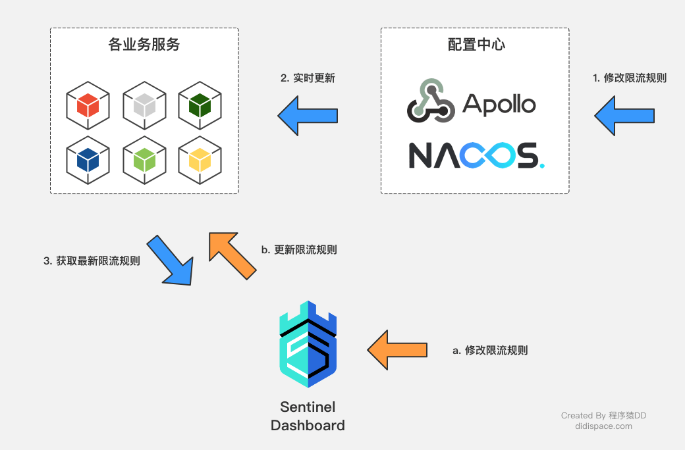
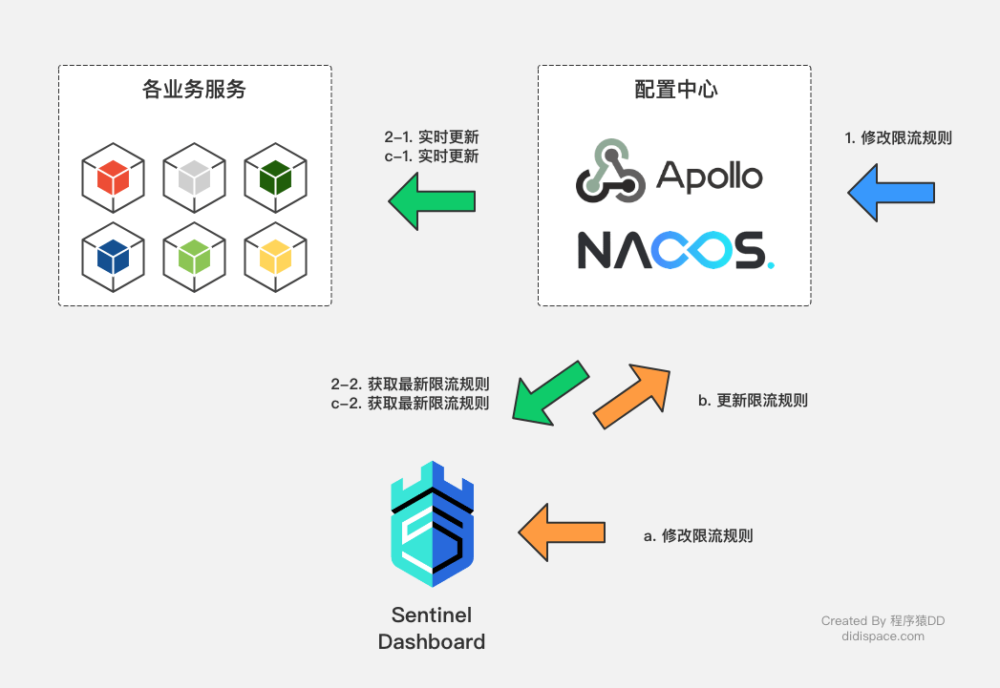

# Sentinel

[Sentinel Wiki](https://github.com/alibaba/spring-cloud-alibaba/wiki)

Sentinel 以流量为切入点，从流量控制、熔断降级、系统负载保护等多个维度保护服务的稳定性。

- **丰富的应用场景**： Sentinel 承接了阿里巴巴近 10 年的双十一大促流量的核心场景，例如秒杀（即突发流量控制在系统容量可以承受的范围）、消息削峰填谷、实时熔断下游不可用应用等。
- **完备的实时监控**： Sentinel 同时提供实时的监控功能。您可以在控制台中看到接入应用的单台机器秒级数据，甚至 500 台以下规模的集群的汇总运行情况。
- **广泛的开源生态**： Sentinel 提供开箱即用的与其它开源框架/库的整合模块，例如与 Spring Cloud、Dubbo、gRPC 的整合。您只需要引入相应的依赖并进行简单的配置即可快速地接入 Sentinel。
- **完善的 SPI 扩展点**： Sentinel 提供简单易用、完善的 SPI 扩展点。您可以通过实现扩展点，快速的定制逻辑。例如定制规则管理、适配数据源等。

Sentinel 的使用可以分为两个部分:

- 核心库（Java 客户端）：不依赖任何框架/库，能够运行于 Java 7 及以上的版本的运行时环境，同时对 Dubbo / Spring Cloud 等框架也有较好的支持。
- 控制台（Dashboard）：控制台主要负责管理推送规则、监控、集群限流分配管理、机器发现等。

基本概念：

- 资源

  资源是 Sentinel 的关键概念。它可以是 Java 应用程序中的任何内容，例如，由应用程序提供的服务，或由应用程序调用的其它应用提供的服务，甚至可以是一段代码。

  只要通过 Sentinel API 定义的代码，就是资源，能够被 Sentinel 保护起来。大部分情况下，可以使用方法签名，URL，甚至服务名称作为资源名来标示资源。

- 规则

  围绕资源的实时状态设定的规则，可以包括流量控制规则、熔断降级规则以及系统保护规则。所有规则可以动态实时调整。

### sentinel 核心概念

Resource

Context

Entry

DefaultNode

StatisticNode

Slot

## Sentinel Dashboard

sentinel-dashboard 是一个标准的spring boot应用，它提供机器发现以及健康情况管理、监控（单机和集群），规则管理和推送的功能。

每个微服务客户端整合sentinel的客户端封装与配置，就可以将监控信息上报给dashboard展示以及实时的更改限流或熔断规则等。

Sentinel 控制台最少应该包含如下功能:

- **查看机器列表以及健康情况**：收集 Sentinel 客户端发送的心跳包，用于判断机器是否在线。
- **监控 (单机和集群聚合)**：通过 Sentinel 客户端暴露的监控 API，定期拉取并且聚合应用监控信息，最终可以实现秒级的实时监控。
- **规则管理和推送**：统一管理推送规则。
- **鉴权**：生产环境中鉴权非常重要。这里每个开发者需要根据自己的实际情况进行定制。

### 部署Dashboard

1. 从 [release 页面](https://github.com/alibaba/Sentinel/releases) 下载最新版本的控制台 jar 包。

2. 启动命令：

   ```powershell
   java -Dserver.port=8080 -Dcsp.sentinel.dashboard.server=localhost:8080 -Dproject.name=sentinel-dashboard -jar sentinel-dashboard.jar
   ```
   
   启动后即可访问 `localhost:{server.port}` 进入控制台页面。

   从 Sentinel 1.6.0 起，Sentinel 控制台引入基本的**登录**功能，默认用户名和密码都是 `sentinel`。
   
   > 注意：启动 Sentinel 控制台需要 JDK 版本为 1.8 及以上版本。
   
3. 微服务应用整合Sentinel模块

   pom.xml依赖

   ```xml
   <dependency>
           <groupId>com.alibaba.cloud</groupId>
           <artifactId>spring-cloud-starter-alibaba-sentinel</artifactId>
       </dependency>
   ```

   bootstrap.properties 配置sentinel dashboard的访问地址

   ```properties
   spring.application.name=alibaba-sentinel-client
   server.port=9527
   # sentinel dashboard
   spring.cloud.sentinel.transport.port=9627
   spring.cloud.sentinel.transport.dashboard=localhost:8080
   ```
   
4. 确保客户端有访问量，Sentinel 会在**客户端首次调用的时候**进行初始化，开始向控制台发送心跳包。

5. 当您在机器列表中看到您的机器，就代表着您已经成功接入控制台；如果没有看到您的机器，请检查配置，并通过 `${user.home}/logs/csp/sentinel-record.log.xxx` 日志来排查原因

### 控制台参数配置

#### 配置方式

控制台配置项主要有两个来源：`System.getProperty()` 和 `System.getenv()`，同时存在时后者可以覆盖前者。

- 命令行方式：

```powershell
java -Dsentinel.dashboard.app.hideAppNoMachineMillis=60000
```

- Java 方式：

```java
System.setProperty("sentinel.dashboard.app.hideAppNoMachineMillis", "60000");
```

- 环境变量方式：

通过环境变量进行配置时，因为不支持 `.` 所以需要将其更换为 `_`。

```powershell
sentinel_dashboard_app_hideAppNoMachineMillis=60000
```

#### 配置项

- `-Dserver.port=8080` 用于指定 Sentinel 控制台端口为 `8080`。
- `-Dcsp.sentinel.dashboard.server=localhost:8080` 指定Sentinel 控制台地址，指定后可在控制台页面监控 sentinel-dashboard。
- `-Dserver.servlet.session.timeout=7200`: 用于指定 Spring Boot 服务端 session 的过期时间，如 7200 表示 7200 秒；60m 表示 60 分钟，默认为 30 分钟；

##### 登录配置

- `-Dsentinel.dashboard.auth.username=sentinel`: 用于指定控制台的登录用户名为 sentinel；
- `-Dsentinel.dashboard.auth.password=123456`: 用于指定控制台的登录密码为 123456；如果省略这两个参数，默认用户和密码均为 sentinel


### 规则持久化

#### 使用Nacos存储限流规则

Dashboard中设置的限流规则在应用重启之后将会丢失，需要将限流规则持久化防止重启丢失。

Sentinel自身就支持了多种不同的数据源来持久化规则配置，目前包括以下几种方式：

- 文件配置
- Nacos配置
- ZooKeeper配置
- Apollo配置

应用配置：

1. pom.xml 依赖

   ```xml
   	<dependency>
           <groupId>org.springframework.cloud</groupId>
           <artifactId>spring-cloud-starter-alibaba-sentinel</artifactId>
       </dependency>
       <dependency>
           <groupId>com.alibaba.csp</groupId>
           <artifactId>sentinel-datasource-nacos</artifactId>
       </dependency>
   ```

2. bootstrap.yml 配置：

   ```yml
   server:
     port: 9528
   spring:
     application:
       name: server-consumer
     cloud:
       sentinel:
         transport:
           port: 9538
           dashboard: localhost:8171
         datasource:
           # 名称，可随意
           ds:
             nacos:
               server-addr: localhost:8848
               dataId: server-consumer-sentinel
               groupId: DEFAULT_GROUP
               rule-type: flow
   ```

   - `spring.cloud.sentinel.datasource.ds.nacos.server-addr`：nacos的访问地址。

   - `spring.cloud.sentinel.datasource.ds.nacos.groupId`：nacos中存储规则的groupId。

   - `spring.cloud.sentinel.datasource.ds.nacos.dataId`：nacos中存储规则的dataId。

   - `spring.cloud.sentinel.datasource.ds.nacos.rule-type`：定义存储的规则类型。

     所有的规则类型可查看枚举类：`org.springframework.cloud.alibaba.sentinel.datasource.RuleType`，每种规则的定义格式可以通过各枚举值中定义的规则对象来查看，比如限流规则可查看：`com.alibaba.csp.sentinel.slots.block.flow.FlowRule`。

   可以通过查看`org.springframework.cloud.alibaba.sentinel.datasource.config.DataSourcePropertiesConfiguration`和`org.springframework.cloud.alibaba.sentinel.datasource.config.NacosDataSourceProperties`两个类来分析具体的配置内容。

   在 `datasource` 下可创建多个子节点对于不同规则。

3. 在Nacos创建规则的配置。`Data ID`、`Group`对应应用配置的内容，配置格式选择JSON。

   配置内容是一个JSON数组，数组中的每个对象是针对每一个保护资源的配置对象。对象限流属性例如：

   - resource：资源名，即限流规则的作用对象
   - limitApp：流控针对的调用来源，若为 default 则不区分调用来源
   - grade：限流阈值类型（QPS 或并发线程数）；`0`代表根据并发数量来限流，`1`代表根据QPS来进行流量控制
   - count：限流阈值
   - strategy：调用关系限流策略
   - controlBehavior：流量控制效果（直接拒绝、Warm Up、匀速排队）
   - clusterMode：是否为集群模式

如上整合了Nacos做规则存储之后：

- Sentinel控制台中修改规则：仅存在于服务的内存中，不会修改Nacos中的配置值，重启后恢复原来的值。
- Nacos控制台中修改规则：服务的内存中规则会更新，Nacos中持久化规则也会更新，重启后依然保持。

#### Dashboard 修改规则同步

如前使用Nacos存储限流规则的配置数据流向图如下：



配置中心的修改都可以实时的刷新到业务服务，从而被`Sentinel Dashboard`读取到，但是对于这些规则的更新到达各个业务服务之后，并没有一个机制去同步到配置中心，作为配置中心的客户端也不会提供这样的逆向更新方法。

从 Sentinel 1.4.0 开始，Sentinel 抽取出了接口用于向远程配置中心推送规则以及拉取规则：

- DynamicRuleProvider: 拉取规则
- DynamicRulePublisher: 推送规则

只需要通过这两个接口，实现对配置中心中存储规则的读写，就能实现`Sentinel Dashboard`中修改规则与配置中心存储同步的效果。具体的配置数据流向图如下：



`Sentinel Dashboard`代码修改：

> 在test目录下实现了nacos配置规则同步。

在pom.xml依赖将`<scope>test</scope>`注释掉，使得在主程序中可以使用。

```
<dependency>
    <groupId>com.alibaba.csp</groupId>
    <artifactId>sentinel-datasource-nacos</artifactId>
    <!--<scope>test</scope>-->
</dependency>
```

修改`resources/app/scripts/directives/sidebar/sidebar.html`文件：

```html
<li ui-sref-active="active">
    <a ui-sref="dashboard.flowV1({app: entry.app})">
        <i class="glyphicon glyphicon-filter"></i>&nbsp;&nbsp;流控规则
    </a>
</li>
<!-- 修改为 -->
<li ui-sref-active="active">
    <a ui-sref="dashboard.flow({app: entry.app})">
        <i class="glyphicon glyphicon-filter"></i>&nbsp;&nbsp;流控规则
    </a>
</li>
```

在`com.alibaba.csp.sentinel.dashboard.rule`包下新建一个nacos包，用来编写针对Nacos的扩展实现。

创建Nacos的配置类：

```java
@Configuration
public class NacosConfig {
    @Bean
    public Converter<List<FlowRuleEntity>, String> flowRuleEntityEncoder() {
        return JSON::toJSONString;
    }

    @Bean
    public Converter<String, List<FlowRuleEntity>> flowRuleEntityDecoder() {
        return s -> JSON.parseArray(s, FlowRuleEntity.class);
    }

    @Bean
    public ConfigService nacosConfigService() throws Exception {
        Properties properties = new Properties();
        properties.put(PropertyKeyConst.SERVER_ADDR, "localhost");
        return ConfigFactory.createConfigService(properties);
    }
}
```

如果用到了namespace隔离环境，可以在`nacosConfigService`方法中再加入配置，比如：`properties.put(PropertyKeyConst.NAMESPACE, "130e71fa-97fe-467d-ad77-967456f2c16d");`

实现Nacos的配置拉取：

```java
@Component("flowRuleNacosProvider")
public class FlowRuleNacosProvider implements DynamicRuleProvider<List<FlowRuleEntity>> {
    @Autowired
    private ConfigService configService;
    @Autowired
    private Converter<String, List<FlowRuleEntity>> converter;

    public static final String FLOW_DATA_ID_POSTFIX = "-sentinel";
    public static final String GROUP_ID = "DEFAULT_GROUP";

    @Override
    public List<FlowRuleEntity> getRules(String appName) throws Exception {
        String rules = configService.getConfig(appName + FLOW_DATA_ID_POSTFIX, GROUP_ID, 3000);
        if (StringUtil.isEmpty(rules)) {
            return new ArrayList<>();
        }
        return converter.convert(rules);
    }
}
```

- `getRules`方法中的`appName`参数是Sentinel中的服务名称。
- `configService.getConfig`方法是从Nacos中获取配置信息的具体操作。其中，DataId和GroupId分别对应客户端使用时候的对应配置。

实现Nacos的配置推送：

```java
@Component("flowRuleNacosPublisher")
public class FlowRuleNacosPublisher implements DynamicRulePublisher<List<FlowRuleEntity>> {
    @Autowired
    private ConfigService configService;
    @Autowired
    private Converter<List<FlowRuleEntity>, String> converter;

    public static final String FLOW_DATA_ID_POSTFIX = "-sentinel";
    public static final String GROUP_ID = "DEFAULT_GROUP";

    @Override
    public void publish(String app, List<FlowRuleEntity> rules) throws Exception {
        AssertUtil.notEmpty(app, "app name cannot be empty");
        if (rules == null) {
            return;
        }
        configService.publishConfig(app + FLOW_DATA_ID_POSTFIX, GROUP_ID, converter.convert(rules));
    }
}
```

修改`com.alibaba.csp.sentinel.dashboard.controller.v2.FlowControllerV2`中`DynamicRuleProvider`和`DynamicRulePublisher`注入的Bean：

```java
@Autowired
@Qualifier("flowRuleNacosProvider")
private DynamicRuleProvider<List<FlowRuleEntity>> ruleProvider;
@Autowired
@Qualifier("flowRuleNacosPublisher")
private DynamicRulePublisher<List<FlowRuleEntity>> rulePublisher;
```

## Sentinel

### 日志

#### 拦截详情日志（block 日志）

无论触发了限流、熔断降级还是系统保护，它们的秒级拦截详情日志都在 `${user_home}/logs/csp/sentinel-block.log`里。如果没有发生拦截，则该日志不会出现。日志格式如下:

```
2014-06-20 16:35:10|1|sayHello(java.lang.String,long),FlowException,default,origin|61,0
2014-06-20 16:35:11|1|sayHello(java.lang.String,long),FlowException,default,origin|1,0
```

日志含义：

| index | 例子                              | 说明                                                         |
| ----- | --------------------------------- | ------------------------------------------------------------ |
| 1     | `2014-06-20 16:35:10`             | 时间戳                                                       |
| 2     | `1`                               | 该秒发生的第一个资源                                         |
| 3     | `sayHello(java.lang.String,long)` | 资源名称                                                     |
| 4     | `XXXException`                    | 拦截的原因, 通常 `FlowException` 代表是被限流规则拦截，`DegradeException` 则表示被降级，`SystemBlockException` 则表示被系统保护拦截 |
| 5     | `default`                         | 生效规则的调用来源（参数限流中代表生效的参数）               |
| 6     | `origin`                          | 被拦截资源的调用者，可以为空                                 |
| 7     | `61,0`                            | 61 被拦截的数量，０无意义可忽略                              |

#### 秒级监控日志

所有的资源都会产生秒级日志，它在 `${user_home}/logs/csp/${app_name}-${pid}-metrics.log`里。格式如下:

```
1532415661000|2018-07-24 15:01:01|sayHello(java.lang.String)|12|3|4|2|295
```

1. `1532415661000`：时间戳
2. `2018-07-24 15:01:01`：格式化之后的时间戳
3. `sayHello(java.lang.String)`：资源名
4. `12`：表示到来的数量，即此刻通过 Sentinel 规则 check 的数量（passed QPS）
5. `3`：实际该资源被拦截的数量（blocked QPS）
6. `4`：每秒结束的资源个数（完成调用），包括正常结束和异常结束的情况（exit QPS）
7. `2`：异常的数量
8. `295`：资源的平均响应时间（RT）

#### 业务日志

其它的日志在 `${user_home}/logs/csp/sentinel-record.log.xxx` 里。该日志包含规则的推送、接收、处理等记录，排查问题的时候会非常有帮助。

#### 集群限流日志

- `${log_dir}/sentinel-cluster-client.log`：Token Client 日志，会记录请求失败的信息

### @SentinelResource

`@SentinelResource` 注解可以灵活的定义控制资源以及配置控制策略。

- `value`：资源名称，必需项（不能为空）
- `entryType`：entry 类型，可选项（默认为 `EntryType.OUT`）
- `blockHandler` / `blockHandlerClass`: `blockHandler`对应处理 `BlockException` 的函数名称，可选项。blockHandler 函数访问范围需要是 `public`，返回类型需要与原方法相匹配，参数类型需要和原方法相匹配并且最后加一个额外的参数，类型为 `BlockException`。blockHandler 函数默认需要和原方法在同一个类中。若希望使用其他类的函数，则可以指定 `blockHandlerClass` 为对应的类的 `Class` 对象，注意对应的函数必需为 static 函数，否则无法解析。
- `fallback`：fallback 函数名称，可选项，用于在抛出异常的时候提供 fallback 处理逻辑。fallback 函数可以针对所有类型的异常（除了`exceptionsToIgnore`里面排除掉的异常类型）进行处理。fallback 函数签名和位置要求：
  - 返回值类型必须与原函数返回值类型一致；
  - 方法参数列表需要和原函数一致，或者可以额外多一个 `Throwable` 类型的参数用于接收对应的异常。
  - fallback 函数默认需要和原方法在同一个类中。若希望使用其他类的函数，则可以指定 `fallbackClass` 为对应的类的 `Class` 对象，注意对应的函数必需为 static 函数，否则无法解析。
- `defaultFallback`（since 1.6.0）：默认的 fallback 函数名称，可选项，通常用于通用的 fallback 逻辑（即可以用于很多服务或方法）。默认 fallback 函数可以针对所有类型的异常（除了`exceptionsToIgnore`里面排除掉的异常类型）进行处理。若同时配置了 fallback 和 defaultFallback，则只有 fallback 会生效。defaultFallback 函数签名要求：
  - 返回值类型必须与原函数返回值类型一致；
  - 方法参数列表需要为空，或者可以额外多一个 `Throwable` 类型的参数用于接收对应的异常。
  - defaultFallback 函数默认需要和原方法在同一个类中。若希望使用其他类的函数，则可以指定 `fallbackClass` 为对应的类的 `Class` 对象，注意对应的函数必需为 `static` 函数，否则无法解析。
- `exceptionsToIgnore`（since 1.6.0）：用于指定哪些异常被排除掉，不会计入异常统计中，也不会进入 fallback 逻辑中，而是会原样抛出。

若 blockHandler 和 fallback 都进行了配置，则被限流降级而抛出 `BlockException` 时只会进入 blockHandler 处理逻辑。若未配置 blockHandler、fallback 和 defaultFallback，则被限流降级时会将 `BlockException` 直接抛出。

> 1.6.0 之前的版本 fallback 函数只针对降级异常（`DegradeException`）进行处理，不能针对业务异常进行处理。

#### 自定义资源点

增加注解支持的配置：

```java
 	@Bean
    public SentinelResourceAspect sentinelResourceAspect() {
        return new SentinelResourceAspect();
    }
```

然后在需要通过Sentinel来控制流量的方法上使用`@SentinelResource`注解，即定义了资源点。

#### 限流控制

默认情况下，Sentinel对控制资源的限流处理是直接抛出异常。

通过`@SentinelResource`注解的`blockHandler`属性可以制定具体的处理函数。该处理函数的传参必须与资源点的传参一样，并且最后加上`BlockException`异常参数；同时，返回类型也必须一样。

```java
	@SentinelResource(value = "doSomeThing", blockHandler = "exceptionHandler")
    public void doSomeThing(String str) {
        log.info(str);
    }
    // 限流与阻塞处理
    public void exceptionHandler(String str, BlockException ex) {
        log.error( "blockHandler：" + str, ex);
    }
```

#### 熔断降级

设置降级策略配置后，发送熔断降级时，默认情况会直接抛出`DegradeException`异常。

使用`@SentinelResource`注解的`fallback`属性来指定具体的降级处理方法，该处理方法也需要注意传参与返回必须一致。

```java
	@SentinelResource(value = "doSomeThing2", fallback = "fallbackHandler")
    public void doSomeThing2(String str) {
        log.info(str);
        throw new RuntimeException("发生异常");
    }

    public void fallbackHandler(String str) {
        log.error("fallbackHandler：" + str);
    }
```