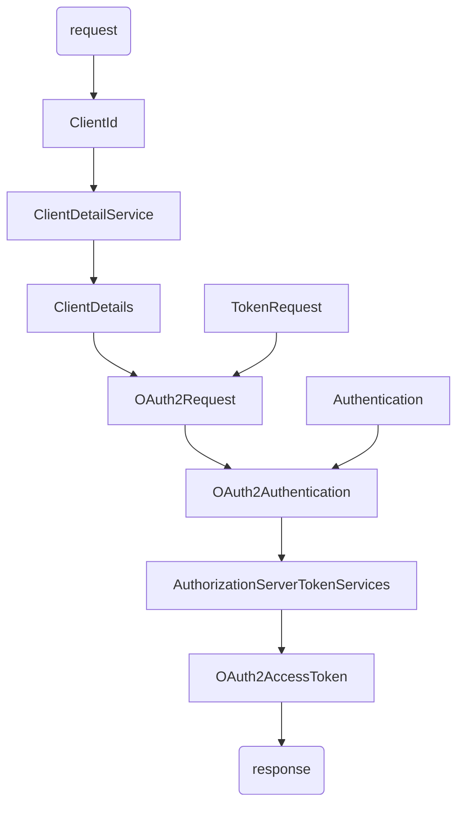

## Spring Security OAuth2

Spring Security OAuth2主要包含认证服务器和资源服务器这两大块的实现：


- 认证服务器主要包含了四种授权模式的实现和Token的生成与存储。

- 资源服务器主要是在Spring Security的过滤器链上加了OAuth2AuthenticationProcessingFilter过滤器，即使用OAuth2协议发放令牌认证的方式来保护我们的资源。

Spring Cloud框架下pom.xml依赖：

```xml
	<properties>
        <java.version>1.8</java.version>
        <spring-cloud.version>Greenwich.SR1</spring-cloud.version>
    </properties>

    <dependencies>
        <dependency>
            <groupId>org.springframework.boot</groupId>
            <artifactId>spring-boot-starter-web</artifactId>
        </dependency>
        <dependency>
            <groupId>org.springframework.cloud</groupId>
            <artifactId>spring-cloud-starter</artifactId>
        </dependency>
        <dependency>
            <groupId>org.springframework.cloud</groupId>
            <artifactId>spring-cloud-starter-oauth2</artifactId>
        </dependency>
        <dependency>
            <groupId>org.springframework.cloud</groupId>
            <artifactId>spring-cloud-starter-security</artifactId>
        </dependency>
        <dependency>
            <groupId>org.apache.commons</groupId>
            <artifactId>commons-lang3</artifactId>
        </dependency>
    </dependencies>

    <dependencyManagement>
        <dependencies>
            <dependency>
                <groupId>org.springframework.cloud</groupId>
                <artifactId>spring-cloud-dependencies</artifactId>
                <version>${spring-cloud.version}</version>
                <type>pom</type>
                <scope>import</scope>
            </dependency>
        </dependencies>
    </dependencyManagement>
```

### 基本使用

#### 认证服务器

1. 实现 `UserDetailsService` 接口的 `loadUserByUsername` 获取用户信息方法。

2. 继承 `WebSecurityConfigurerAdapter ` 创建配置类。

3. 使用 `@EnableAuthorizationServer` 注解开启认证服务器。

4. 此时启动项目，可在控制台找到随机分配的client-id和client-secret。也可以在 `application.yml` 手动指定值。

   ```yml
   security:
     oauth2:
       client:
         client-id: test
         client-secret: test1234
         registered-redirect-uri: http://example.com
   ```

#### 资源服务器

在配置类上使用`@EnableResourceServer`注解标注即可。

在同时定义了认证服务器和资源服务器后，再去使用授权码模式获取令牌可能会遇到 Full authentication is required to access this resource 的问题，这时候只要确保认证服务器先于资源服务器配置即可，比如在认证服务器的配置类上使用`@Order(1)`标注，在资源服务器的配置类上使用`@Order(2)`标注。

> 配置类添加了`@Order`标签后如果要使用token访问资源，需要重写`WebSecurityConfigurerAdapter`的`configure(HttpSecurity http)`方法，不使用父类的实现。

#### 获取资源

##### 授权码模式获取令牌

1. 在浏览器访问如下url，向认证服务器请求授权码：

   `http://localhost:8080/oauth/authorize?response_type=code&client_id=test&redirect_uri=/admin&scope=all&state=hello`

   - response_type 必须为code，表示授权码模式；
   - client_id 就是在配置文件中指定的client-id；
   - redirect_uri 用来重定向获取授权码的；
   - scope 指定为all，表示所有权限。
   - state：表示客户端的当前状态，可以指定任意值，认证服务器会原封不动地返回这个值。

2. 页面跳转至登录页。登录成功后跳转授权页面。

3. 确定授权后，页面跳转到指定的redirect_uri，并带上授权码信息。如：

   `http://localhost:8080/admin?code=bZIgOj&state=hello`
   
4. `POST`请求如下url，使用授权码从认证服务器获取令牌Token：

   `http://localhost:8080/oauth/token?grant_type=authorization_code&code=bZIgOj&client_id=test&redirect_uri=/admin&scope=all`

   - grant_type 固定填authorization_code；

   - code 为上一步获取到的授权码；

   - client_id和redirect_uri 必须和上面定义的一致。

   此外，在请求头增加 key 为 `Authorization`的属性，value为`Basic`加上`client_id:client_secret`经过base64加密后的值。

5. 获取到令牌Token：

   ```json
   {
       "access_token": "3dfb39b6-6f74-411f-8b16-686eebd388b5",
       "token_type": "bearer",
       "refresh_token": "da198353-1eae-4b66-96ac-359d48c3a759",
       "expires_in": 43199,
       "scope": "all"
   }
   ```

   一个授权码只能换一次令牌，如果再次点击postman的发送按钮，将返回`"error": "invalid_grant"`。‘

##### 密码模式获取令牌

`POST` 请求令牌url如下：

`http://localhost:8080/oauth/token?grant_type=password&username=user&password=123&scope=all`

- grant_type 填password，表示密码模式；


在请求头增加Authorization信息，内容为`Basic`加上`client_id:client_secret`经过base64加密后的值。

发送即可获得令牌。

##### 使用令牌获取资源

请求资源时增加`Authorization`请求头，值为`token_type access_token`，如`bearer 3dfb39b6-6f74-411f-8b16-686eebd388b5`，即可。

> 使用授权码模式获取令牌，登录成功时，即可使用Cookie中的`JSESSIONID`访问登录角色有权限的页面。

### 自定义Token获取方式

#### 自定义用户名密码方式获取令牌

Spring Security OAuth2自带的令牌获取方式可以归纳为以下几个步骤：



#### 短信验证码获取令牌