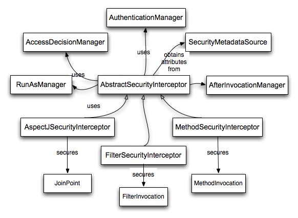

# Spring Security

Spring Security是一款基于Spring的安全框架，主要包含**认证**（Authentication）和**授权**（Authorization）两大安全模块。

安全框架比较

## 基本使用

pom.xml 依赖

```xml
<dependency>
    <groupId>org.springframework.boot</groupId>
    <artifactId>spring-boot-starter-security</artifactId>
</dependency>
```

当Spring项目中引入了Spring Security依赖的时候，项目会默认开启如下配置：

```yml
security:  
  basic:    
	enabled: true
```

这个配置开启了一个HTTP basic类型的认证，所有服务的访问都必须先过这个认证，默认的用户名为user，密码由Sping Security自动生成，在控制台输出信息可以找到密码信息。也可以在配置文件中指定用户名，密码及认证角色

```yml
security:
  user:
    name: user
    password: 123456
    role: USER      #认证角色
```

### 基于表单认证

通过一些配置将HTTP Basic认证修改为基于表单的认证方式。

`org.springframework.security.config.annotation.web.configuration.WebSecurityConfigurerAdapter`是由Spring Security提供的Web应用安全配置的适配器。

创建配置类继承`WebSecurityConfigurerAdapter`抽象类并重写`configure(HttpSecurity http)`方法。

```java
@Configuration
public class BrowserSecurityConfig extends WebSecurityConfigurerAdapter {
    @Override
    protected void configure(HttpSecurity http) throws Exception {
        http.formLogin() // 表单方式
                .and()
                .authorizeRequests() // 授权配置
                .anyRequest()  // 所有请求
                .authenticated(); // 都需要认证
    }
}
```

> HTTP Basic认证方式： `http.httpBasic().and()...`

### 基本原理

Spring Security采用的是责任链的设计模式，其中包含了众多的过滤器，这些过滤器形成了一条链，所有请求都必须通过这些过滤器后才能成功访问到资源。

1. WebAsyncManagerIntegrationFilter：将 Security 上下文与 Spring Web 中用于处理异步请求映射的 WebAsyncManager 进行集成。
2. SecurityContextPersistenceFilter：在每次请求处理之前将该请求相关的安全上下文信息加载到 SecurityContextHolder 中，然后在该次请求处理完成之后，将 SecurityContextHolder 中关于这次请求的信息存储到一个“仓储”中，然后将 SecurityContextHolder 中的信息清除，例如在Session中维护一个用户的安全信息就是这个过滤器处理的。
3. HeaderWriterFilter：用于将头信息加入响应中。
4. CsrfFilter：用于处理跨站请求伪造。
5. LogoutFilter：用于处理退出登录。如果是登出路径则到 logoutHandler ，如果登出成功则到 logoutSuccessHandler 登出成功处理，如果登出失败则由 ExceptionTranslationFilter 处理；如果不是登出路径则直接进入下一个过滤器。
6. UsernamePasswordAuthenticationFilter：用于处理基于表单的登录请求，从表单中获取用户名和密码。默认情况下处理来自 /login 的请求。从表单中获取用户名和密码时，默认使用的表单 name 值为 username 和 password，这两个值可以通过设置这个过滤器的usernameParameter 和 passwordParameter 两个参数的值进行修改。
7. DefaultLoginPageGeneratingFilter：如果没有配置登录页面，那系统初始化时就会配置这个过滤器，并且用于在需要进行登录时生成一个登录表单页面。
8. BasicAuthenticationFilter：检测和处理 http basic 认证。
9. RequestCacheAwareFilter：用来处理请求的缓存。
10. SecurityContextHolderAwareRequestFilter：主要是包装请求对象request。
11. AnonymousAuthenticationFilter：检测 SecurityContextHolder 中是否存在 Authentication 对象，如果不存在为其提供一个匿名 Authentication。
12. SessionManagementFilter：管理 session 的过滤器
13. ExceptionTranslationFilter：处理 AccessDeniedException 和 AuthenticationException 异常。
14. FilterSecurityInterceptor：可以看做过滤器链的出口。
15. RememberMeAuthenticationFilter：当用户没有登录而直接访问资源时, 从 cookie 里找出用户的信息, 如果 Spring Security 能够识别出用户提供的remember me cookie, 用户将不必填写用户名和密码, 而是直接登录进入系统，该过滤器默认不开启。

在过滤器链的末尾是一个名为`FilterSecurityInterceptor`的拦截器，用于判断当前请求身份认证是否成功，是否有相应的权限，当身份认证失败或者权限不足的时候便会抛出相应的异常。

`ExceptionTranslateFilter`捕获抛出的异常并处理，比如需要身份认证时将请求重定向到相应的认证页面，当认证失败或者权限不足时返回相应的提示信息。

## 自定义认证过程

### 用户信息获取

自定义认证的过程需要实现Spring Security提供的`UserDetailService`接口，该接口只有一个抽象方法`loadUserByUsername`。

通过重写`loadUserByUsername`方法可以自定义用户名到用户信息之间的映射关系，通常是从数据库获取。

```java
public interface UserDetailsService {    
	UserDetails loadUserByUsername(String username) throws UsernameNotFoundException;
}
```

`loadUserByUsername`方法返回一个`UserDetail`对象，该对象也是一个接口，包含一些用于描述用户信息的方法

```java
public interface UserDetails extends Serializable {
    Collection<? extends GrantedAuthority> getAuthorities();
    String getPassword();
    String getUsername();
    boolean isAccountNonExpired();
    boolean isAccountNonLocked();
    boolean isCredentialsNonExpired();
    boolean isEnabled();
}
```

- `getAuthorities`获取用户包含的权限，返回权限集合，权限是一个继承了`GrantedAuthority`的对象；
- `getPassword`和`getUsername`用于获取密码和用户名；
- `isAccountNonExpired`方法返回boolean类型，用于判断账户是否未过期，未过期返回true反之返回false；
- `isAccountNonLocked`方法用于判断账户是否未锁定；
- `isCredentialsNonExpired`用于判断用户凭证是否没过期，即密码是否未过期；
- `isEnabled`方法用于判断用户是否可用。

实际中我们可以自定义`UserDetails`接口的实现类，也可以直接使用Spring Security提供的`UserDetails`接口实现类`org.springframework.security.core.userdetails.User`。

示例如下，用户名任意，密码为123456均可通过认证。

```java
@Configuration
public class UserDetailService implements UserDetailsService {
    @Autowired
    private PasswordEncoder passwordEncoder;
    @Override
    public UserDetails loadUserByUsername(String username) throws UsernameNotFoundException {
        // 模拟一个用户，替代数据库获取逻辑（MyUser自定义类）
        MyUser user = new MyUser();
        user.setUserName(username);
        user.setPassword(this.passwordEncoder.encode("123456"));
        // 输出加密后的密码
        System.out.println(user.getPassword());
        return new User(username, user.getPassword(), user.isEnabled(),
                user.isAccountNonExpired(), user.isCredentialsNonExpired(),
                user.isAccountNonLocked(), AuthorityUtils.commaSeparatedStringToAuthorityList("admin"));
    }
}
```

权限参数不能为空，此处使用`AuthorityUtils.commaSeparatedStringToAuthorityList`方法模拟一个admin的权限，该方法可以将逗号分隔的字符串转换为权限集合。

`PasswordEncoder`对象用于密码加密，注入前需要手动配置。`PasswordEncoder`是一个密码加密接口，而`BCryptPasswordEncoder`是Spring Security提供的一个实现方法。

```java
	@Bean
    public PasswordEncoder passwordEncoder() {
        return new BCryptPasswordEncoder();
    }
```

### 替换默认登录页

`configure`配置

```java
@Override
protected void configure(HttpSecurity http) throws Exception {
    http.formLogin() // 表单登录
            .loginPage("/login.html") 
            .loginProcessingUrl("/login")
            .and()
            .authorizeRequests() // 授权配置
            .antMatchers("/login.html").permitAll()
            .anyRequest()  // 所有请求
            .authenticated(); // 都需要认证
}
```

- `.loginPage("/login.html")`指定了跳转到登录页面的请求URL

- `.loginProcessingUrl("/login")`对应登录页面form表单的`action="/login"`

  loginPage和loginProcessingUrl默认都是/login。

  只配置loginProcessingUrl，loginPage默认提供的页面。

  只配置loginPage，loginProcessingUrl默认就是loginPage。

- `.antMatchers("/login.html").permitAll()`表示跳转到登录页面的请求不被拦截，否则会进入无限循环。

> 关闭CSRF攻击防御：
>
> `http....and().csrf().disable();`

示例如下，在未登录的情况下，当用户访问html资源的时候跳转到登录页，否则返回JSON格式数据，状态码为401。

```java
@RestController
public class BrowserSecurityController {
    private RequestCache requestCache = new HttpSessionRequestCache();
    private RedirectStrategy redirectStrategy = new DefaultRedirectStrategy();
    @GetMapping("/authentication/require")
    @ResponseStatus(HttpStatus.UNAUTHORIZED)
    public String requireAuthentication(HttpServletRequest request, HttpServletResponse response) throws IOException {
        SavedRequest savedRequest = requestCache.getRequest(request, response);
        if (savedRequest != null) {
            String targetUrl = savedRequest.getRedirectUrl();
            if (StringUtils.endsWithIgnoreCase(targetUrl, ".html"))
                redirectStrategy.sendRedirect(request, response, "/login.html");
        }
        return "访问的资源需要身份认证！";
    }
}
```

- `HttpSessionRequestCache`为Spring Security提供的用于缓存请求的对象，通过调用它的`getRequest`方法可以获取到本次请求的HTTP信息。
- `DefaultRedirectStrategy`的`sendRedirect`为Spring Security提供的用于处理重定向的方法。

### 处理成功与失败

Spring Security有一套默认的处理登录成功和失败的方法：当用户登录成功时，页面会跳转会引发登录的请求；登录失败时则是跳转到Spring Security默认的错误提示页面。

#### 自定义登录成功逻辑

要改变默认的处理成功逻辑，需要实现`org.springframework.security.web.authentication.AuthenticationSuccessHandler`接口的`onAuthenticationSuccess`方法。

```java
void onAuthenticationSuccess(HttpServletRequest request,
			HttpServletResponse response, Authentication authentication)
			throws IOException, ServletException;
```

`Authentication`参数既包含了认证请求的一些信息，比如IP，请求的SessionId等，也包含了用户信息，即前面提到的`User`对象。

> 像`password`，`credentials`这些敏感信息，Spring Security已经将其屏蔽。

在`configure`方法中配置自定义登录成功回调函数。

```java
http.formLogin() // 表单登录
.successHandler(authenticationSucessHandler) // 处理登录成功
.and().authorizeRequests().... // 授权配置
```

登录成功后，便可以使用`SecurityContextHolder.getContext().getAuthentication()`获取到`Authentication`对象信息。或者在controller的方法上直接添加`Authentication authentication`参数。

#### 自定义登录失败逻辑

自定义登录失败处理逻辑需要实现`org.springframework.security.web.authentication.AuthenticationFailureHandler`的`onAuthenticationFailure`方法。

```java
public void onAuthenticationFailure(HttpServletRequest request, HttpServletResponse response,
                                        AuthenticationException exception) throws IOException {
}
```

`AuthenticationException`参数是一个抽象类，Spring Security根据登录失败的原因封装了许多对应的实现类。

不同的失败原因对应不同的异常，比如用户名或密码错误对应的是`BadCredentialsException`，用户不存在对应的是`UsernameNotFoundException`，用户被锁定对应的是`LockedException`等。

在`configure`中配置：

```java
http.formLogin() // 表单登录          
    .failureHandler(authenticationFailureHandler) // 处理登录失败
```

## 配置方法

### configure(AuthenticationManagerBuilder auth)

AuthenticationManager 的建造器，配置 AuthenticationManagerBuilder 会让Security 自动构建一个 AuthenticationManager；如果想要使用该功能你需要配置一个 UserDetailService 和 PasswordEncoder。

UserDetailsService 用于在认证器中根据用户传过来的用户名查找一个用户， PasswordEncoder 用于密码的加密与比对，存储用户密码的时候用PasswordEncoder.encode() 加密存储，在认证器里会调用 PasswordEncoder.matches() 方法进行密码比对。

如果重写了该方法，Security 会启用 DaoAuthenticationProvider 这个认证器，该认证就是先调用 UserDetailsService.loadUserByUsername 然后使用 PasswordEncoder.matches() 进行密码比对，如果认证成功成功则返回一个 Authentication 对象。

### configure(WebSecurity web)

这个配置方法用于配置静态资源的处理方式，可使用 Ant 匹配规则。

### configure(HttpSecurity http)

 HttpSecurity 使用的是链式编程，`and()`是返回一个securityBuilder对象。

```java
http	
  .formLogin()  //表单验证
	.loginPage("/login_page") //登录页请求路径
	.passwordParameter("username") //用户名属性名
	.passwordParameter("password") //密码属性名
	.loginProcessingUrl("/sign_in")	//登录请求路径
	.permitAll() //允许所有用户基于表单登录访问登录地址
  .and()
  .authorizeRequests() //进行权限配置
	.antMatchers("/tets_a/**","/test_b/**").hasRole("test") //具有相应权限才能访问
	.anyRequest().authenticated() //其他请求，已登录才能访问
	.accessDecisionManager(accessDecisionManager()); //鉴权管理器
  .and()
  .logout() //进行登出配置
	.logoutUrl("/logout") //登出 url
  .and()
  
.exceptionHandling()
	.accessDeniedHandler(new MyAccessDeniedHandler()); //配置鉴权失败的处理器
  .and()
  .addFilterAfter(new MyFittler(), LogoutFilter.class);	//在LogoutFilter过滤器后添加过滤器
```

框架原有的 Filter 在启动 HttpSecurity 配置的过程中，都由框架完成了其一定程度上固定的配置，是不允许更改替换的。根据测试结果来看，调用 addFilterAt 方法插入的 Filter ，会在这个位置上的原有 Filter 之前执行。

url 匹配规则可以采用 Ant 风格的路径匹配符：

| 通配符 | 含义             |
| :----- | :--------------- |
| **     | 匹配多层路径     |
| *      | 匹配一层路径     |
| ?      | 匹配任意单个字符 |

匹配是按照从上往下的顺序来匹配，一旦匹配到了就不继续匹配。未配置的请求路径默认都需要登录才能访问。

访问权限设置方法：


**access**

常见 SpEL 方法：

- hasIpAddress(ipAddress)
- hasRole(role)
- hasAnyRole(role)

常见 SpEL 属性：

- permitAll
- denyAll
- anonymous
- authenticated
- rememberMe
- fullyAuthenticated

示例：

```java
//同时具有 "ROLE_ADMIN" 和 "ROLE_DBA"权限的用户才可以访问
.antMatchers("/db/**").access("hasRole('ADMIN') and hasRole('DBA')")   
//使用自定义授权策略               
    .anyRequest().access("@mySecurity.check(authentication,request)");
```

```java
@Component("mySecurity")
public class MySecurity(){
    //注入用户和该用户所拥有的权限（权限在登录成功的时候已经缓存起来，当需要访问该用户的权限是，直接从缓存取出），然后验证该请求是否有权限，有就返回true，否则则返回false不允许访问该Url。
    //而且这里还传入了request,我也可以使用request获取该次请求的类型。
    //根据restful风格我们可以使用它来控制我们的权限，例如当这个请求是post请求，证明该请求是向服务器发送一个新建资源请求，我们可以使用request.getMethod()来获取该请求的方式，然后在配合角色所允许的权限路径进行判断和授权操作。
    public boolean check(Authentication authentication, HttpServletRequest request){
          //如果能获取到Principal对象不为空证明，授权已经通过
          Object principal  = authentication.getPrincipal();
          if(principal  != null && principal  instanceof UserDetails){
                  //获取请求登录的url
                  System.out.println(((UserDetails)principal).getAuthorities()) ;
                  return true;
          }
          return false;
    }
}
```

## 权限系统

- **UserDetails**

  Security 中的用户接口，自定义用户类要实现该接口。

- **GrantedAuthority**

  Security 中的用户权限接口，自定义权限需要实现该接口:

  ```java
  public class MyGrantedAuthority implements GrantedAuthority {	
      private String authority;	
  }
  ```
  authority 表示权限字段，需要注意的是在 config 中配置的权限会被加上 ROLE_ 前缀，比如 .hasRole("test")，配置了一个 test 权限但存储的权限字段（authority）应该是 ROLE_test 。
  
- **UserDetailsService**

  Security 中的用户 Service，自定义用户服务类需要实现该接口，接口的 loadUserByUsername 方法根据用户名查询用户对象。

- **SecurityContextHolder**

  用户在完成登录后用户信息将存储到这个类中，之后其他流程（比如鉴权）需要得到用户信息时都是从这个类中获得。

  用户信息被封装成 SecurityContext ，而实际存储的类是 SecurityContextHolderStrategy ，默认的SecurityContextHolderStrategy 实现类是 ThreadLocalSecurityContextHolderStrategy，它使用了ThreadLocal来存储了用户信息。

  对于 token 鉴权系统中，验证token后手动填充SecurityContextHolder，填充时机只要在执行投票器之前即可，或者干脆可以在投票器中填充，然后在登出操作中清空SecurityContextHolder。
  
  ```java
  UsernamePasswordAuthenticationToken token = new UsernamePasswordAuthenticationToken("test","test",list);
  SecurityContextHolder.getContext().setAuthentication(token);
  ```

## Security 扩展

- 鉴权失败处理器
- 验证器
- 登录成功处理器
- 投票器
- 自定义token处理过滤器
- 登出成功处理器
- 登录失败处理器
- 自定义 UsernamePasswordAuthenticationFilter

## 添加图像验证码

Spring Security的认证校验是由`UsernamePasswordAuthenticationFilter`过滤器完成的，因此验证码校验逻辑应该在这个过滤器之前。

验证码功能依赖

```xml
<dependency>
    <groupId>org.springframework.social</groupId>
    <artifactId>spring-social-config</artifactId>
</dependency>
```

验证码对象：

```java
public class ImageCode {
    private BufferedImage image;// 图片
    private String code;// 验证码
    private LocalDateTime expireTime;// 过期时间
    
    boolean isExpire() {
        return LocalDateTime.now().isAfter(expireTime);
    }
}
```

验证码请求：

```java
 	public final static String SESSION_KEY_IMAGE_CODE = "SESSION_KEY_IMAGE_CODE";
    private SessionStrategy sessionStrategy = new HttpSessionSessionStrategy();

    @GetMapping("/code/image")
    public void createCode(HttpServletRequest request, HttpServletResponse response) throws IOException {
        ImageCode imageCode = createImageCode();
        sessionStrategy.setAttribute(new ServletWebRequest(request), SESSION_KEY, imageCode);
        ImageIO.write(imageCode.getImage(), "jpeg", response.getOutputStream());
    }
```

- `org.springframework.social.connect.web.HttpSessionSessionStrategy`对象封装了一些处理Session的方法，包含了`setAttribute`、`getAttribute`和`removeAttribute`方法。

验证码生成：

```java
private ImageCode createImageCode() {

    int width = 100; // 验证码图片宽度
    int height = 36; // 验证码图片长度
    int length = 4; // 验证码位数
    int expireIn = 60; // 验证码有效时间 60s

    BufferedImage image = new BufferedImage(width, height, BufferedImage.TYPE_INT_RGB);
    Graphics g = image.getGraphics();

    Random random = new Random();

    g.setColor(getRandColor(200, 250));
    g.fillRect(0, 0, width, height);
    g.setFont(new Font("Times New Roman", Font.ITALIC, 20));
    g.setColor(getRandColor(160, 200));
    for (int i = 0; i < 155; i++) {
        int x = random.nextInt(width);
        int y = random.nextInt(height);
        int xl = random.nextInt(12);
        int yl = random.nextInt(12);
        g.drawLine(x, y, x + xl, y + yl);
    }

    StringBuilder sRand = new StringBuilder();
    for (int i = 0; i < length; i++) {
        String rand = String.valueOf(random.nextInt(10));
        sRand.append(rand);
        g.setColor(new Color(20 + random.nextInt(110), 20 + random.nextInt(110), 20 + random.nextInt(110)));
        g.drawString(rand, 13 * i + 6, 16);
    }
    g.dispose();
    return new ImageCode(image, sRand.toString(), expireIn);
}

private Color getRandColor(int fc, int bc) {
    Random random = new Random();
    if (fc > 255) {
        fc = 255;
    }
    if (bc > 255) {
        bc = 255;
    }
    int r = fc + random.nextInt(bc - fc);
    int g = fc + random.nextInt(bc - fc);
    int b = fc + random.nextInt(bc - fc);
    return new Color(r, g, b);
}
```

前端验证码显示：

```html

```

自定义验证码异常：

```java
public class ValidateCodeException extends AuthenticationException {
    ValidateCodeException(String message) {
        super(message);
    }
}
```

验证码校验的过滤器：

```java
@Component
public class ValidateCodeFilter extends OncePerRequestFilter {
    @Autowired
    private AuthenticationFailureHandler authenticationFailureHandler;

    private SessionStrategy sessionStrategy = new HttpSessionSessionStrategy();

    @Override
    protected void doFilterInternal(HttpServletRequest httpServletRequest, HttpServletResponse httpServletResponse, 
    	FilterChain filterChain) throws ServletException, IOException {

        if (StringUtils.equalsIgnoreCase("/login", httpServletRequest.getRequestURI())
                && StringUtils.equalsIgnoreCase(httpServletRequest.getMethod(), "post")) {
            try {
                validateCode(new ServletWebRequest(httpServletRequest));
            } catch (ValidateCodeException e) {
                authenticationFailureHandler.onAuthenticationFailure(httpServletRequest, httpServletResponse, e);
                return;
            }
        }
        filterChain.doFilter(httpServletRequest, httpServletResponse);
    }
    private void validateCode(ServletWebRequest servletWebRequest) throws ServletRequestBindingException {
        	ImageCode codeInSession = (ImageCode) sessionStrategy.getAttribute(servletWebRequest, ValidateController.SESSION_KEY);
			String codeInRequest = ServletRequestUtils.getStringParameter(servletWebRequest.getRequest(), "imageCode");
			if (StringUtils.isBlank(codeInRequest)) {
				throw new ValidateCodeException("验证码不能为空！");
			}
			if (codeInSession == null) {
				throw new ValidateCodeException("验证码不存在！");
			}	
			if (codeInSession.isExpire()) {
				sessionStrategy.removeAttribute(servletWebRequest, ValidateController.SESSION_KEY);
				throw new ValidateCodeException("验证码已过期！");
			}
			if (!StringUtils.equalsIgnoreCase(codeInSession.getCode(), codeInRequest)) {
				throw new ValidateCodeException("验证码不正确！");
			}
			sessionStrategy.removeAttribute(servletWebRequest, ValidateController.SESSION_KEY);
		}
    }		
}
```

- `OncePerRequestFilter` 保证在一次请求中只执行一次。（为了兼容不同的web container，并不是所有的container都如我们期望的只过滤一次（Filter），servlet版本不同，执行过程也不同）

添加过滤器，只有验证码校验通过后才去校验用户名和密码。

```java
http.addFilterBefore(validateCodeFilter, UsernamePasswordAuthenticationFilter.class) // 添加验证码校验过滤器
```

## remember-me

当用户勾选了记住我选项并登录成功后，Spring Security会生成一个token标识，然后将该token标识持久化到数据库，并且生成一个与该token相对应的cookie返回给浏览器。当用户过段时间再次访问系统时，如果该cookie没有过期，Spring Security便会根据cookie包含的信息从数据库中获取相应的token信息，然后帮用户自动完成登录操作。

```java
	@Autowired
    private DataSource dataSource;

    @Bean
    public PersistentTokenRepository persistentTokenRepository() {
        JdbcTokenRepositoryImpl jdbcTokenRepository = new JdbcTokenRepositoryImpl();
        jdbcTokenRepository.setDataSource(dataSource);
        jdbcTokenRepository.setCreateTableOnStartup(false);
        return jdbcTokenRepository;
    }
```

`PersistentTokenRepository`为一个接口类，用于完成数据持久化。可以使用`PersistentTokenRepository`的实现类`JdbcTokenRepositoryImpl`将数据持久化到数据库中。

- `createTableOnStartup`属性用于是否启动项目时创建保存token信息的数据表。

  `JdbcTokenRepositoryImpl`的`CREATE_TABLE_SQL`属性表创建sql语句。

前端显示：

```java
<input type="checkbox" name="remember-me"/> 记住我
```

其中`name`属性必须为`remember-me`。

`configure`配置开启记住我功能。

```java
http.rememberMe()
    .tokenRepository(persistentTokenRepository())
    .tokenValiditySeconds(3600)
    .userDetailsService(userDetailService)
```

- `rememberMe()`用于开启记住我功能；
- `tokenRepository(persistentTokenRepository())`用于指定token持久化方法；
- `tokenValiditySeconds`配置了token的有效时长，单位为秒；
- `userDetailsService(userDetailService)`用于处理通过token对象自动登录。

## 短信验证码登录

Spring Security默认只提供了账号密码的登录认证逻辑，所以要实现手机短信验证码登录认证功能，需要模仿Spring Security账号密码登录逻辑代码来实现一套自己的认证逻辑。

短信验证码对象：

```java
public class SmsCode {
    private String code;
    private LocalDateTime expireTime;
    boolean isExpire() {
        return LocalDateTime.now().isAfter(expireTime);
    }
}
```

短信验证码请求：

```java
@GetMapping("/code/sms")
    public void createSmsCode(HttpServletRequest request, HttpServletResponse response, String mobile) throws IOException {
        SmsCode smsCode = createSMSCode();
        sessionStrategy.setAttribute(new ServletWebRequest(request), SESSION_KEY_SMS_CODE + mobile, smsCode);
        // 输出验证码到控制台代替短信发送服务
        System.out.println("您的登录验证码为：" + smsCode.getCode() + "，有效时间为60秒");
    }

    private SmsCode createSMSCode() {
        String code = RandomStringUtils.randomNumeric(6);
        return new SmsCode(code, 60);
    }
```

### 认证流程


`UsernamePasswordAuthenticationFilter`过滤器来拦截用户名密码认证请求，将用户名和密码封装成一个`UsernamePasswordToken`对象交给`AuthenticationManager`处理。

`AuthenticationManager`将挑出一个支持处理该类型Token的`AuthenticationProvider`（这里为`DaoAuthenticationProvider`，`AuthenticationProvider`的其中一个实现类）来进行认证。

认证过程中`DaoAuthenticationProvider`将调用`UserDetailService`的`loadUserByUsername`方法来处理认证，如果认证通过（即`UsernamePasswordToken`中的用户名和密码相符）则返回一个`UserDetails`类型对象，并将认证信息保存到Session中。

认证后我们便可以通过`Authentication`对象获取到认证的信息了。

### 短信验证码认证流程


为了实现这个流程，我们需要定义`SmsAuthenticationFitler`、`SmsAuthenticationToken`和`SmsAuthenticationProvider`。

#### SmsAuthenticationToken

```java
public class SmsAuthenticationToken extends AbstractAuthenticationToken {
    private static final long serialVersionUID = SpringSecurityCoreVersion.SERIAL_VERSION_UID;

    private final Object principal;

    public SmsAuthenticationToken(String mobile) {
        super(null);
        this.principal = mobile;
        setAuthenticated(false);
    }

    public SmsAuthenticationToken(Object principal, Collection<? extends GrantedAuthority> authorities) {
        super(authorities);
        this.principal = principal;
        super.setAuthenticated(true); // must use super, as we override
    }

    @Override
    public Object getCredentials() {
        return null;
    }

    public Object getPrincipal() {
        return this.principal;
    }

    public void setAuthenticated(boolean isAuthenticated) throws IllegalArgumentException {
        if (isAuthenticated) {
            throw new IllegalArgumentException(
                    "Cannot set this token to trusted - use constructor which takes a GrantedAuthority list instead");
        }
        super.setAuthenticated(false);
    }

    @Override
    public void eraseCredentials() {
        super.eraseCredentials();
    }
}
```

在认证之前`principal`存的是手机号，认证之后存的是用户信息。

`UsernamePasswordAuthenticationToken`原来还包含一个`credentials`属性用于存放密码，这里不需要就去掉了。

#### SmsAuthenticationFilter

```java
public class SmsAuthenticationFilter extends AbstractAuthenticationProcessingFilter {

    public static final String MOBILE_KEY = "mobile";

    private String mobileParameter = MOBILE_KEY;
    private boolean postOnly = true;


    public SmsAuthenticationFilter() {
        super(new AntPathRequestMatcher("/login/mobile", "POST"));
    }


    public Authentication attemptAuthentication(HttpServletRequest request,
                                                HttpServletResponse response) throws AuthenticationException {
        if (postOnly && !request.getMethod().equals("POST")) {
            throw new AuthenticationServiceException(
                    "Authentication method not supported: " + request.getMethod());
        }
        String mobile = obtainMobile(request);

        if (mobile == null) {
            mobile = "";
        }

        mobile = mobile.trim();

        SmsAuthenticationToken authRequest = new SmsAuthenticationToken(mobile);

        setDetails(request, authRequest);

        return this.getAuthenticationManager().authenticate(authRequest);
    }

    protected String obtainMobile(HttpServletRequest request) {
        return request.getParameter(mobileParameter);
    }

    protected void setDetails(HttpServletRequest request,
                              SmsAuthenticationToken authRequest) {
        authRequest.setDetails(authenticationDetailsSource.buildDetails(request));
    }

    public void setMobileParameter(String mobileParameter) {
        Assert.hasText(mobileParameter, "mobile parameter must not be empty or null");
        this.mobileParameter = mobileParameter;
    }

    public void setPostOnly(boolean postOnly) {
        this.postOnly = postOnly;
    }

    public final String getMobileParameter() {
        return mobileParameter;
    }
}
```

构造函数中指定了当请求为`/login/mobile`，请求方法为**POST**的时候该过滤器生效。

`mobileParameter`属性值为mobile，对应登录页面手机号输入框的name属性。

`attemptAuthentication`方法从请求中获取到mobile参数值，并调用`SmsAuthenticationToken`的`SmsAuthenticationToken(String mobile)`构造方法创建了一个`SmsAuthenticationToken`。

然后`SmsAuthenticationFilter`将`SmsAuthenticationToken`交给`AuthenticationManager`处理。

#### SmsAuthenticationProvider

```java
public class SmsAuthenticationProvider implements AuthenticationProvider {

    private UserDetailService userDetailService;

    @Override
    public Authentication authenticate(Authentication authentication) throws AuthenticationException {
        SmsAuthenticationToken authenticationToken = (SmsAuthenticationToken) authentication;
        UserDetails userDetails = userDetailService.loadUserByUsername((String) authenticationToken.getPrincipal());

        if (userDetails == null)
            throw new InternalAuthenticationServiceException("未找到与该手机号对应的用户");

        SmsAuthenticationToken authenticationResult = new SmsAuthenticationToken(userDetails, userDetails.getAuthorities());

        authenticationResult.setDetails(authenticationToken.getDetails());

        return authenticationResult;
    }

    @Override
    public boolean supports(Class<?> aClass) {
        return SmsAuthenticationToken.class.isAssignableFrom(aClass);
    }

    public UserDetailService getUserDetailService() {
        return userDetailService;
    }

    public void setUserDetailService(UserDetailService userDetailService) {
        this.userDetailService = userDetailService;
    }
}
```

- `supports`方法指定了支持处理的Token类型为`SmsAuthenticationToken`。

- `authenticate`方法用于编写具体的身份认证逻辑。

  在`authenticate`方法中，我们从`SmsAuthenticationToken`中取出了手机号信息，并调用了`UserDetailService`的`loadUserByUsername`方法。

  `loadUserByUsername`方法在用户名密码类型的认证中，主要逻辑是通过用户名查询用户信息，如果存在该用户并且密码一致则认证成功；而在短信验证码认证的过程中，该方法需要通过手机号去查询用户，如果存在该用户则认证通过。

  认证通过后接着调用`SmsAuthenticationToken`的`SmsAuthenticationToken(Object principal, Collection authorities)`构造函数构造一个认证通过的Token，包含了用户信息和用户权限。

短信验证码的校验是在`SmsAuthenticationFilter`之前完成的，即只有当短信验证码正确以后才开始走认证的流程。

#### SmsCodeFilter

```java
@Component
public class SmsCodeFilter extends OncePerRequestFilter {
    @Autowired
    private AuthenticationFailureHandler authenticationFailureHandler;

    private SessionStrategy sessionStrategy = new HttpSessionSessionStrategy();

    @Override
    protected void doFilterInternal(HttpServletRequest httpServletRequest, HttpServletResponse httpServletResponse, 
    	FilterChain filterChain) throws ServletException, IOException {
        if (StringUtils.equalsIgnoreCase("/login/mobile", httpServletRequest.getRequestURI())
                && StringUtils.equalsIgnoreCase(httpServletRequest.getMethod(), "post")) {
            try {
                validateCode(new ServletWebRequest(httpServletRequest));
            } catch (ValidateCodeException e) {
                authenticationFailureHandler.onAuthenticationFailure(httpServletRequest, httpServletResponse, e);
                return;
            }
        }
        filterChain.doFilter(httpServletRequest, httpServletResponse);
    }

    private void validateSmsCode(ServletWebRequest servletWebRequest) throws ServletRequestBindingException {
        String smsCodeInRequest = ServletRequestUtils.getStringParameter(servletWebRequest.getRequest(), "smsCode");
        String mobile = ServletRequestUtils.getStringParameter(servletWebRequest.getRequest(), "mobile");
        ValidateCode codeInSession = (ValidateCode) sessionStrategy.getAttribute(servletWebRequest, FebsConstant.SESSION_KEY_SMS_CODE + mobile);

        if (StringUtils.isBlank(smsCodeInRequest)) {
            throw new ValidateCodeException("验证码不能为空！");
        }
        if (codeInSession == null) {
            throw new ValidateCodeException("验证码不存在，请重新发送！");
        }
        if (codeInSession.isExpire()) {
            sessionStrategy.removeAttribute(servletWebRequest, FebsConstant.SESSION_KEY_SMS_CODE + mobile);
            throw new ValidateCodeException("验证码已过期，请重新发送！");
        }
        if (!StringUtils.equalsIgnoreCase(codeInSession.getCode(), smsCodeInRequest)) {
            throw new ValidateCodeException("验证码不正确！");
        }
        sessionStrategy.removeAttribute(servletWebRequest, FebsConstant.SESSION_KEY_SMS_CODE + mobile);

    }
}
```

#### SecurityConfigurerAdapter 配置

```java
@Component
public class SmsAuthenticationConfig extends SecurityConfigurerAdapter<DefaultSecurityFilterChain, HttpSecurity> {

    @Autowired
    private AuthenticationSuccessHandler authenticationSuccessHandler;

    @Autowired
    private AuthenticationFailureHandler authenticationFailureHandler;

    @Autowired
    private UserDetailService userDetailService;

    @Override
    public void configure(HttpSecurity http) throws Exception {
        SmsAuthenticationFilter smsAuthenticationFilter = new SmsAuthenticationFilter();
        smsAuthenticationFilter.setAuthenticationManager(http.getSharedObject(AuthenticationManager.class));
        smsAuthenticationFilter.setAuthenticationSuccessHandler(authenticationSuccessHandler);
        smsAuthenticationFilter.setAuthenticationFailureHandler(authenticationFailureHandler);
        
        SmsAuthenticationProvider smsAuthenticationProvider = new SmsAuthenticationProvider();
        smsAuthenticationProvider.setUserDetailService(userDetailService);

        http.authenticationProvider(smsAuthenticationProvider)
                .addFilterAfter(smsAuthenticationFilter, UsernamePasswordAuthenticationFilter.class);

    }
}
```

1. 为`AbstractAuthenticationProcessingFilter`实现类设置`AuthenticationManager`、`AuthenticationSuccessHandler`和`AuthenticationFailureHandler`属性。
2. 将`UserDetailService`注入到`SmsAuthenticationProvider`。
3. 调用`HttpSecurity`的`authenticationProvider`方法指定了`AuthenticationProvider`为`SmsAuthenticationProvider`，并将`SmsAuthenticationFilter`过滤器添加到了`UsernamePasswordAuthenticationFilter`后面。

#### WebSecurityConfigurerAdapter 配置

```java
http.addFilterBefore(smsCodeFilter, UsernamePasswordAuthenticationFilter.class) // 添加短信验证码校验过滤器
    ...
    .apply(smsAuthenticationConfig); // 将短信验证码认证配置加到 Spring Security 中
```

> 有时间断点调试下，看看原理

## Session管理

### 超时设置

用户登录成功后，信息保存在服务器Session中。

通过配置文件设置session超时时间，如下：

```yml
server:
  session:
    timeout: 3600
```

单位为秒。Session的最小有效期为60秒，也就是说即使你设置为小于60秒的值，其有效期还是为60秒。由`TomcatEmbeddedServletContainerFactory`的源码可知。

在`configure`方法里配置Session管理器：

```java
http...
     .and()
         .sessionManagement() // 添加 Session管理器
         .invalidSessionUrl("/session/invalid") // Session失效后跳转到这个链接
```

### 并发控制

```java
http...
     .and()
         .sessionManagement() // 添加 Session管理器
         .maximumSessions(1)
         .maxSessionsPreventsLogin(true)
         .expiredSessionStrategy(sessionExpiredStrategy)
```

- `maximumSessions` 配置了最大Session并发数量为1个。

  默认如果一个账户登录后，在另一个客户端也使用该账户登录，那么第一个登录的账户将会失效（先入先出队列）。

- `maxSessionsPreventsLogin` 设置`true`时当Session达到最大有效数的时候，不再允许相同的账户登录。

- `expiredSessionStrategy` 配置了Session在并发下失效后的处理策略。可以实现`SessionInformationExpiredStrategy`自定义策略。

```java
@Component
public class MySessionExpiredStrategy implements SessionInformationExpiredStrategy {
    @Override
    public void onExpiredSessionDetected(SessionInformationExpiredEvent event) throws IOException, ServletException {
        HttpServletResponse response = event.getResponse();
        response.setStatus(HttpStatus.UNAUTHORIZED.value());
        response.setContentType("application/json;charset=utf-8");
        response.getWriter().write("您的账号已经在别的地方登录，当前登录已失效。如果密码遭到泄露，请立即修改密码！");
    }
}
```

> Session并发控制只对Spring Security默认的登录方式——账号密码登录有效，而像短信验证码登录，社交账号登录并不生效，解决方案可以参考开源项目https://github.com/wuyouzhuguli/FEBS-Security

### Session 集群处理

当应用集群部署的时候，用户在A应用上登录认证了，后续通过负载均衡可能会把请求发送到B应用，而B应用服务器上并没有与该请求匹配的认证Session信息，所以用户就需要重新进行认证。

要解决这个问题，可以把Session信息存储在第三方容器里（如Redis集群），而不是各自的服务器，这样应用集群就可以通过第三方容器来共享Session了。

引入Redis和Spring Session依赖：

```xml
<dependency>
    <groupId>org.springframework.session</groupId>
    <artifactId>spring-session</artifactId>
</dependency>
<dependency>
    <groupId>org.springframework.boot</groupId>
    <artifactId>spring-boot-starter-data-redis</artifactId>
</dependency>
```

在yml中配置Session存储方式为Redis：

```yml
spring:
  session:
    store-type: redis
```

Redis配置采用默认配置即可实现集群化Session管理。

### 其他操作

`SessionRegistry`包含了一些使用的操作Session的方法，比如：

1. 踢出用户（让Session失效）：

   ```java
   String currentSessionId = request.getRequestedSessionId();
   sessionRegistry.getSessionInformation(sessionId).expireNow();
   ```

2. java获取所有Session信息：

   ```java
   List<Object> principals = sessionRegistry.getAllPrincipals();
   ```

## 退出登录

Spring Security默认的退出登录URL为`/logout`，退出登录后，Spring Security会做如下处理：

1. 是当前的Sesion失效；
2. 清除与当前用户关联的RememberMe记录；
3. 清空当前的SecurityContext；
4. 重定向到登录页。

### 自定义退出登录行为

```java
http....
    .and()
    .logout()
    .logoutUrl("/signout")
    .logoutSuccessUrl("/signout/success")
    .deleteCookies("JSESSIONID")
```

- `logoutUrl` 设置退出登录的URL
- `logoutSuccessUrl` 设置退出成功后跳转的URL
- `deleteCookies` 退出成功后删除指定名称为的cookie。

除了指定`logoutUrl`外，也可以通过`logoutSuccessHandler`指定退出成功处理器来处理退出成功后的回调：

```java
@Component
public class MyLogOutSuccessHandler implements LogoutSuccessHandler {
    @Override
    public void onLogoutSuccess(HttpServletRequest httpServletRequest, HttpServletResponse httpServletResponse, Authentication authentication) throws IOException, ServletException {
        httpServletResponse.setStatus(HttpStatus.UNAUTHORIZED.value());
        httpServletResponse.setContentType("application/json;charset=utf-8");
        httpServletResponse.getWriter().write("退出成功，请重新登录");
    }
}
```

## 权限控制

Spring Security权限控制可以配合授权注解使用。要开启这些注解，需要在Spring Security配置文件中添加如下注解：

```java
@EnableGlobalMethodSecurity(prePostEnabled = true)
```

### 保护方法注解

Spring Security提供了三种不同的安全注解：

1. Spring Security自带的@Secured注解；

2. JSR-250的@RolesAllowed注解；

3. 表达式驱动的注解，包括@PreAuthorize、@PostAuthorize、@PreFilter和 @PostFilter。

#### @Secured

在Spring-Security.xml中启用@Secured注解：

```xml
<global-method-security secured-annotations="enabled"/>
```

@Secured注解会使用一个String数组作为参数。每个String值是一个权限，调用这个方法至少需要具备其中的一个权限。

```java
@Secured({"ROLE_ADMIN","ROLE_USER"})
public void test(){
    ...
}
```

权限不足时，方法抛出Access Denied异常。

#### @RolesAllowed

@RolesAllowed注解和@Secured注解在各个方面基本上都是一致的。启用@RolesAllowed注解：

```xml
<global-method-security jsr250-annotations="enabled"/>
```

#### SpEL注解

启用该注解：

```xml
<global-method-security pre-post-annotations="enabled"/>
```

java配置启用注解：

```java
@EnableGlobalMethodSecurity(prePostEnabled = true)
```

##### @PreAuthorize

该注解用于方法前验证权限，比如限制非VIP用户提交blog的note字段字数不得超过1000字：

```java
@PreAuthorize("hasRole('ROLE_ADMIN') and #form.note.length() <= 1000 or hasRole('ROLE_VIP')")
public void writeBlog(Form form){
    ...
}
```

表达式中的#form部分直接引用了方法中的同名参数。这使得Spring Security能够检查传入方法的参数，并将这些参数用于认证决策的制定。

##### @PostAuthorize

方法后调用权限验证，比如校验方法返回值：

```java
@PreAuthorize("hasRole(ROLE_USER)")
@PostAuthorize("returnObject.user.userName == principal.username")
public User getUserById(long id){
    ...		
}
```

Spring Security在SpEL中提供了名为returnObject 的变量。在这里方法返回一个User对象，所以这个表达式可以直接访问user对象中的userName属性。

### AccessDeniedHandler

可以实现`AccessDeniedHandler`接口自定义权限不足处理器来处理权限不足时候的操作。

```java
@Component
public class MyAuthenticationAccessDeniedHandler implements AccessDeniedHandler {
    @Override
    public void handle(HttpServletRequest request, HttpServletResponse response, AccessDeniedException accessDeniedException) throws IOException {
        response.setStatus(HttpStatus.INTERNAL_SERVER_ERROR.value());
        response.setContentType("application/json;charset=utf-8");
        response.getWriter().write("很抱歉，您没有该访问权限");
    }
}
```

将这个处理器添加到Spring Security配置链中：

```java
http.exceptionHandling()
    .accessDeniedHandler(authenticationAccessDeniedHandler)
```

## 自定义决策管理器

`Spring Security`使用决策管理器`AccessDecisionManager`进行动态的权限验证。

### 权限资源 SecurityMetadataSource

要实现动态的权限验证，首先要有对应的访问权限资源。`Spring Security`是通过`SecurityMetadataSource`来加载访问请求所需要的具体权限。

`SecurityMetadataSource`接口有一个`FilterInvocationSecurityMetadataSource`子接口。`FilterInvocationSecurityMetadataSource`只是一个标识接口，对应于`FilterInvocation`。

web项目通常需要实现的接口是`FilterInvocationSecurityMetadataSource`。

```java
@Component
public class MyInvocationSecurityMetadataSourceService implements FilterInvocationSecurityMetadataSource {
    @Autowired
    private PermissionMapper permissionMapper;
    /**
     * 每一个资源所需要的角色 Collection<ConfigAttribute>
     */
    private static HashMap<String, Collection<ConfigAttribute>> map =null;
    /**
     * 返回请求的资源需要的角色
     */
    @Override
    public Collection<ConfigAttribute> getAttributes(Object o) throws IllegalArgumentException {
        if (null == map) {
            loadResourceDefine();
        }
        //object 中包含用户请求的request 信息
        HttpServletRequest request = ((FilterInvocation) o).getHttpRequest();
        for (Iterator<String> it = map.keySet().iterator() ; it.hasNext();) {
            String url = it.next();
            if (new AntPathRequestMatcher( url ).matches( request )) {
                return map.get( url );
            }
        }

        return null;
    }
    @Override
    public Collection<ConfigAttribute> getAllConfigAttributes() {
        return null;
    }
    @Override
    public boolean supports(Class<?> aClass) {
        return FilterInvocation.class.isAssignableFrom(clazz);
    }
    /**
     * 初始化 所有资源 对应的角色
     */
    public void loadResourceDefine() {
        map = new HashMap<>(16);
        //权限资源 和 角色对应的表  也就是 角色权限 中间表
        List<RolePermisson> rolePermissons = permissionMapper.getRolePermissions();
        //某个资源 可以被哪些角色访问
        for (RolePermisson rolePermisson : rolePermissons) {

            String url = rolePermisson.getUrl();
            String roleName = rolePermisson.getRoleName();
            ConfigAttribute role = new SecurityConfig(roleName);

            if(map.containsKey(url)){
                map.get(url).add(role);
            }else{
                List<ConfigAttribute> list =  new ArrayList<>();
                list.add( role );
                map.put( url , list );
            }
        }
    }
}
```

`FilterInvocationSecurityMetadataSource`接口有3个方法：

- `getAttributes`方法返回本次访问需要的权限，可以有多个权限。此处如果没有匹配的url直接返回null，也就是没有配置权限的url默认都为白名单。
- `getAllConfigAttributes`方法如果返回了所有定义的权限资源，`Spring Security`会在启动时校验每个`ConfigAttribute`是否配置正确，不需要校验直接返回null。
- `supports`方法返回类对象是否支持校验，web项目一般使用`FilterInvocation`来判断，或者直接返回true。

> ConfigAttribute只是一个简单的配置属性，其具体的解释将由AccessDecisionManager来决定，比如只存储角色名称。

### 权限决策 AccessDecisionManager

`AccessDecisionManager`是由`AbstractSecurityInterceptor`调用的，它负责鉴定用户是否有访问对应资源（方法或URL）的权限。

```java
@Component
public class MyAccessDecisionManager implements AccessDecisionManager {
    private final static Logger logger = LoggerFactory.getLogger(MyAccessDecisionManager.class);
    /**
     * 决定用户是否有访问对应受保护对象的权限
     *
     * @param authentication 包含了当前的用户信息，包括拥有的权限。这里的权限来源就是前面登录时UserDetailsService中设置的authorities。
     * @param object  就是FilterInvocation对象，可以得到request等web资源
     * @param configAttributes configAttributes是本次访问需要的权限
     */
    @Override
    public void decide(Authentication authentication, Object object, Collection<ConfigAttribute> configAttributes) throws AccessDeniedException, InsufficientAuthenticationException {
        if (null == configAttributes || 0 >= configAttributes.size()) {
            return;
        } else {
            String needRole;
            for(Iterator<ConfigAttribute> iter = configAttributes.iterator(); iter.hasNext(); ) {
                needRole = iter.next().getAttribute();
                for(GrantedAuthority ga : authentication.getAuthorities()) {
                    if(needRole.trim().equals(ga.getAuthority().trim())) {
                        return;
                    }
                }
            }
            throw new AccessDeniedException("当前访问没有权限");
        }
    }
    /**
     * 表示此AccessDecisionManager是否能够处理传递的ConfigAttribute呈现的授权请求
     */
    @Override
    public boolean supports(ConfigAttribute configAttribute) {
        return true;
    }
    /**
     * 表示当前AccessDecisionManager实现是否能够为指定的安全对象（方法调用或Web请求）提供访问控制决策
     */
    @Override
    public boolean supports(Class<?> aClass) {
        return true;
    }
}
```

`AccessDecisionManager` 接口的 `decide` 方法决定是否具有权限进行本次访问。抛出`AccessDeniedException`异常即为无权限，正常返回则具有权限。本例为具有任意一个所需权限即可访问。

### 拦截器 AbstractSecurityInterceptor

`AbstractSecurityInterceptor` 是一个实现了对受保护对象的访问进行拦截的抽象类。每种受支持的安全对象类型（方法调用或Web请求）都有自己的拦截器类，其为`AbstractSecurityInterceptor`的子类。

Spring Security内部默认主要有三个`AbstractSecurityInterceptor`的实现。


`MethodSecurityInterceptor`用于调用受保护的方法；`FilterSecurityInterceptor`用于受保护的Web请求。

实现`AbstractSecurityInterceptor`就是通过设置自定义的 `AccessDecisionManager` 和 `securityMetadataSource`实现使用自定义的决策管理器。

```java
@Component
public class MyFilterSecurityInterceptor extends AbstractSecurityInterceptor implements Filter {
    @Autowired
    private FilterInvocationSecurityMetadataSource securityMetadataSource;
    
    @Autowired
    public void setMyAccessDecisionManager(MyAccessDecisionManager myAccessDecisionManager) {
        super.setAccessDecisionManager(myAccessDecisionManager);
    }
    
    @Override
    public void doFilter(ServletRequest servletRequest, ServletResponse servletResponse, FilterChain filterChain) throws IOException, ServletException {
        FilterInvocation fi = new FilterInvocation(servletRequest, servletResponse, filterChain);
        invoke(fi);
    }
    
    public void invoke(FilterInvocation fi) throws IOException, ServletException {
        InterceptorStatusToken token = super.beforeInvocation(fi);
        try {
            //执行下一个拦截器
            fi.getChain().doFilter(fi.getRequest(), fi.getResponse());
        } finally {
            super.afterInvocation(token, null);
        }
    }
    
    @Override
    public Class<?> getSecureObjectClass() {
        return FilterInvocation.class;
    }
    
    @Override
    public SecurityMetadataSource obtainSecurityMetadataSource() {

        return this.securityMetadataSource;
    }
}
```

`AbstractSecurityInterceptor`中的方法：

- `beforeInvocation`方法实现了对访问受保护对象的权限校验，内部用到了AccessDecisionManager和AuthenticationManager；
- `finallyInvocation`方法用于实现受保护对象请求完毕后的一些清理工作，主要是如果在beforeInvocation()中改变了SecurityContext，则在finallyInvocation()中需要将其恢复为原来的SecurityContext，该方法的调用应当包含在子类请求受保护资源时的finally语句块中。
- `afterInvocation`方法实现了对返回结果的处理。在注入了AfterInvocationManager的情况下默认会调用其decide()方法。

`AbstractSecurityInterceptor`在处理受保护对象的请求时都具有一致的逻辑，可以分为几个步骤：

1. 先将正在请求调用的受保护对象传递给beforeInvocation()方法进行权限鉴定。
2. 权限鉴定失败就直接抛出异常了。
3. 鉴定成功将尝试调用受保护对象，调用完成后，不管是成功调用，还是抛出异常，都将执行finallyInvocation()。
4. 如果在调用受保护对象后没有抛出异常，则调用afterInvocation()。

安全拦截器和安全对象模型：



> 在AccessDecisionManager鉴权成功后，可以通过RunAsManager在现有Authentication基础上构建一个新的Authentication，如果新的Authentication不为空则将产生一个新的SecurityContext，并把新产生的Authentication存放在其中。
>
> 这样在请求受保护资源时从SecurityContext中获取到的Authentication就是新产生的Authentication。待请求完成后会在finallyInvocation()中将原来的SecurityContext重新设置给SecurityContextHolder。
>
> AbstractSecurityInterceptor默认持有的是一个对RunAsManager进行空实现的NullRunAsManager。
>
> 此外，Spring Security对RunAsManager还有一个非空实现类RunAsManagerImpl，其在构造新的Authentication时是这样的逻辑：如果受保护对象对应的ConfigAttribute中拥有以`RUN_AS_`开头的配置属性，则在该属性前加上`ROLE_`，然后再把它作为一个GrantedAuthority赋给将要创建的Authentication，最后再利用原Authentication的principal、权限等信息构建一个新的Authentication进行返回；如果不存在任何以`RUN_AS_`开头的ConfigAttribute，则直接返回`null`。

除了继承`AbstractSecurityInterceptor`配置自定义决策管理外，还可以使用`ObjectPostProcessor`进行配置，如下：

```java
htttp.withObjectPostProcessor(new ObjectPostProcessor<FilterSecurityInterceptor>() {
    	// 创建默认的FilterSecurityInterceptor的时候把自定义的accessDecisionManager和securityMetadataSource设置进去
        public <O extends FilterSecurityInterceptor> O postProcess(O fsi) {
            fsi.setAccessDecisionManager(accessDecisionManager());
            fsi.setSecurityMetadataSource(securityMetadataSource());
            return fsi;
        }
}
```

## 投票器

Spring Security内置了几个基于投票的`AccessDecisionManager`。

使用这种方式，一系列的`AccessDecisionVoter`将会被`AccessDecisionManager`用来对`Authentication`是否有权访问受保护对象进行投票，然后再根据投票结果来决定是否要抛出`AccessDeniedException`。


`AccessDecisionVoter` 接口：

```java
public interface AccessDecisionVoter<S> {
    int ACCESS_GRANTED = 1;
    int ACCESS_ABSTAIN = 0;
    int ACCESS_DENIED = -1;
    
    boolean supports(ConfigAttribute attribute);
    
    boolean supports(Class<?> clazz);
    
    int vote(Authentication authentication, S object, Collection<ConfigAttribute> attributes);

}
```

### 基于投票的决策管理器

Spring Security提供了3个决策管理器，默认是一票制`AffirmativeBased`。

- **AffirmativeBased**

   - 只要有`AccessDecisionVoter`的投票为`ACCESS_GRANTED`则同意用户进行访问；
   - 如果全部弃权也表示通过；
   - 如果没有一个人投赞成票，但是有人投反对票，则将抛出`AccessDeniedException`。

- **ConsensusBased**

   - 如果赞成票多于反对票则表示通过。
   - 反过来，如果反对票多于赞成票则将抛出`AccessDeniedException`。
   - 如果赞成票与反对票相同且不等于0，并且属性`allowIfEqualGrantedDeniedDecisions`的值为`true`，则表示通过，否则将抛出异常`AccessDeniedException`。参数`allowIfEqualGrantedDeniedDecisions`的值默认为`true`。
   - 如果所有的`AccessDecisionVoter`都弃权了，则将视参数`allowIfAllAbstainDecisions`的值而定，如果该值为`true`则表示通过，否则将抛出异常`AccessDeniedException`。参数`allowIfAllAbstainDecisions`的值默认为`false`。

- **UnanimousBased**
  
   另外两种会一次性把受保护对象的配置属性全部传递给`AccessDecisionVoter`进行投票，而`UnanimousBased`会一次只传递一个`ConfigAttribute`给`AccessDecisionVoter`进行投票。
   
   - 如果受保护对象配置的某一个`ConfigAttribute`被任意的`AccessDecisionVoter`反对了，则将抛出`AccessDeniedException`。
   - 如果没有反对票，但是有赞成票，则表示通过。
   - 如果全部弃权了，则将视参数`allowIfAllAbstainDecisions`的值而定，`true`则通过，`false`则抛出`AccessDeniedException`。

### 内置的投票器

Spring Security有两个默认的投票器。

- **RoleVoter**

  `RoleVoter`将`ConfigAttribute`简单的看作是一个角色名称。如果`ConfigAttribute`是以“ROLE_”开头的，则将使用RoleVoter进行投票。

  - 当用户拥有的权限中有一个或多个能匹配受保护对象配置的以`ROLE_`开头的`ConfigAttribute`时其将投赞成票；
  - 如果用户拥有的权限中没有一个能匹配受保护对象配置的以`ROLE_`开头的`ConfigAttribute`，则RoleVoter将投反对票；
  - 如果受保护对象配置的`ConfigAttribute`中没有以`ROLE_`开头的，则RoleVoter将弃权。

- **AuthenticatedVoter**

  `AuthenticatedVoter`主要用来区分匿名用户、通过`Remember-Me`认证的用户和完全认证的用户。完全认证的用户是指由系统提供的登录入口进行成功登录认证的用户。

  `AuthenticatedVoter`可以处理的`ConfigAttribute`有`IS_AUTHENTICATED_FULLY`、`IS_AUTHENTICATED_REMEMBERED`和`IS_AUTHENTICATED_ANONYMOUSLY`。如果`ConfigAttribute`不在这三者范围之内，则`AuthenticatedVoter`将弃权。否则将视`ConfigAttribute`而定。

  - 如果`ConfigAttribute`为 `IS_AUTHENTICATED_ANONYMOUSLY`，则不管用户是匿名的还是已经认证的都将投赞成票；

  - 如果`ConfigAttribute`为 `IS_AUTHENTICATED_REMEMBERED`，则仅当用户是由`Remember-Me`自动登录，或者是通过登录入口进行登录认证时才会投赞成票，否则将投反对票；

  - 如果`ConfigAttribute`为 `IS_AUTHENTICATED_FULLY`时， 则仅当用户是通过登录入口进行登录的才会投赞成票，否则将投反对票。

  `AuthenticatedVoter`是通过`AuthenticationTrustResolver`的`isAnonymous`()方法和`isRememberMe`()方法来判断`SecurityContextHolder`持有的`Authentication`是否为`AnonymousAuthenticationToken`或`RememberMeAuthenticationToken`的，即是否为`IS_AUTHENTICATED_ANONYMOUSLY`和`IS_AUTHENTICATED_REMEMBERED`。

## 调用后的处理

Spring Security为我们提供了一个`AfterInvocationManager`接口，它允许我们在受保护对象访问完成后对返回值进行修改或者进行权限鉴定，决定是否需要抛出`AccessDeniedException`，其将由`AbstractSecurityInterceptor`的子类进行调用。


类似于`AuthenticationManager`，`AfterInvocationManager`拥有一个默认的实现类`AfterInvocationProviderManager`，其中拥有一个由`AfterInvocationProvider`组成的集合，`AfterInvocationProvider`与`AfterInvocationManager`具有相同的方法定义，在调用`AfterInvocationProviderManager`中的方法时实际上就是依次调用其中包含的`AfterInvocationProvider`对应的方法。

需要注意的是`AfterInvocationManager`需要在受保护对象成功被访问后才能执行。

## 角色的继承

当要求`ROLE_ADMIN`拥有所有的`ROLE_USER`所具有的权限，我们可以给拥有`ROLE_ADMIN`角色的用户同时授予`ROLE_USER`角色来达到这一效果或者修改需要`ROLE_USER`进行访问的资源使用`ROLE_ADMIN`也可以访问。

Spring Security为我们提供了一种更为简便的办法，那就是角色的继承，它允许我们的`ROLE_ADMIN`直接继承`ROLE_USER`，这样所有`ROLE_USER`可以访问的资源`ROLE_ADMIN`也可以访问。

定义角色的继承我们需要在`ApplicationContext`中定义一个`RoleHierarchy`，然后再把它赋予给一个`RoleHierarchyVoter`，之后再把该`RoleHierarchyVoter`加入到我们基于`Voter`的`AccessDecisionManager`中，并指定当前使用的`AccessDecisionManager`为我们自己定义的那个。

- [聊聊spring security的role hierarchy - 简书](https://www.jianshu.com/p/cdc597e6d546)

## 参考

- [标签: Spring Security | MrBird](https://mrbird.cc/tags/Spring-Security/)
- [#SpringSecurity系列](https://mp.weixin.qq.com/mp/appmsgalbum?__biz=MzI1NDY0MTkzNQ==&action=getalbum&album_id=1319828555819286528&scene=173#wechat_redirect)