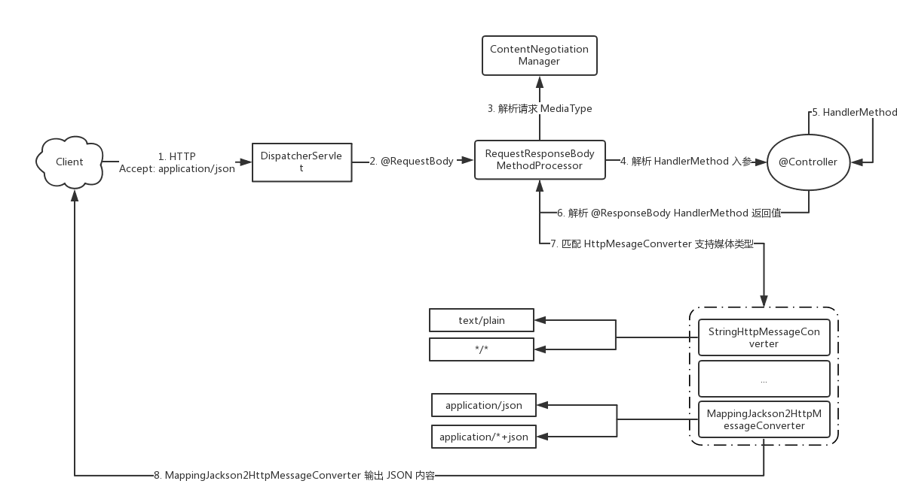

### Controller入参

#### 参数注解

> 可注解value为接收参数的key，如：`@XXX("key") type param`

**@PathVariable**

处理request的uri部分的参数，使用restful访问方式时， 即 someUrl/{paramId}，这时的参数可通过 @Pathvariable注解来获取。

**@RequestHeader**

@RequestHeader 注解，可以把Request请求header部分的值绑定到方法的参数上。

**@CookieValue**

@CookieValue 可以把Request header中关于cookie的指定值绑定到方法的参数上。

**@RequestParam**

@RequestParam注解通常用于接收地址中的参数，比如`http://XXXX?uid=111111&uname=张三`。

也可以用来处理 Content-Type 为 application/x-www-form-urlencoded 编码或者 form-data格式 的内容（表单提交）。

> get 请求的 application/x-www-form-urlencoded 数据解析不到。

@RequestParam有三个配置参数：

- `required` 表示是否必须，默认为 `true`，必须。
- `defaultValue` 可设置请求参数的默认值。
- `value` 为接收url的参数名（相当于key值）。

接收剩余未绑定的参数键值对：

`@RequestParam Map<String,String> map`

> js ajax上传query string parameters时会将多层的js对象转换为（多个）键值对，值为基本数据类型，键为其路径，如，`param[0][key]`。
>
> query string parameters键值对的值会被解析成 java.lang.String 类型，如`?param1=`会解析成`{"param1":""}`

**@RequestBody**

@RequestBody注解接收来自requestBody的参数。一般用于处理非 `Content-Type: application/x-www-form-urlencoded`编码格式的数据，比如：`application/json`编码格式的json对象，使用`@RequestBody JSONObject paramsObj`接收。

GET请求中，因为没有HttpEntity，所以@RequestBody并不适用。

https://blog.csdn.net/weixin_38004638/article/details/99655322

**@RequestPart**

@RequestPart这个注解用在multipart/form-data表单提交请求的方法上。

支持的请求方法的方式MultipartFile，属于SpringMultipartResolver类。

@RequestParam也同样支持multipart/form-data请求。他们最大的不同是，当请求方法的请求参数类型不再是String类型的时候。@RequestParam适用于name-value "String"类型的请求域，@RequestPart适用于复杂的请求域（像JSON，XML）。例如：key = user, value = {"name":"aaa","xx":"xx"}。

#### 自定义参数解析器

自定义解析器需要实现`HandlerMethodArgumentResolver`接口，用于解析request请求参数并绑定数据到Controller的入参上。

```java
public interface HandlerMethodArgumentResolver {
    boolean supportsParameter(MethodParameter var1);

    @Nullable
    Object resolveArgument(MethodParameter var1, @Nullable ModelAndViewContainer var2, NativeWebRequest var3, @Nullable WebDataBinderFactory var4) throws Exception;
}
```

- supportsParameter：可以设置一些标志，表示该解析器可以处理这些参数，返回ture才执行resolveArgument()函数。
- resolveArgument：处理实参的具体方法，返回参数值。

通常使用注解标识是否处理该参数，如：

```java
@Target({ElementType.PARAMETER})
@Retention(RetentionPolicy.RUNTIME)
@Documented
public @interface XxxAnnotation {
	String value() default "";
}
```

```java
	@Override
    public boolean supportsParameter(MethodParameter parameter) {
        if (parameter.getParameterType().isAssignableFrom(ParamType.class) && parameter.hasParameterAnnotation(XxxAnnotation.class)) {
            return true;
        }
        return false;
    }
```

注册自定义参数解析器

```java
@Configuration
public class XxxResolverHandlerConfig extends WebMvcConfigurationSupport {
    @Autowired
    XxxResolverHandlerConfig xxxResolverHandlerConfig;

    @Override
    protected void addArgumentResolvers(List<HandlerMethodArgumentResolver> argumentResolvers) {
        super.addArgumentResolvers(argumentResolvers);
        argumentResolvers.add(xxxResolverHandlerConfig);
    }
}
```

#### 日期参数

##### @RequestParam

```java
public String formX(@RequestParam(name="date") Date d) {
    return "formX Response Ok! " + d;
}
```

可接收 http请求传入**特定日期格式的字符串**。

@RequestParam注解决定了使用 RequestParamMethodArgumentResolver这个参数解析器，mvc-annotation注册的参数类型转换器并没有 String转Date类型的转换器 , 但是用到了ObjectToObjectConvert这个转换器。

ObjectToObjectConvert转换器是尝试去寻找目标类（Date）构造方法即目标类构造方法需要唯一含有String类型的构造方法，然后实例化该目标类，没找到就会抛出异常。

因此，是否支持传过来的字符串日期格式，测试 `new Date(“your pattern”)` 是否抛出异常即可。

##### @DateTimeFormat

在日期参数或javabean日期属性前加 `@DateTimeFormat(pattern="yyyy-MM-dd  HH:mm:ss")` 即可接收**指定格式的日期字符串**。

```java
public String formX(@RequestParam(name="date") @DateTimeFormat(pattern = "yyyy-MM-dd") Date d) {
        return "formX Response Ok! " + d;
    }
```

> 参数是javabean时，该类必须要有空参的构造器，以及对应日期属性的set方法，没有构造器就抛出异常无法实例化Java对象，没有set方法就是Java对象属性为null。
>
> 参数解析器使用ServletModelAttributeMethodProcessor，将请求参数映射到Java对象的属性上；该Java对象需要有空参public类型构造器，不然无法实例化抛出异常，这种方式也支持级联属性设置，同样的级联的属性也需要有空参构造方法。

这次使用到的Converter是AnnotationParserConverter，其专门针对String到@DateTimeFormat的转换器，这些转换器都注册在SpringMVC的ConversionService中。

AnnotationParserConverter的convert方法，最后几行调用了ParserConvert的convert方法，ParserConvert继承自GenericConvert，其convert方法就是使用parser对象的parse方法，当前情况也就是DateFormatter的parser方法， 其parse方法等同于new SimpleDateFormat(“patten”).parse(“..”)。

@DateTimeFormat 不仅可以得到**Date**类型数据，还可以转换成**Calendar**和**Long**型数据。

在前面解析结束得到Date类型数据后，由于Date不符合需要参数类型要求，于是继续调用conversionService的convert进行解析。SpringMVC注册了Date转Calendar和转Long的转换器。


@ResponseBody

@JsonFormat

### 其他注解

@JsonInclude(value = JsonInclude.Include.NON_NULL)

### Servlet注册

https://blog.csdn.net/javarrr/article/details/89920656

https://www.jianshu.com/p/be2dafc8c644

### 内容协商

[自定义Spring Boot 内容协商](https://mrbird.cc/Spring-Boot-Diy-Resolver.html)

**内容协商**机制是指客户端和服务器端就响应的资源内容进行交涉，然后提供给客户端最为适合的资源。

在Spring Boot中，一个完整的内容协商过程如下图所示：



### 过滤器

过滤器依赖于servlet容器，在实现上基于函数回调，可以对request请求进行过滤。

#### 注册过滤器

除了使用 web.xml 配置注册过滤器，还可以通过`@WebFilter` 和 `FilterRegistrationBean` 进行配置。

#### @WebFilter

在配置类上添加`@WebFilter`注册过滤器，如：

```java
@WebFilter(filterName = "loginFilter",
    urlPatterns = "/*",
    initParams = {
            @WebInitParam(name = "loginUI", value = "/home/login"),
            @WebInitParam(name = "encoding", value = "UTF-8")
    })
```

属性：

- filterName  过滤器名称
- urlPatterns/value  指定拦截的路径
- initParams  配置参数，通过`@WebInitParam`数组设置值。
- servletNames  指定对哪些Servlet进行过滤
- displayName  Filter显示名
- asyncSupported  指定Filter是否支持异步模式
- dispatcherTypes  指定Filter对哪种方式的请求进行过滤。支持的属性：ASYNC、ERROR、FORWARD、INCLUDE、REQUEST。默认过滤所有方式的请求

#### FilterRegistrationBean

通过注入`FilterRegistrationBean`注册过滤器，如：

```java
@Configuration
public class FilterConfig {
    @Bean
    public FilterRegistrationBean filterRegistrationBean() {
        //新建过滤器注册类
        FilterRegistrationBean registration = new FilterRegistrationBean();
        // 添加过滤器
        registration.setFilter( new LoginFilter());
        // 设置过滤器的URL模式
        registration.addUrlPatterns("/*");
        // 设置过滤器配置参数
        registration.addInitParameter("loginUI", "/home/login");
        registration.addInitParameter("encoding", "UTF-8");
        // 设置过滤器名称
        registration.setName("loginFilter");
        //设置过滤顺序，从小到大依次执行
        registration.setOrder(1);
        return registration;
    }
}
```

#### 拦截器与过滤器区别

- 使用范围不同：Filter是Servlet规范规定的，只能用于Web程序中。

https://blog.csdn.net/heweimingming/article/details/79993591

https://segmentfault.com/a/1190000018381259?utm_source=tag-newest