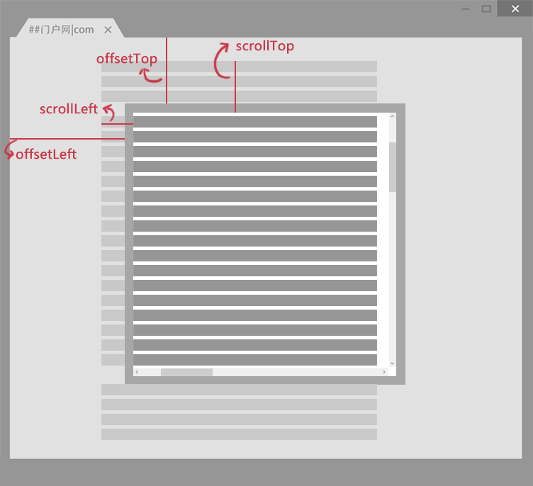

## JavaScript

- **HTML** 定义了网页的内容
- **CSS** 描述了网页的布局
- **JavaScript** 网页的行为

[JavaScript 知识图谱](https://www.w3cschool.cn/javascript/javascript-skillmap.html)

**JavaScript 脚本位置**

- 保存到外部文件中，扩展名为 .js。

  JS 文件不能直接运行，需嵌入到 HTML 文件中执行。HTML 使用 `<script>` 标签的 src 属性设置 js 文件

  `<script src="/statics/demosource/myscript.js"></script>`

  在 JS 文件中可直接编写 JavaScript 代码不需要\<script>标签。

- HTML 中的脚本必须位于 `<script>` 与 `</script>` 标签之间，可放置在 `<body>` 或 `<head>` 部分中。

  浏览器解释 html 时是按先后顺序的，因此 script 的执行也是按先后顺序的。

  放在 head 中的 JS 代码会在页面加载完成之前就读取，此时 body 还未被解析，其相关的代码会返回空；在 head 中嵌入的外部 js 文件同理。使用 `window.onload=function(){;};` 解决此问题。

  而放在 body 中的 JS 代码，会在整个页面加载完成之后读取。

  通常，需调用才执行的脚本或事件触发执行的脚本放在HTML的head部分中；当页面被加载时执行的脚本放在HTML的body部分的最后面。

> `<script>` 写在头部会导致页面加载堵塞等待
>
> html 页面加载过程

JavaScript 语句会在页面加载时执行。

通常在语句的结尾后加上一个分号`";"`来表示语句的结束。

单行注释，在注释内容前加符号 “//”；多行注释以"/\*"开始，以"\*/"结束。

### 语法

#### 变量

定义变量：`var num1,num2;`

1. 变量必须使用字母、下划线(_)或者美元符($)开始。_
2. 然后可以使用任意多个英文字母、数字、下划线(_)或者美元符($)组成。字母区分大小写。
3. 不能使用 JavaScript 关键词与 JavaScript 保留字。

变量虽然也可以不声明，直接使用（需赋值），但不规范，需要先声明，后使用。

> 变量可以存储任意数据类型。

##### 变量提升

JavaScript 中，函数及变量的声明都将被提升到函数的最顶部。因此，变量可以在使用后声明，也就是变量可以先使用再声明。

JavaScript 只有声明的变量会提升，初始化不会。

>  如果不声明，不赋值，直接使用会报 ReferenceError。
>
>  如果不赋值，后声明，直接使用则是 undefined。

#### 运算符

**操作符之间的优先级（高到低）:**

算术操作符 → 比较操作符 → 逻辑操作符 → "="赋值符号

##### typeof

##### instanceof

双等号==： 

1. 如果两个值类型相同，再进行三个等号(===)的比较

2. 如果两个值类型不同，也有可能相等，需根据以下规则进行类型转换在比较：

   - 如果一个是null，一个是undefined，那么相等

   - 如果一个是字符串，一个是数值，把字符串转换成数值之后再进行比较

三等号===:

1. 如果类型不同，就一定不相等
1. 如果两个都是数值，并且是同一个值，那么相等；如果其中至少一个是NaN，那么不相等。（判断一个值是否是NaN，只能使用isNaN( ) 来判断）
1. 如果两个都是字符串，每个位置的字符都一样，那么相等，否则不相等。
1. 如果两个值都是true，或是false，那么相等
1. 如果两个值都引用同一个对象或是函数，那么相等，否则不相等
1. 如果两个值都是null，或是undefined，那么相等

#### 数据类型

基本数据类型：number、string、boolean、null、 undefined、symbol（ES6）

引用（复杂）数据类型：object（除了基本数据类型以外的都属于 object 类型）、function

基本数据类型把数据名和值直接存储在栈当中

复杂数据类型在栈中存储数据名和一个堆的地址，在堆中存储属性及值，访问时先从栈中获取地址，再到堆中拿出相应的值

https://www.cnblogs.com/c2016c/articles/9328725.html

常见 object 类型


#### 数组<a name="Array"></a>

**创建数组语法：**

```javascript
var myarray=new Array();	 
```

1. 创建的新数组是空数组，没有值，如输出，则显示undefined。
2. 虽然创建数组时，可指定长度 `new Array(i)`，但实际上数组都是变长的，也就是说即使指定了长度，仍然可以将元素存储在规定长度以外。
3. 数组索引号从0开始。
4. 数组存储的数据可以是任何类型（数字、字符、布尔值等）

**数组赋值：**

```javascript
var myarray = new Array(66,80,90,77,59);//创建数组同时赋值
var myarray = [66,80,90,77,59];//直接输入一个字面量数组
```

**数组属性 length**

length 属性表示数组的长度，即数组中元素的个数。

JavaScript 数组的 length 属性是可变的。

```javascript
arr.length=10; //增大数组的长度
```

数组遍历方法

**二维数组的定义**

```javascript
var Myarr = [[0 , 1 , 2 ],[1 , 2 , 3]];	//直接赋值
var myarr=new Array();  //先声明一维 
myarr[i]=new Array(); //再创建第二维
```

#### 分支语句

```javascript
if(条件1) { 
    条件1成立时执行的代码
} else if(条件n) { 
    条件n成立时执行的代码
} else { 
    条件1、n不成立时执行的代码
}
```

```javascript
//switch必须赋初始值，值与每个case值匹配。满足执行该 case 后的所有语句
switch(表达式)	{
case值1:
  执行代码块 1
  break;
case值n:
  执行代码块 n
  break;
default:
  与 case值1 、case值n 不同时执行的代码
}
```

#### 循环语句

```javascript
for(初始化变量;循环条件;循环迭代) {     
    循环语句 
}
```

```javascript
while(判断条件){
    循环语句
}
do {
    循环语句
} while(判断条件)
```

- **break**  退出当前循环。
- **continue**  仅仅跳过本次循环，而整个循环体继续执行

#### 对象/键值对

**创建对象**：

```javascript
//new Object创建对象，然后添加属性和方法。
var obj1 = new Object();
obj1.property1=value1;
//使用字面量创建对象
var obj2 = {key1:value1,keyN:valueN};
//使用 new
```

如果属性名包含特殊字符，就必须用 ' ' 括起来，并且访问时必须用 ['xxx'] 来访问。

实际上，JavaScript对象的所有属性都是字符串，属性对应的值可以是任何数据类型。

> 使用字面量创建对象时，其属性都被认为是字符串，其属性值则相当于函数传参。

**定义属性**：

- 直接 obj.property
- **Object.defineProperty(obj, prop, descriptor)** 

https://www.cnblogs.com/xiaoliwang/p/9043876.html

https://blog.csdn.net/qq_31214097/article/details/85861006

Object 方法

#### 原型链

js的原型链和java的class的区别就在，js没有class的概念，所有的对象都是实例，所谓继承关系只不过是把一个对象的原型指向另一个对象。

https://www.w3cschool.cn/javascript/javascript-5isn2lax.html

#### 函数

```javascript
function 函数名(参数1,参数2){
    函数代码;
    return 值;
}
```

JavaScript 支持嵌套函数。

**变量**

在 JavaScript 中，所有函数都能访问它们上层的作用域（作用域继承）。

如果当前 {} 中创建了同名的局部变量，则访问的是该局部变量，而不是上层同名局部变量，无论前后顺序，即在创建前使用会出现 undefined。

**传参**

函数传参规则与 Java 类似。所有函数的参数都是按值传递的。

对于基本数据类型，传递变量值；对于引用数据类型，传地址值，也称 “按共享传递”。

##### 匿名函数

```javascript

```

自执行函数写法（即匿名函数直接执行）。

1. 
2. !
3. ()

##### 闭包

闭包是可访问上一层函数作用域里变量的函数，即便上一层函数已经关闭。

闭包使得函数拥有私有变量变成可能。局部变量受匿名函数的作用域保护，只能通过该方法修改。示例：

```javascript
var add = (function () {
    var counter = 0;
    return function () {return counter += 1;}
})();

add();
add(); //2
```

##### 回调函数

定义：A callback is a function that is passed as an argument to another function and is executed after its parent function has completed.

示例：

```javascript
function func(callback,arg){
    if(typeof callback === "function"){
        callback(arg);
    }
}
```

常用回调方法：

- 异步调用（例如读取文件，进行HTTP请求，等等）
- 事件监听器/处理器
- setTimeout和setInterval方法

#### this

this 上下文对象。全局的上下文为 window 对象。

##### new

创建对象

##### 隐式绑定

场景 示例

##### 绑定规则

1. 是否在new中调用(new绑定)？如果是的话this绑定的是新创建的对象。
2. 是否通过call、apply(显式绑定)或者硬绑定调用？如果是的话，this绑定的是 指定的对象。
3. 是否在某个上下文对象中调用(隐式绑定)？如果是的话，this绑定的是那个上下文对象。
4. 如果都不是的话，无论是否为嵌套函数，都使用默认绑定。
5. 如果在严格模式下，就绑定到undefined，否则绑定到全局对象。

https://blog.csdn.net/cjgeng88/article/details/79846670

块级作用域

可变长参数 

arguments

字符串作为函数调用。

eval   的参数不是字符串， `eval()` 会将参数原封不动地返回。

eval("("+data+")")

eval本身的问题。 由于json是以”{}”的方式来开始以及结束的，在JS中，它会被当成一个语句块来处理，所以必须强制性的将它转换成一种表达式。

eval替代方法  Function

https://developer.mozilla.org/zh-CN/docs/Web/JavaScript/Reference/Global_Objects/eval

window[]

Object 对象遍历

https://blog.csdn.net/tomy123456123456/article/details/81633548

#### 作用域

**局部变量**：在**函数中**通过var声明的变量，只能在函数内部访问，在函数执行完毕后销毁。

**全局变量**：在**函数外**通过var声明的变量，网页中所有脚本和函数以及引入的外部 js 文件均可使用，在页面关闭后销毁。

没有声明就使用的变量，默认为全局变量，不论这个变量在哪被使用。

在 HTML 中, 所有全局数据变量都属于 window 对象。

var变量没有块级作用域，在块 `{}`（除函数块） 里定义的变量会进行变量提升。块中重定义的变量赋值会覆盖该局部/全局作用域该变量的值。

>java：（变量可见区域）不允许重定义。
>
>c++：相同块作用域不允许重定义，子块中重定义的变量不允许父块作用域。

#### 严格模式

"use strict;" 指令在 JavaScript 1.8.5 (ECMAScript5) 中新增。

"use strict" 是一个字面量表达式，在 JavaScript 旧版本中会被忽略，其目的是指定代码在严格条件下执行。

关键字


void

void(表达式)  该操作符指定要计算一个表达式但是不返回其值，返回 undefined。

> `void a+b` 相当于 `void(a)+b`

### 事件

| 事件        | 说明             |
| ----------- | ---------------- |
| onclick     | 鼠标单击         |
| onmouseover | 鼠标经过         |
| onmouseout  | 鼠标移开         |
| onchange    | 文本内容改变     |
| onselect    | 文本内容被选中   |
| onfocus     | 光标聚集         |
| onblur      | 光标离开（失焦） |
| onload      | 页面加载         |
| onunload    | 页面关闭         |

oncontextmenu 

#### 特别事件

form

- onsubmit

  示例：`<form onsubmit="return checkForm()">`

#### 事件监听器

window.addEventListener();

document.addEventListener();

事件绑定与解绑 

readystatechange

执行事件方法 blur() 失焦

### 常用方法

#### 输出

- 使用 **window.alert()** 弹出警告框显示消息。

- 使用 **document.write()** 方法将内容显示到 HTML 界面中。

  如果在文档已完成加载后执行 document.write，整个 HTML 页面将被覆盖。

- 使用 **innerHTML** 在 HTML 元素上显示信息。

  `document.getElementById("demo").innerHTML = "段落已修改。";`

- 使用 **console.log()** 输出信息到浏览器的控制台。

  浏览器中使用 F12 来启用调试模式， 在调试窗口中点击 Console 菜单查看控制台输出。

#### 消息框

- `alert(str);  ` 警告框，包含一个确定按钮。

- `confirm(str);` 确认框，包含确定和取消按钮。

  点击"确定"按钮时，返回true；点击"取消"按钮时，返回false。

- `prompt(str1, str2);` 提问框，包含一个确定按钮、取消按钮与一个文本输入框。

  str1：要显示在消息对话框中的文本；str2：文本框中的内容，对文本框内容的修改不会改变 str2 的值。

  点击确定按钮，文本框中的内容将作为函数返回值；点击取消按钮，将返回null。

> 这些消息对话框是排它的。

#### 打开/关闭窗口

`window.open([URL], [窗口名称], [参数字符串])`

查找一个已经存在或者新建的浏览器窗口。返回值为对应窗口对象。

- URL：可选参数，在窗口中要显示网页的网址或路径。如果省略这个参数，或者它的值是空字符串，那么窗口就不显示任何文档。

- 窗口名称：可选参数，被打开窗口的名称。

  1. 该名称由字母、数字和下划线字符组成。
  2. "\_top"、"\_blank"、"_self"具有特殊意义的名称。
     _blank：在新窗口显示目标网页
     _self：在当前窗口显示目标网页
     _top：框架网页中在上部窗口中显示目标网页
  3. 相同 name 的窗口只能创建一个，要想创建多个窗口则 name 不能相同。
  4. .name 不能包含有空格。

- 参数字符串：可选参数，设置窗口参数，各参数用逗号隔开。

  | 参数       | 值      | 说明                         |
  | ---------- | ------- | ---------------------------- |
  | top        | Number  | 窗口顶部离开屏幕顶部的像素数 |
  | left       | Number  | 窗口左端离开屏幕左端的像素数 |
  | width      | Number  | 窗口的宽度                   |
  | height     | Number  | 窗口的高度                   |
  | menubar    | yes, no | 窗口有没有菜单               |
  | toolbar    | yes, no | 窗口有没有工具条             |
  | scrollbars | yes, no | 窗口有没有滚动条             |
  | status     | yes, no | 窗口有没有状态栏             |

`window.close();` 关闭本窗口。

`<窗口对象>.close();` 关闭指定的窗口。

#### 类型转换

- **result = parseInt(str)**  解析字符串，返回一个整数。

### 内置对象

> 内置对象可直接输出显示。

#### Date

##### 创建日期对象

```javascript
var nDate=new Date();
var d = new Date(2012, 10, 1);  //2012年10月1日
var d = new Date('Oct 1, 2012');  //2012年10月1日
document.write(nDate+"<br>");
//Sun Sep 08 2019 15:35:50 GMT+0800 (中国标准时间)
```

##### 获取/设置时间日期

- get/setDay()  返回/设置星期。0-6，0 表示星期天。
- get/setFullYear()  返回/设置年份，用四位数表示 
- get/setYear()  返回/设置年份
- get/setMonth()  返回/设置月份。0：一月，...，11：十二月
- get/setDate() 返回/设置日。
- get/setHours()  返回/设置小时，24小时制
- get/setMinutes()  返回/设置分钟数
- get/setSeconds()  返回/设置秒钟数
- get/setTime()  返回/设置时间，单位维毫秒 ，计算从 1970 年 1 月 1 日零时到日期对象所指的日期的毫秒数。

#### String

`new String('x')` 与 `'x'` 不是同一类型，前者是 object 类型，后者是 string 类型。

##### 定义字符串

```javascript
var mystr = "Hello World!";
```

##### 属性/方法

- **length** 属性为字符串的长度。

- **charAt(index)** 返回指定位置的字符。返回的字符是长度为 1 的字符串。

  如果参数 index 不在 0 与 string.length-1 之间，该方法将返回一个空字符串。

- **indexOf(substring, startpos)** 返回某个指定的字符串值在字符串中首次出现的位置。可选参数 startpos 指定在字符串中开始查找的位置。

  indexOf() 方法区分大小写。如果要检索的字符串值没有出现，则该方法返回 -1。

- **split(separator, limit)** 将字符串分割为字符串数组，返回此数组。可选参数 limit 设置返回的数组长度。

  空字符串 ("") 用作 separator时，每个字符之间都会被分割。

- **substring(startPos, stopPos)**   提取字符串中介于两个指定下标之间的字符串。可选 stopPos 指定结束位置（返回字符串不包含该位置）。

  返回字符串长度为 stop 减start。如果参数 start 与 stop 相等，那么该方法返回的就是一个空串 ""。

  如果 start 比 stop 大，那么该方法在提取子串之前会先交换这两个参数。

- **substr(startPos,length)** 提取从 startPos位置开始的指定数目的字符串。length 可选。

  此方法 startPos 为负数时，从字符串的尾部开始算起的位置。即 -1 指字符串中最后一个字符。当 startPos 为负数且绝对值大于字符串长度，startPos为0。

- **toUpperCase()** 方法将字符串小写字母转换为大写。

- **toLowerCase()** 方法将字符串所有大写字母都变成小写。

#### Math

Math 对象，提供对数据的数学计算。

Math 对象是一个固有的对象，无需创建它，直接把 Math 作为对象使用就可以调用其所有属性和方法。

##### 方法

- **Math.ceil(x)** 返回的是大于或等于x，并且与x最接近的整数。

- **Math.floor(x)** 返回的是小于或等于x，并且与 x 最接近的整数。

- **Math.round(x)** 四舍五入为最接近的整数。

  如果 x 与两侧整数同等接近，则结果接近 +∞方向的数字值 。

- **Math.random()** 方法可返回大于或等于 0 但小于 1 的一个随机数。

#### Array

[Array](#Array)

特性

动态增加

``` javascript
array[array.length]=array.length    // [0]
```

##### 方法

- **concat(array1,..., arrayN)**  方法用于连接两个或多个数组。此方法返回一个新数组，不改变原来的数组。

- **join(separator)** 把数组中的所有元素放入一个字符串。可选分隔符。

- **reverse()** 颠倒数组中元素的顺序。该方法会改变原来的数组，而不会创建新的数组。

- **slice(start,end)** 从已有的数组中返回选定的数组。可选 end 指定结束位置（不包含该位置）。

  可使用负值从数组的尾部选取元素。

- **sort(func)**  使数组中的元素按照一定的顺序排列。默认按unicode码顺序排列。

  func 比较函数比较 a, b 两个值。

  若返回值 <=-1，则表示 a 在排序后的序列中出现在 b 之前。
  若返回值 >-1 && <1，则表示 a 和 b 具有相同的排序顺序。
  若返回值 >=1，则表示 a 在排序后的序列中出现在 b 之后。

- **forEach(function(currentValue, index, arr), thisValue)** 

- [【JS】JS数组添加元素的三种方法 - willingtolove - 博客园](https://www.cnblogs.com/willingtolove/p/10957669.html)

#### Map

- [Map - JavaScript | MDN](https://developer.mozilla.org/zh-CN/docs/Web/JavaScript/Reference/Global_Objects/Map)
- [dictionary - Map vs Object in JavaScript - Stack Overflow](https://stackoverflow.com/questions/18541940/map-vs-object-in-javascript)
- [JS选择 Object 还是 Map - 知乎](https://zhuanlan.zhihu.com/p/270006807)
- [JavaScript Map 和 Object 的区别_ckwang6的博客-CSDN博客](https://blog.csdn.net/ckwang6/article/details/89215396)

### window 对象

window 对象是BOM的核心，指当前的浏览器窗口。

BOM，Browser Object Model，即浏览器对象模型。浏览器页面初始化时，会在内存创建一个全局对象，用来描述当前窗口的属性和状态，这个全局对象被称为浏览器对象模型。

使用 window 对象的属性和方法时可省略 window。


#### 计时器

##### 间隔性触发计时器

- **setInterval(代码,交互时间)**  载入页面后每隔指定的时间执行代码，以毫秒计时。返回值可传递给 clearInterval() 从而取消周期性执行。

  ```javascript
  setInterval("clock()",1000)
  setInterval(clock,1000)  //每隔1秒调用一次clock()函数
  ```

- **clearInterval(id_of_setInterval)** 取消由 setInterval() 设置的定时任务。

##### 一次性计时器

- **setTimeout(代码,延迟时间)** 在载入后延迟指定时间后执行一次代码，以毫秒为单位。
- **clearTimeout(id_of_setTimeout)** 取消计时器。

#### history 对象

history 对象记录了用户曾经浏览过的页面(URL)，并可以实现浏览器前进与后退相似导航的功能。

从窗口被打开的那一刻开始记录，每个浏览器窗口、每个标签页乃至每个框架，都有自己的 history 对象与特定的 window 对象关联。

##### 属性/方法

- **length** 返回当前窗口历史列表中的 URL 数量。
- **back()** 加载 history 列表中的前一个 URL。等同于点击浏览器的后退按钮。
- **forward()** 加载 history 列表中的下一个 URL。等同于前进按钮。
- **go(number)** 根据当前所处的页面，加载 history 列表中相对当前页面偏移 number 的页面。即，0：当前页面；1：forward()；-1：back()。

#### sessionStorage 对象

#### localStorage 对象

#### location 对象

location 表示窗口中当前显示的文档的 Web 地址。用于获取或设置窗体的URL，并且可以用于解析URL。

##### 属性


##### 方法

- **assign()** 加载新的文档。
- **reload()** 重新加载当前文档。
- **replace()** 用新的文档代替当前文档。

#### navigator 对象

navigator 对象包含有关浏览器的信息，通常用于检测浏览器与操作系统的版本。

##### 属性

- **appCodeName** 浏览器代码名的字符串表示
- **appName**  返回浏览器的名称
- **appVersion**  返回浏览器的平台和版本信息
- **platform** 返回运行浏览器的操作系统平台
- **userAgent** 返回发送服务器的 user-agent 头部的值，即包括浏览器版本信息等的字符串

#### screen 对象

screen 对象用于获取用户的屏幕信息。

##### 属性

- **avaiHeight**  窗口可以使用的屏幕高度，单位像素；

  即访问者屏幕的宽度，减去界面特性，比如任务栏。

- **avaiWidth** 窗口可以使用的屏幕宽度，单位像素；

- **colorDepth** 用户浏览器表示的颜色位数，通常为32位（每像素的位数）;

- **pixelDepth** 用户浏览器表示的颜色位数，通常为32位（每像素的位数）（IE不支持此属性)

- **height** 屏幕分辨率的高度，单位像素；

- **width** 屏幕分辨率的宽度，单位像素；

### DOM

文档对象模型 DOM（Document Object Model）定义访问和处理 HTML 文档的标准方法。DOM 将 HTML 文档呈现为带有元素、属性和文本的节点树结构（节点树）。

HTML 文档可以说由节点构成的集合，DOM节点有：

1. 元素节点：即标签。
2. 文本节点：向用户展示的内容。
3. 属性节点：元素属性。

#### 获取元素节点

- **document.body** html dom中的body节点 即\<body>

- **document.documentElement** html dom中的root 节点 即\<html>

- **document.getElementById("id")**  

  返回 null 或 [object HTMLParagraphElement]。

  通过元素对象的属性或方法对元素进行操作。

- **document.getElementsByName(name)**

  返回带有指定名称的节点对象的数组。

  直接输出这个数组显示 [object NodeList]，即使 length 为 0。

- **document.getElementsByTagName(Tagname)** 

  返回带有指定标签名（如 p、a、img 等标签名）的节点对象的数组。返回元素的顺序是它们在文档中的顺序。

#### 节点属性

- **nodeName** 节点的名称，只读

  1. 元素节点的 nodeName 与标签名相同
  2. 属性节点的 nodeName 是属性的名称
  3. 文本节点的 nodeName 永远是 #text
  4. 文档节点的 nodeName 永远是 #document

- **nodeValue** 节点的值

  1. 元素节点的 nodeValue 是 undefined 或 null
  2. 文本节点的 nodeValue 是文本自身
  3. 属性节点的 nodeValue 是属性的值

- **nodeType** 节点的类型，只读

  元素：1；属性：2；文本：3；注释：8；文档：9。

#### 节点遍历

- **childNodes** 属性为该元素节点下的所有子节点的数组。

  如果该节点没有子节点，则该属性返回不包含节点的 NodeList。

  节点之间的空白符（换行），在firefox、chrome、opera、safari浏览器都是（空白）文本节点，而 IE 会忽略。

- **firstChild** 属性返回 childNodes 属性数组的第一个子节点。如果选定的节点没有子节点，则该属性返回 NULL。

- **lastChild** 属性返回 childNodes 属性数组的最后一个子节点。如果选定的节点没有子节点，则该属性返回 NULL。

- **parentNode **获取节点的父节点。

- **nextSibling** 属性可返回某个节点之后紧跟的节点（处于同一树层级中）。

  如果无此节点，则该属性返回 null。

- **previousSibling** 属性可返回某个节点之前紧跟的节点（处于同一树层级中）。

#### 节点操作

##### document 方法

- **document.createElement(tagName)** 方法可创建元素类型为 tagName 的节点。此方法可返回一个 Element 对象。
- **document.createTextNode(data)** 方法创建新的文本节点，返回新创建的 Text 节点。

##### 节点方法

- **appendChild(newnode)** 在节点的最后一个子节点列表之后添加一个新的子节点。

- **insertBefore(newnode,node)** 方法可在已有的子节点 node 前插入一个新的子节点。

- **removeChild(node)** 方法从子节点列表中删除某个节点。如删除成功，此方法可返回被删除的节点，如失败，则返回 NULL。

  把删除的子节点赋值给 x，这个子节点不在DOM树中，但是还存在内存中，可通过 x 操作。如果要完全删除对象，给 x 赋 null 值。

- **replaceChild (newnode,oldnew)**  实现子节点对象的替换。返回被替换对象的引用。 newnode 必须先被建立。 

  当 oldnode 被替换时，所有与之相关的属性内容都将被移除。

#### 元素节点对象

##### 元素方法

- **getAttribute(name)** 通过元素节点的属性名称获取属性的值。

- **setAttribute(name,value)** 增加一个指定名称和值的新属性，或者把一个现有的属性设定为指定的值。

- **removeAttribute(name)** 移除属性

  示例：element.removeAttribute("style"); 移除元素的样式属性。

##### 元素属性

> Object.attribute

- **innerHTML** 属性用于获取或替换 HTML 元素的内容（标签头尾间的字符串）。

- **style.[property]** HTML 元素的 CSS 样式属性。赋的值须使用 "" 。 

  使用示例：objmychar.style.fontSize="20"; 

  obj.style="color:red;background-color:#CCC";

- **style.display** 控制元素显示或隐藏。

  值："none" 隐藏；"block"显示为块级元素。

- **classNam** 属性设置或返回元素的 class 属性。

  可为网页内的某个元素指定一个css样式（类选择器）来更改该元素的外观。

value & innerHTML 区别

> radio： check 属性

#### document 属性

- **readyState** 属性描述了文档的加载状态。

  当该属性值发生变化时，会在document 对象上触发readystatechange事件。

  值：**loading**（正在加载）、**interactive**（文档已被解析，"正在加载"状态结束，但是诸如图像，样式表和框架之类的子资源仍在加载。）、**complete**（文档和所有子资源已完成加载。表示 `load` 状态的事件即将被触发。）。

Cookie

原型链

Boolean

herf="javascript:;" 之类的

execCommand

debugger 关键字

语法 补全/深入

严格模式

https://www.w3cschool.cn/javascript/js-cookies.html

全局函数 777

> 全局函数与内置对象（window）的属性或方法不是一个概念。全局函数它不属于任何一个内置对象。

js 对象/方法 all


File Blob 

URL

错误处理

throw

try{}catch(err){}

### JSON

- JSON.parse(text[, reviver])  用于将一个 JSON 字符串转换为 JavaScript 对象。
- JSON.stringify(value[, replacer[, space]])  用于将 JavaScript 值转换为 JSON 字符串。

### 正则表达式

#### 语法

格式：`/正则表达式主体/修饰符[可选]`

#### 修饰符

- i：执行对大小写不敏感的匹配。
- g：执行全局匹配（查找所有匹配而非在找到第一个匹配后停止）。
- m：执行多行匹配。

#### 正则表达式模式

https://developer.mozilla.org/zh-CN/docs/Web/JavaScript/Guide/Regular_Expressions

#### 字符串方法

##### search

##### replace

#### RegExp

##### test

##### exec

#### 使用示例

##### Cookie

```javascript
var str=unescape("token=-1223249887; username=user".match(/(^| )username=([^;]*)(;|$)/));
		for(var i=0;i<str.length;i++)
			document.write(str[i]+"</br>");
```

> 使用Cookie似乎不比使用字符串方法直接分析字符串性能好。

### 新增

let & const & 块级作用域

[JavaScript let 和 const](https://www.runoob.com/js/js-let-const.html)

### Tips

注意：回调函数中访问的外部变量是会实时更新的。

void 0 替代 undefined。

输入编码处理：使用 escape 编码输入，使用时再用 unescape 解码。（避免特殊字符影响传输）

输入逻辑处理：考虑各种输入情况。

转义字符是用户透明的，除了在编写字面量时需要考虑。

存储需要解析的字符串字面量时，注意转义字符的处理。示例：

```javascript
JSON.parse('{"id\\"":1}'); // 正常，使用"\\"，字符串中才会存储反斜杠，在解析时才能转义想转义的字符。
```

#### Js代码引入其他js文件

方式一：

```javascript
document.write("<script src='xxx.js'></script>");
```

> 在加载完页面后执行 write 会覆盖当前页面

方式二：

```
var ele= document.createElement("script");
ele.setAttribute("type", "text/javascript");
ele.setAttribute("src", "xxx.js");
document.body.appendChild(ele);
```

> 引入js文件后，需要一定时间才能完成加载，不能马上使用该 js 文件内容。

方式三：

ES6 语法

```javascript
import 'xxx.js';
```

#### JS 输出空格

1. 使用 html 标签`"&nbsp;"`
2. 使用CSS样式 `"<span style='white-space:pre;'>"`

#### 浏览器窗口可视区域大小

获得浏览器窗口的尺寸（浏览器的窗口可视区域，不包括工具栏和滚动条）的方法:

1. 对于IE9+、Chrome、Firefox、Opera 以及 Safari：

   - window.innerHeight - 浏览器窗口的内部高度
   - window.innerWidth - 浏览器窗口的内部宽度

2. 对于 Internet Explorer 8、7、6、5：

   - document.documentElement.clientHeight表示HTML文档所在窗口的当前高度。

   - document.documentElement.clientWidth表示HTML文档所在窗口的当前宽度。

   或者，document对象的body属性对应HTML文档的\<body>标签

   - document.body.clientHeight

   - document.body.clientWidth

在不同浏览器都实用的 JavaScript 方案：

```javascript
var w= document.documentElement.clientWidth
      || document.body.clientWidth;
var h= document.documentElement.clientHeight
      || document.body.clientHeight;
```

#### 网页尺寸

##### 网页尺寸 scrollHeight 

scrollHeight 和 scrollWidth，获取网页内容高度和宽度。

scrollHeight和scrollWidth还可获取Dom元素中内容实际占用的高度和宽度。

**一、针对IE、Opera:**

scrollHeight 是网页内容实际高度，可以小于 clientHeight。

**二、针对NS、FF:**

scrollHeight 是网页内容高度，不过最小值是 clientHeight。也就是说网页内容实际高度小于 clientHeight 时，scrollHeight 返回 clientHeight 。

**三、浏览器兼容性**

```javascript
var w=document.documentElement.scrollWidth
   || document.body.scrollWidth;
var h=document.documentElement.scrollHeight
   || document.body.scrollHeight;
```

##### 网页尺寸offsetHeight

offsetHeight 和 offsetWidth，获取网页内容高度和宽度(包括滚动条等边线，会随窗口的显示大小改变)。

**一、值**

offsetHeight = clientHeight + 滚动条 + 边框。

**二、浏览器兼容性**

```javascript
var w= document.documentElement.offsetWidth
    || document.body.offsetWidth;
var h= document.documentElement.offsetHeight
    || document.body.offsetHeight;
```

#### 网页卷去的距离与偏移量



scrollLeft：设置或获取位于给定对象左边界与窗口中目前可见内容的最左端之间的距离 ，即左边灰色的内容。

scrollTop：设置或获取位于对象最顶端与窗口中可见内容的最顶端之间的距离 ，即上边灰色的内容。

> scrollLeft 和 scrollTop 会随着滑块的滑动而改变。

offsetLeft：获取指定对象相对于版面或由 offsetParent 属性指定的父坐标的计算左侧位置 。

offsetTop：获取指定对象相对于版面或由 offsetParent 属性指定的父坐标的计算顶端位置 。

> offsetParent：布局中设置postion属性(Relative、Absolute、fixed)的父容器，从最近的父节点开始，一层层向上找，直到HTML的body。

- [js获取元素相对于父级元素的高度_lx_1024的博客-CSDN博客_获取元素相对于父元素的位置](https://blog.csdn.net/lx_1024/article/details/78854720)

js引擎