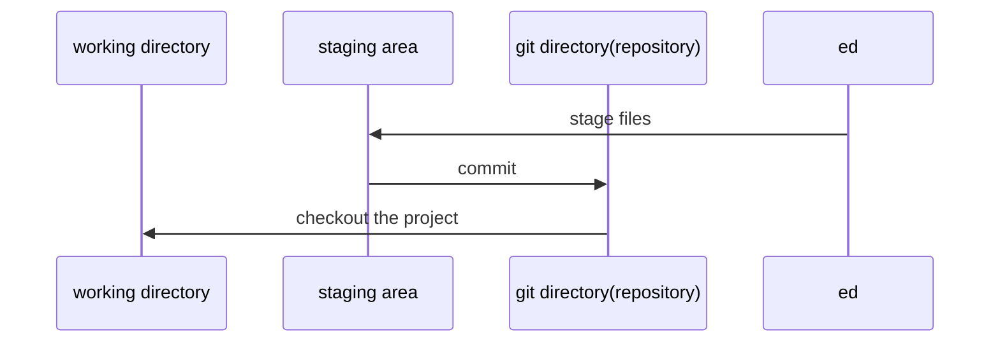
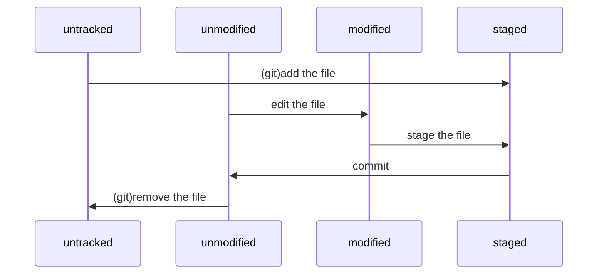

# Git

## 版本控制

版本控制是一种记录一个或若干文件内容变化，以便将来查阅特定版本修订情况的系统。

版本控制系统历史：

1. 本地版本控制系统
   
   大多都是采用某种简单的数据库来记录文件的历次更新差异。
   
   其中最流行的一种叫做 rcs。它的工作原理基本上就是保存并管理文件补丁（patch）。文件补丁是一种特定格式的文本文件，记录着对应文件修订前后的内容变化。所以，根据每次修订后的补丁，rcs 可以通过不断打补丁，计算出各个版本的文件内容。

2. 集中化的版本控制系统

   有一个单一的集中管理的服务器，保存所有文件的修订版本，而协同工作的人们都通过客户端连到这台服务器，取出最新的文件或者提交更新。

   优点：每个人都可以在一定程度上看到项目中的其他人正在做些什么；而管理员也可以轻松掌控每个开发者的权限，并且管理一个 CVCS 要远比在各个客户端上维护本地数据库来得轻松容易。

   缺点：中央服务器的单点故障。

3. 分布式版本控制系统

   客户端并不只提取最新版本的文件快照，而是把代码仓库完整地镜像下来。这么一来，任何一处协同工作用的服务器发生故障，事后都可以用任何一个镜像出来的本地仓库恢复。

   更进一步，许多这类系统都可以指定和若干不同的远端代码仓库进行交互。

## Git 基础

### 简介

Git 版本控制系统开发目标：

- 速度
- 简单的设计
- 对非线性开发模式的强力支持（允许上千个并行开发的分支）
- 完全分布式
- 有能力高效管理类似 Linux 内核一样的超大规模项目（速度和数据量）

Git 与 SVN 区别点：

1. Git 是分布式的，SVN 不是：这是 Git 和其它非分布式的版本控制系统，例如 SVN，CVS 等，最核心的区别。
2. Git 把内容按元数据方式存储，而 SVN 是按文件：所有的资源控制系统都是把文件的元信息隐藏在一个类似 .svn， .cvs 等的文件夹里。
3. Git 分支和 SVN 的分支不同：分支在 SVN 中一点都不特别，其实它就是版本库中的另外一个目录。
4. Git 没有一个全局的版本号，而 SVN 有：目前为止这是跟 SVN 相比 Git 缺少的最大的一个特征。
5. Git 的内容完整性要优于 SVN：Git 的内容存储使用的是 SHA-1 哈希算法。这能确保代码内容的完整性，确保在遇到磁盘故障和网络问题时降低对版本库的破坏。

### Git 特点

#### 直接记录快照，而非差异比较

Git 和其他版本控制系统的主要差别在于，Git 只关心文件数据的整体是否发生变化，而大多数其他系统则只关心文件内容的具体差异，每次记录有哪些文件作了更新，以及都更新了哪些行的什么内容。

Git 并不保存这些前后变化的差异数据。实际上，Git 更像是把变化的文件作快照后，记录在一个微型的文件系统中。每次提交更新时，它会纵览一遍所有文件的指纹信息并对文件作一快照，然后保存一个指向这次快照的索引。为提高性能，若文件没有变化，Git 不会再次保存，而只对上次保存的快照作一链接。

#### 近乎所有操作都是本地执行

在 Git 中的绝大多数操作都只需要访问本地文件和资源，不用连网。但如果用 CVCS 的话，差不多所有操作都需要连接网络。因为 Git 在本地磁盘上就保存着所有当前项目的历史更新，所以处理起来速度飞快。

#### 时刻保持数据完整性

在保存到 Git 之前，所有数据都要进行内容的校验和（checksum）计算，并将此结果作为数据的唯一标识和索引。换句话说，不可能在你修改了文件或目录之后，Git 一无所知。这项特性作为 Git 的设计哲学，建在整体架构的最底层。所以如果文件在传输时变得不完整，或者磁盘损坏导致文件数据缺失，Git 都能立即察觉。

Git 使用 SHA-1 算法计算数据的校验和，通过对文件的内容或目录的结构计算出一个 SHA-1 哈希值，作为指纹字符串。该字串由 40 个十六进制字符（0-9 及 a-f）组成，看起来就像是：
24b9da6552252987aa493b52f8696cd6d3b00373。

Git 的工作完全依赖于这类指纹字串，所以你会经常看到这样的哈希值。实际上，所有保存在 Git 数据库中的东西都是用此哈希值来作索引的，而不是靠文件名。

#### 多数操作仅添加数据

常用的 Git 操作大多仅仅是把数据添加到数据库。因为任何一种不可逆的操作，比如删除数据，都会使回退或重现历史版本变得困难重重。在别的 VCS 中，若还未提交更新，就有可能丢失或者混淆一些修改的内容，但在 Git 里，一旦提交快照之后就完全不用担心丢失数据，特别是养成定期推送到其他仓库的习惯的话。

### 基本概念

对于任何一个文件，在 Git 内都只有三种状态：已提交（committed），已修改（modified）和已暂存（staged）。

- 已提交表示该文件已经被安全地保存在本地数据库中了；
- 已修改表示修改了某个文件，但还没有提交保存；
- 已暂存表示把已修改的文件放在下次提交时要保存的清单中。

Git 管理项目时，文件流转的三个工作区域：Git 的工作目录，暂存区域，以及本地仓库。



每个项目都有一个 Git 目录（如果 `git clone` 出来的话，就是其中 `.git` 的目录；如果 `git clone --bare` 的话，新建的目录本身就是 Git 目录。），它是 Git 用来保存元数据和对象数据库的地方。该目录非常重要，每次克隆镜像仓库的时候，实际拷贝的就是这个目录里面的数据。

从项目中取出某个版本的所有文件和目录，用以开始后续工作的叫做工作目录。这些文件实际上都是从 Git 目录中的压缩对象数据库中提取出来的，接下来就可以在工作目录中对这些文件进行编辑。

所谓的暂存区域只不过是个简单的文件，一般都放在 Git 目录中。

基本的 Git 工作流程如下：

1. 在工作目录中修改某些文件。

2. 对修改后的文件进行快照，然后保存到暂存区域。

3. 提交更新，将保存在暂存区域的文件快照永久转储到 Git 目录中。

## 配置

### config

`git config` 命令（即 `git-config`），专门用来配置或读取相应的工作环境变量。而正是由这些环境变量，决定了 Git 在各个环节的具体工作方式和行为。

这些变量可以存放在以下三个不同的地方：

- `/etc/gitconfig` 文件：系统中对所有用户都普遍适用的配置。若使用 `git config` 时用 `--system` 选项，读写的就是这个文件。

- `~/.gitconfig` 文件：用户目录下的配置文件只适用于该用户。若使用 `git config` 时用 `--global` 选项，读写的就是这个文件。

- 当前项目的 Git 目录中的配置文件（也就是工作目录中的 `.git/config` 文件）：这里的配置仅仅针对当前项目有效。

每一个级别的配置都会覆盖上层的相同配置，优先级为local(仓库) > global(全局) > system(系统)。

在 Windows 系统上，Git 会找寻用户主目录下的 `.gitconfig` 文件。主目录即 $HOME 变量指定的目录，一般都是 `C:\Documents and Settings\$USER`。

#### 用户信息

配置用户名称和电子邮箱地址，每次 Git 提交时都会引用这两条信息，说明是谁提交了更新，所以会随更新内容一起被永久纳入历史记录。

```shell
git config --global user.name "xxx xxx"
git config --global user.email xxxxxx@example.com
```

如果要在某个特定的项目中使用其他名字或者电邮，只要去掉 --global 选项重新配置即可，新的设定保存在当前项目的 .git/config 文件里。

#### 文本编辑器

Git 需要你输入一些额外消息的时候，会自动调用一个外部文本编辑器给你用。

```shell
git config --global core.editor emacs
```

#### 差异分析工具

在解决合并冲突时使用哪种差异分析工具。

```shell
git config --global merge.tool vimdiff
```

#### 查看配置信息

要检查已有的配置信息，可以使用 `git config --list` 命令。

有时候会看到重复的变量名，那就说明它们来自不同的配置文件（比如 `/etc/gitconfig` 和 `~/.gitconfig`），不过最终 Git 实际采用的是最后一个。

也可以直接查阅某个环境变量的设定，只要把特定的名字跟在后面即可。如：

```shell
git config user.name
```

### .gitignore

有些文件无需纳入 Git 的管理，也不希望它们总出现在未跟踪文件列表，比如，自动生成的文件。可以通过创建一个名为 `.gitignore` 的文件，列出要忽略的文件模式。

文件 `.gitignore` 的格式规范如下：

- 所有空行或者以注释符号 `＃` 开头的行都会被 Git 忽略。

- 可以使用标准的 glob 模式匹配。

- 匹配模式最后跟反斜杠（`/`）说明要忽略的是目录。

- 要忽略指定模式以外的文件或目录，可以在模式前加上惊叹号（`!`）取反。

glob 模式是指 shell 所使用的简化了的正则表达式。规则如下：

- 星号（`*`）匹配零个或多个任意字符；
- `[abc]` 匹配任何一个列在方括号中的字符（这个例子要么匹配一个 a，要么匹配一个 b，要么匹配一个 c）；
- 问号（`?`）只匹配一个任意字符；
- 如果在方括号中使用短划线分隔两个字符，表示所有在这两个字符范围内的都可以匹配（比如 `[0-9]` 表示匹配所有 0 到 9 的数字）。

参考：

- [GitHub - github/gitignore: A collection of useful .gitignore templates](https://github.com/github/gitignore)

## 基本使用

### 取得项目的 Git 仓库

有两种取得 Git 项目仓库的方法：

1. 在现存的目录下，通过导入所有文件来创建新的 Git 仓库。

2. 从已有的 Git 仓库克隆出一个新的镜像仓库来。

#### 在工作目录中初始化新仓库

在项目所在目录执行 `git init` 初始化 Git 仓库。

> 或者使用 `git init [指定目录]`

初始化后，在项目目录下会出现一个名为 `.git` 的目录，所有 Git 需要的数据和资源都存放在这个目录中。

然后用 git add 命令告诉 Git 开始对项目文件进行跟踪，并提交：

```shell
git add *.c
git add README
git commit -m 'initial project version'
```

#### 从现有仓库克隆

克隆仓库的命令格式为 `git clone [url]`。

如果要自定义要新建的项目目录名称，可以在上面的命令末尾指定新的名字。

Git 支持许多数据传输协议。如，`git://` 协议，或者 `http(s)://`，或者 `user@server:/path.git` 表示的 SSH 传输协议。

### 记录修改

使用 Git 时的文件状态变化周期如下图：



使用 `git status` 命令可以查看哪些文件处于什么状态。

#### 跟踪，暂存文件

使用命令 `git add [files]` 开始跟踪一个新文件。文件标记跟踪后，处于已暂存状态。

在 git add 后面可以指明要跟踪的文件或目录路径。如果是目录的话，就说明要递归跟踪该目录下的所有文件。

当已跟踪文件的内容发生了变化，但还没有放到暂存区。要暂存这次更新，需要运行 `git add [files]` 命令。

`git add` 是个多功能命令，根据目标文件的状态不同，此命令的效果也不同。可以用它开始跟踪新文件，或者把已跟踪的文件放到暂存区，还能用于合并时把有冲突的文件标记为已解决状态等

> git add 的潜台词就是把目标文件快照放入暂存区域，也就是 add file into staged area，同时未曾跟踪过的文件标记为需要跟踪。

#### 查看已暂存和未暂存的更新

`git status` 的显示比较简单，仅仅是列出了修改过的文件，如果要查看具体修改了什么地方，可以用 `git diff` 命令。

`git diff` 命令可以看尚未暂存的文件更新了哪些部分。

此命令比较的是工作目录中当前文件和暂存区域快照之间的差异。

若要看已经暂存起来的文件和上次提交时的快照之间的差异，可以用 `git diff --cached` 命令（或 `git diff --staged`，效果相同）。

#### 提交更新

`git commit` 命令提交暂存文件。提交时记录的是放在暂存区域的快照，任何还未暂存的仍然保持已修改状态，可以在下次提交时纳入版本管理。

这种方式会启动文本编辑器以便输入本次提交的说明。（默认会启用 shell 的环境变量 `$EDITOR` 所指定的软件）

默认的提交消息包含最后一次运行 `git status` 的输出，放在注释行里，另外开头还有一空行，供你输入提交说明。还可以用 `-v` 选项将修改差异的每一行都包含到注释中来。
退出编辑器时，Git 会丢掉注释行，将说明内容和本次更新提交到仓库。

另外也可以用 `-m` 参数后跟提交说明的方式提交更新。

此外，还可以跳过使用暂存区域，只要在提交的时候，给 `git commit` 加上 `-a` 选项，Git 就会自动把所有已经跟踪过的文件暂存起来一并提交，从而跳过 `git add` 步骤。

#### 移除文件

要从 Git 中移除某个文件，就必须要从已跟踪文件清单中移除（亦即从暂存区域移除），然后提交。可以用 `git rm` 命令完成此项工作，并连带从工作目录中删除指定的文件。

后面可以列出文件或者目录的名字，也可以使用 glob 模式。

如果删除之前修改过并且已经放到暂存区域的话，则必须要用强制删除选项 `-f`，以防误删除文件后丢失修改的内容。

当想把文件从 Git 仓库中删除，但仍然希望保留在当前工作目录中。使用 `--cached` 选项即可。

```shell
git rm log/\*.log
```

注意，星号 `*` 之前的反斜杠 `\`，因为 Git 有它自己的文件模式扩展匹配方式，所以我们不用 shell 来帮忙展开。不加反斜杠也可以运行，只不过按照 shell 扩展的话，仅仅删除指定目录下的文件而不会递归匹配子目录。

#### 移动文件

Git 并不跟踪文件移动操作。如果在 Git 中重命名了某个文件，仓库中存储的元数据并不会体现出这是一次改名操作。不过 Git 会推断出究竟发生了什么。

```shell
git mv file_from file_to
```

使用 `git mv`相当于运行了下面三条命令：

```shell
mv file_from file_to
git rm file_from
git add file_to
```

### 查看提交历史

使用 `git log` 命令查看提交历史。

默认不用任何参数的话，`git log` 会按提交时间列出所有的更新，最近的更新排在最上面。

每次更新都有一个 SHA-1 校验和、作者的名字和电子邮件地址、提交时间，最后缩进一个段落显示提交说明。

常用选项：

- `-p` 选项展开显示每次提交的内容差异；
- `-(n)` 则仅显示最近的 n 次更新；
- `--stat` 仅显示简要的增改行数统计；
- `--pretty=<>` 指定使用完全不同于默认格式的方式展示提交历史；  
   格式有 `oneline `，`short`，`full`，`fuller`等。  
   还可以用 `format` 定制格式，如 `git log --pretty=format:"%h - %an, %ar : %s"`。
- `--graph` 选项结合 `oneline` 或 `format`，可以看到开头多出一些 ASCII 字符串表示的简单图形，形象地展示了每个提交所在的分支及其分化衍合情况。
- `--reverse` 逆向显示所有日志。
- `--decorate` 查看标签。

限制日志输出选项：

- `--author=xxx` 查看指定作者相关的提交
- `--committer` 仅显示指定提交者相关的提交
- `--since/--before , /--until/--after ={}` 指定时间
- `--grep` 搜索提交说明中的关键字

注意，如果要得到同时满足这两个选项搜索条件的提交，就必须用 `--all-match` 选项。否则，满足任意一个条件的提交都会被匹配出来。

另外，`git log`选项可以有路径(path)，如果只关心某些文件或者目录的历史提交，可以在 git log 选项的最后指定它们的路径。因为是放在最后位置上的选项，所以用两个短划线（--）隔开之前的选项和后面限定的路径名。

### 撤销操作

#### 修改最后一次提交

`git commit --amend` 重新提交。

此命令将使用当前的暂存区域快照提交。如果刚才提交完没有作任何改动，直接运行此命令的话，相当于有机会重新编辑提交说明，但将要提交的文件快照和之前的一样。

如果刚才提交时忘了暂存某些修改，可以先补上暂存操作，然后再运行 `--amend` 提交。如下：

```shell
git commit -m 'initial commit'
git add forgotten_file
git commit --amend
```

上面的三条命令最终只是产生一个提交，第二个提交命令修正了第一个的提交内容。

#### 取消已经暂存的文件

> 查看文件状态的时候就提示了该如何撤消已经暂存的文件和取消对文件的修改。

已经暂存的文件，即 `add` 了，而没有 `commit`。

使用 `git reset HEAD <file>` 命令的方式取消暂存操作。

#### 取消对文件的修改

`git checkout -- <file>` 命令取消未暂存的**本地修改**操作。

或使用 `git restore <file>`命令也可取消未暂存的本地修改操作。

注意，在用这两条命令前，请务必确定真的不再需要保留刚才的修改。

- [git commit之后，想撤销commit - 持＆恒 - 博客园](https://www.cnblogs.com/lfxiao/p/9378763.html)

git reset --hard

### 远程仓库

远程仓库是指托管在网络上的项目仓库。

`git remote` 命令列出每个远程库的简短名字。

在克隆完某个项目后，至少可以看到一个名为 origin 的远程库，Git 默认使用这个名字来标识克隆的原始仓库。

加上 `-v` 选项，显示对应的克隆地址。

运行 `git remote add [shortname] [url]`，添加一个新的远程仓库，可以指定一个简单的名字，以便将来引用。

`git fetch [remote-name]` 命令从远程仓库抓取数据到本地。fetch 命令只是将远端的数据拉到本地仓库，并不自动合并到当前工作分支

如果设置了某个分支用于跟踪某个远端仓库的分支，可以使用 `git pull` 命令自动抓取数据下来，然后将远端分支自动合并到本地仓库中当前分支。

默认情况下 `git clone` 命令本质上就是自动创建了本地的 master 分支用于跟踪远程仓库中的 master 分支。所以一般我们运行 `git pull`，目的都是要从原始克隆的远端仓库中抓取数据后，合并到工作目录中的当前分支。

`git push [remote-name] [branch-name]`。如果要把本地的 branch-name 分支推送到 remote-name 服务器上

只有在所克隆的服务器上有写权限，或者同一时刻没有其他人在推数据，这条命令才会如期完成任务。如果在你推数据前，已经有其他人推送了若干更新，那你的推送操作就会被驳回。你必须先把他们的更新抓取到本地，合并到自己的项目中，然后才可以再次推送。

命令 `git remote show [remote-name]` 查看某个远程仓库的详细信息，比如，运行 `git push` 时缺省推送的分支是什么；有哪些远端分支还没有同步到本地，哪些已同步到本地的远端分支在远端服务器上已被删除，以及运行 `git pull` 时将自动合并哪些分支。

`git remote rename [old] [new]` 命令修改某个远程仓库在本地的简称。

运行 `git remote rm [name]` 命令，移除对应的远端仓库。

### 标签

同大多数 VCS 一样，Git 也可以对某一时间点上的版本打上标签。

`git tag` 命令列出现有标签，显示的标签按字母顺序排列。

也可用特定的搜索模式列出符合条件的标签，如，`git tag -l 'v1.4.2.*'`。

Git 使用的标签有两种类型：轻量级的（lightweight）和含附注的（annotated）。

- 轻量级标签就像是个不会变化的分支，实际上它就是个指向特定提交对象的引用。

- 含附注标签，实际上是存储在仓库中的一个独立对象，它有自身的校验和信息，包含着标签的名字，电子邮件地址和日期，以及标签说明，标签本身也允许使用 GNU Privacy Guard (GPG) 来签署或验证。

一般建议使用含附注型的标签，以便保留相关信息；当然，如果只是临时性加注标签，或者不需要旁注额外信息，用轻量级标签也没问题。

#### 含附注的标签

`git tag -a [tag_name] -m 'description'` 命令创建一个含附注类型的标签。`-a`指定标签名；`-m` 选项则指定了对应的标签说明，Git 会将此说明一同保存在标签对象中。如果没有给出该选项，Git 会启动文本编辑软件供你输入标签说明。

`git show [tag_name]` 命令查看相应标签的版本信息，并连同显示打标签时的提交对象。

##### 签署标签

如果你有自己的私钥，还可以用 GPG 来签署标签。使用命令 `git tag -s [tag_name] -m 'description'`。

#### 验证标签

`git tag -v [tag-name]` 验证已经签署的标签。此命令会调用 GPG 来验证签名，所以你需要有签署者的公钥，存放在 keyring 中，才能验证。

#### 轻量级标签

轻量级标签实际上就是一个保存着对应提交对象的校验和信息的文件。要创建这样的标签，不用选项，直接给出标签名字即可，如，`git tag v1.5`。

#### 其他操作

后期对早先的某次提交加注标签，只要在打标签的时候跟上对应提交对象的校验和（或前几位字符）即可，如：`git tag -a v1.2 9fceb02`。

默认情况下，git push 并不会把标签传送到远端服务器上，只有通过显式命令才能分享标签到远端仓库。其命令格式如同推送分支，运行 `git push origin [tagname]`即可。

如果要一次推送所有本地新增的标签上去，可以使用 `--tags` 即可，如，`git push origin --tags`。

### 技巧

#### 自动补全

如果用的是 Bash shell，可以试试看 Git 提供的自动补全脚本。下载 Git 的源代码，进入 `contrib/completion` 目录，会看到一个 `git-completion.bash` 文件。将此文件复制到你自己的用户主目录中（`cp git-completion.bash ~/.git-completion.bash`），并把下面一行内容添加到你的 `.bashrc` 文件中：

```shell
source ~/.git-completion.bash
```

Linux 上将此脚本复制到 `/etc/bash_completion.d/` 目录中，可以为系统上所有用户都设置默认使用此脚本。该目录中的脚本，都会在 Bash 启动时自动加载。

如果在 Windows 上安装了 msysGit，默认使用的 Git Bash 就已经配好了这个自动补全脚本，可以直接使用。

在输入 Git 命令的时候可以敲两次跳格键（Tab），就会看到列出所有匹配的可用命令建议。

#### Git 命令别名

Git 并不会推断你输入的几个字符将会是哪条命令，不过，可以用 `git config` 为命令设置别名。如下：

```shell
git config --global alias.ci commit
git config --global alias.unstage 'reset HEAD --'
git config --global alias.last 'log -1 HEAD'
git config --global alias.visual '!gitk'
```

现在，如果要输入 `git commit` 只需键入 `git ci` 即可。

如果希望运行某个外部命令，而非 Git 的子命令，只需要在命令前加上 `!` 就行。

## 分支

使用分支意味着可以从开发主线上分离开来，然后在不影响主线的同时继续工作。

在 Git 中提交时，会保存一个提交（commit）对象，该对象包含一个指向暂存内容快照（Git 使用 blob 类型的对象存储这些快照）的指针，包含本次提交的作者等相关附属信息，包含零个或多个指向该提交对象的父对象指针：首次提交是没有直接祖先的，普通提交有一个祖先，由两个或多个分支合并产生的提交则有多个祖先。

### 分支新建与合并

#### 分支新建与切换

要新建并切换到该分支，运行 git checkout 并加上 -b 参数：

```shell
git checkout -b iss53
```

相当于执行下面两条命令

```shell
git branch iss53
git checkout iss53
```

暂存区或者工作目录里，那些还没有提交的修改，它会和你即将检出的分支产生冲突从而阻止 Git 为你切换分支。因此，切换分支的时候最好保持一个清洁的工作区域。

`git merge [branch]` 命令将指定分支合并到当前分支。

如果当前 master 分支所在的提交对象是要并入的 iss53 分支的直接上游，Git 只需把 master 分支指针直接右移。换句话说，如果顺着一个分支走下去可以到达另一个分支的话，那么 Git 在合并两者时，只会简单地把指针右移，因为这种单线的历史分支不存在任何需要解决的分歧，所以这种合并过程可以称为快进（Fast forward）。

当分支完成了它的历史使命时，使用 `git branch -d [branch]` 删除分支。 

如果另一分支需要纳入 master 分支的修补，可以用 `git merge master` 把 master 分支合并到当前分支；或者等当前分支完成之后，再将当前分支分支中的更新并入 master 即可。

#### 分支的合并

合并时，当 master 分支所指向的提交对象并不是 iss53 分支的直接祖先，Git 将不得不进行一些额外处理。就此例而言，Git 会用两个分支的末端以及它们的共同祖先进行一次简单的三方合并计算。

### git rebase

- [Git rebase命令实战 - 胡峻峥 - 博客园](https://www.cnblogs.com/hujunzheng/p/9732936.html)
- [Git Book 中文版 - rebase](http://gitbook.liuhui998.com/4_2.html)

## 远程仓库

### 添加远程仓库

`git remote add (shortname) (url)`

将当前仓库连接到某个远程服务器。可以指定一个简单的名字，以便将来引用。

url 如果是本地地址，可不用加`.git`。

`git remote`

查看当前配置有哪些远程仓库。

-v 参数，可以看到每个别名的实际链接地址。如果没有推送权限，就看不到push的地址。

### 从远程仓库克隆

Git支持多种协议，默认的`git://`使用ssh，但也可以使用`https`等其他协议。

使用`https`除了速度慢以外，还有个最大的麻烦是每次推送都必须输入口令，但是在某些只开放http端口的公司内部就无法使用`ssh`协议而只能用`https`。

https://segmentfault.com/a/1190000002783245

https://blog.csdn.net/qq_32452623/article/details/78417609

`git fetch`

将远程仓库的分支及分支最新版本代码拉取到本地仓库，不合并到本地分支。

https://segmentfault.com/a/1190000007996197

https://www.cnblogs.com/wgwyanfs/p/7290657.html

## 分支管理

### 基本操作

`git branch [branchname]` 创建分支

没有参数时，**git branch** 会列出你在本地的分支。

`git branch -a`

查看所有分支，包括远端仓库的分支。

执行 **git init** 的时候，默认情况下 Git 就会为你创建 **master** 分支。（新建的空分支，git branch无显示）

带分支名参数时，创建新分支。

`git checkout (branchname)`

切换分支，Git 会用该分支的最后提交的快照替换你的工作目录的内容。

`git checkout -b (branchname)` 命令创建新分支并立即切换到该分支。

`git branch -d (branchname)` 删除分支

`git branch -m oldname newname` 重命名分支

### 合并分支

`git merge [branchname] `

合并分支到当前分支。

## 历史记录

`git log`

列出历史提交记录。

`git log [仓库分支]`  查看指定仓库分支的提交记录（可查看远端仓库记录，查看之前需要先运行`git fetch`更新远程仓库信息）。

--oneline 选项查看历史记录的简洁的版本。

--graph 选项查看历史中什么时候出现了分支、合并。

--reverse 选项来逆向显示所有日志。

--author=xxx 查看指定用户的提交日志

--since / --before , --until / --after ={} 指定时间

--decorate 查看标签

git reflog

列出命令使用记录

## 标签

## Issue

### 添加空目录

git 不能提交一个空的文件夹，因此可以在空目录下创建 .gitkeep 文件或 README 文件。

eclipse 会自动忽略了后缀为gitkepp的文件。

.gitkeep 中可添加如下内容。

```
# Ignore everything in this directory 
* 
# Except this file 
!.gitkeep 
```

### 从https转ssh协议

在 `git clone` 项目后，只需将 `.git/config` 文件中

`url = http://xxx.com/Name/project.git`

改为

`url = git@xxx.com:Name/project.git`

即可。

### 删除提交记录

- [git删除中间某次提交 - qiqi715 - 博客园](https://www.cnblogs.com/qiqi715/p/11540999.html)

- [【转】Git删除commit提交的log记录 - 程序小工 - 博客园](https://www.cnblogs.com/zqunor/p/8620335.html)

### .gitignore不起作用

`.gitignore` 只能忽略那些原来没有被 track 的文件，如果某些文件已经被纳入了版本管理中，则修改 `.gitignore` 是无效的。

解决方法：

```bash
git rm -r --cached .
git add .
git commit -m 'update .gitignore'
```

使用 rm 命令清除一下相关的缓存内容。这样文件将以未追踪的形式出现。然后再重新添加提交一下，`.gitignore` 文件里的规则就起作用。


git init --shared --bare

git config receive.denyCurrentBranch ignore

### autocrlf

[[Git使用] warning: LF will be replaced by CRLF](https://www.jianshu.com/p/d8e84e8b5b0c)

[为什么我应该在Git中使用core.autocrlf = true？](https://cloud.tencent.com/developer/ask/60586)

### 注意

- 合并分支时，默认是合并本地分支到当前分支，注意本地分支是否有与远程同步。可直接加上远程分支别名，以合并远程仓库最新的改动。

## Question

**Q1:**

warning: LF will be replaced by CRLF in database.md.
The file will have its original line endings in your working directory.

**Q2:**

 ! [rejected]        master -> master (fetch first)
error: failed to push some refs to 'git@github.com:nnnoh/StudyNotes.git'
hint: Updates were rejected because the remote contains work that you do
hint: not have locally. This is usually caused by another repository pushing
hint: to the same ref. You may want to first integrate the remote changes
hint: (e.g., 'git pull ...') before pushing again.
hint: See the 'Note about fast-forwards' in 'git push --help' for details.

## 参考

- [Pro git](https://gitee.com/progit/)
- [图解Git](http://marklodato.github.io/visual-git-guide/index-zh-cn.html)
- [git stash详解_stone_yw的博客-CSDN博客](https://blog.csdn.net/stone_yw/article/details/80795669#commentBox)