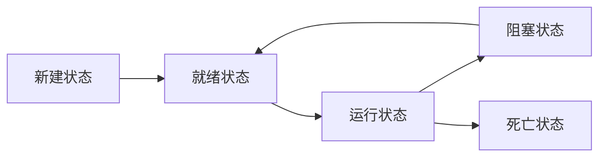

# 多线程编程

## 概念

### 进程与线程的区别

进程是具有一定独立功能的程序关于某个数据集合上的一次运行活动，进程是是系统进行资源分配和调度的基本单位。

线程是 CPU 调度和分派的基本单位。线程自己基本上不拥有系统资源，只拥有一些在运行中必不可少的资源（如程序计数器，一组寄存器和栈），但是它可与同属一个进程的其他的线程共享进程所拥有的全部资源。

1. 地址空间

   进程之间是独立的地址空间，但同一进程的线程共享本进程的地址空间。

2. 资源占用

   同一进程内的线程共享本进程的资源如内存、I/O、cpu等，但是进程之间的资源是独立的。

3. 健壮性

   一个进程崩溃后，在保护模式下不会对其他进程产生影响；

   一个线程崩溃整个进程都死掉，所以多进程要比多线程健壮。

4. 执行过程

   每个独立的进程有一个程序运行的入口、顺序执行序列。但是线程不能独立执行，必须依存在应用程序中，由应用程序提供多个线程执行控制。

5. 资源消耗

   进程切换消耗资源大。线程更“ 轻量级”， 创建、撤销一个线程比启动新进程的开销要小得多。

#### 线程生命周期

线程五状态模型



- 新建状态:

  使用 **new** 关键字和 **Thread** 类或其子类建立一个线程对象后，该线程对象就处于新建状态。

- 就绪状态:

  当线程对象调用了**start()**方法之后，该线程就进入就绪状态。就绪状态的线程处于就绪队列中，要等待JVM里线程调度器的调度。

- 运行状态:

  如果就绪状态的线程获取 CPU 资源，就可以执行 run()，此时线程便处于运行状态。

- 阻塞状态:

  如果一个线程执行了sleep、suspend等方法，失去所占用资源之后，该线程就从运行状态进入阻塞状态。在睡眠时间已到或获得设备资源后可以重新进入就绪状态。

  - 等待阻塞：运行状态中的线程执行 wait() 方法，使线程进入到等待阻塞状态。
  - 同步阻塞：线程在获取 synchronized 同步锁失败。
  - 其他阻塞：通过调用线程的 sleep() 或 join() 、发出 I/O 请求时，线程就会进入到阻塞状态。当sleep() 状态超时，join() 等待线程终止或超时，或者 I/O 处理完毕，线程重新转入就绪状态。

- 死亡状态:

  一个运行状态的线程完成任务或者其他终止条件发生（没有捕获的异常）时，该线程就切换到终止状态。

> 关于进程/线程状态还有其他说法，扶额。

## 基本使用

### 创建线程

### Callable & Future

Callable 接口是一个参数化的一个参数化的类型， 只有一
个方法 call。类型参数是返回值的类型

```java
public interface Callable<V>{
	V call() trows Exception;
}
```

Future 保存异步计算的结果。Future 对象的所有者在结果计算好之后就可以获得它。

```java
public interface Future<V>{
	V get() throws ..;
	V get(long timeout, TimeUnit unit) throws ..;
	boolean cancel (boolean mayInterrupt);
	boolean isCancelled();
	boolean isDone();
}
```

### FutureTask

FutureTask 包装器是一种非常便利的机制，可将Callable 转换成Future 和Runnable，它同时实现二者的接口。


## 同步

## 线程池


Thread.sleep()	可抛出 InterruptedException

sleep方法不会释放共享资源的锁

https://www.zhihu.com/question/42962803


wait() 和 sleep() 的区别
同：

1. 都是线程同步时会用到的方法，使当前线程暂停运行，把机会交给其他线程

2.如果任何线程在等待期间被中断都会抛出InterruptedException

3.都是native() 方法

异：

1. wait() 是Object超类中的方法；而sleep()是线程Thread类中的方法

2. 对锁的持有不同，wait()会释放锁，而sleep()并不释放锁

3. 唤醒方法不完全相同，wait() 依靠notify或者notifyAll 、中断、达到指定时间来唤醒；而sleep()到达指定时间被唤醒.

4. 使用位置不同，wait只能在同步代码块或同步控制块中使用，而sleep可以在任何位置使用。

await & wait

1. wait()是Object超类中的方法，而await()是ConditionObject类里面的方法.

2. await会导致当前线程被阻塞，会释放锁，这点和wait是一样的

3. await中的lock不再使用synchronized把代码同步包装起来

4. await的阻塞需要另外的一个对象condition

5. notify是用来唤醒使用wait的线程；而signal是用来唤醒await线程。

6. 所在的超类不同使用场景也不同，wait一般用于Synchronized中，而await只能用于ReentrantLock锁中


概念

- 原子性。原子操作是指相应的操作是单一不可分割的操作。例如：count++就不是原子操作，因为该操作分为三步，1）读取count的值，2）count做++运算，3）把运算后的值赋予count。在多线程环境下，该操作可能会收到其他线程的干扰，导致我们不能得到想要的结果。
- 内存可见性。CPU在执行代码的时候，为了减少变量访问的时间消耗，可能会将代码中访问的变量的值缓存到该CPU的缓存区。因此代码访问或者写入的变量，可能只是在缓存区而不是主内存。这就导致了一个CPU对变量的操作可能无法被其他CPU感知。
- 重排序。编译器和CPU为了提高指令的执行效率可能会进行指令重排序，意思是一段代码的实际执行顺序会被重新排序。例如：People p = new People()；正常地执行流程为：1）创建People的实例，2）将实例赋予变量p。但是由于指令重排的作用，实际实行顺序可能是：1）分配一段用于储存People实例的内存空间，2）将对该空间的引用赋值给变量p，3）创建People的实例。因此，当其他线程访问变量p时，可能此时p实例的初始化尚未完成。

volatile x synchronized

- synchronized关键字实现操作原子性的本质是通过该关键字所包括的临界区的排他性保证在同一时刻只有一个线程能执行临界区中的代码。该操作保证了原子性和内存可见性。
- volatile关键字保证了内存可见性，即，一个线程对一个volatile关键字修饰的变量的值的更改对于其他访问该变量的线程总是可见的。其核心机制为当一个线程更改了volatile关键字修饰的变量的值时，该值会被写入主内存而不仅仅时该线程的CPU缓存区，而其他CPU的缓存区中储存的该变量的值就会失效。这就保证了当任意线程访问一个volatile修饰的值时，那一刻得到的值一定是最新的。但是如果在读取后，有线程对其进行了修改，就无法保证操作的原子性了。volatile关键字的另一个作用是它禁止了指令重排序。
- synchronized关键字技能保证操作的原子性，也能保证内存可见性，但是会导致上下文切换。volatile关键字仅能保证内存可见性。

线程池

DCL (单例模式)缺点

wait / notify

https://www.cnblogs.com/moongeek/p/7631447.html

方法抛出的异常总结

https://www.jianshu.com/p/46728d6bc6b2

https://www.cnblogs.com/CarpenterLee/p/9558026.html

## 常用类

### ThreadLocal